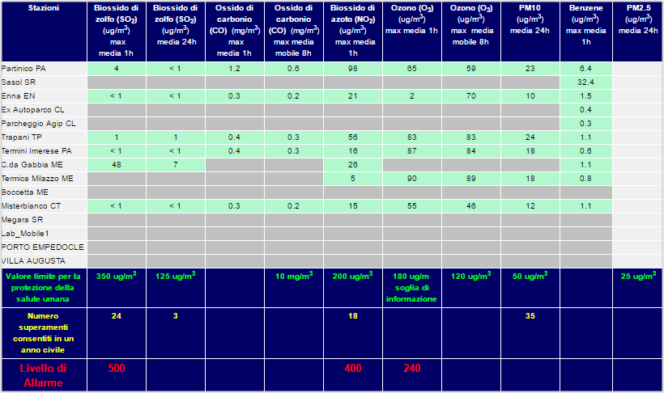

# Valori limite
Le soglie di concentrazione sono stabilite dal D.Lgs. 155/2010.

Qui sotto si riportano le soglie presenti sul [sito ARPA Sicilia](http://www.arpa.sicilia.it/storage/#titoloinizio) (in basso screenshot del 9 marzo 2016) 

| inquinante              | unità di misura dati raccolti | tipologia            | valore limite per la protezione della salute umana | unità di misura valori limite | note                   |
|-------------------------|-------------------------------|----------------------|----------------------------------------------------|-------------------------------|------------------------|
| Biossido di zolfo (SO2) | ug/m3                         | max media 1h         | 350                                                | ug/m3                         |                        |
| Biossido di zolfo (SO2) | ug/m3                         | media 24h            | 125                                                | ug/m3                         |                        |
| Ossido di carbonio (CO) | mg/m3                         | max media 1h         |                                                    |                               |                        |
| Ossido di carbonio (CO) | mg/m3                         | max media mobile 8h  | 10                                                 | mg/m3                         |                        |
| Biossido di azoto (NO2) | ug/m3                         | max media 1h         | 200                                                | ug/m3                         |                        |
| Ozono (O3)              | ug/m3                         | max media 1h         | 180                                                | ug/m                          | soglia di informazione |
| Ozono (O3)              | ug/m3                         | max  media mobile 8h | 120                                                | ug/m3                         |                        |
| PM10                    | ug/m3                         | media 24h            | 50                                                 | ug/m3                         |                        |
| Benzene                 | ug/m3                         | max media 1h         | 25                                                 | ug/m3                         |                        |
| PM2.5                   | ug/m3                         | media 24h            | 25                                                 | ug/m3                         |                        |

