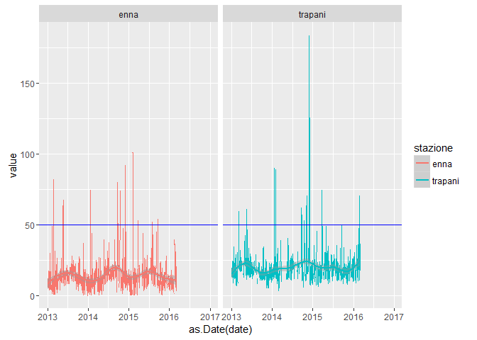

# Maria_report
Patrick Hausmann  
12/03/2016  


```r
library('stringr')
library('reshape2')
library('ggplot2')
library('dplyr')
```

```
## 
## Attaching package: 'dplyr'
```

```
## The following objects are masked from 'package:stats':
## 
##     filter, lag
```

```
## The following objects are masked from 'package:base':
## 
##     intersect, setdiff, setequal, union
```

```r
library('tidyr')
library('highcharter')

options(stringsAsFactors = FALSE)
```


```r
split_names <- function(m) {
   stazione <- zz$stazione[which(str_detect(m, zz$stazione))]
   inq      <- zz$inq[which(str_detect(m, zz$inq))]
   tdm      <- zz$tdm[which(str_detect(m, zz$tdm))]
   out <- paste(stazione, inq, tdm, sep = "__")
   out
}

# tdm -> tipo di misura

zz <- read.table(header = TRUE, sep = ";", text = "
stazione;inq;tdm
partinico;SO2;Max_orario
sasol;CO;Media_24_h
enna;NO2;Max_media_8h
ex_autoparco;O3;NA
trapani;Benzene;NA
termini;PM10;NA
cda_gabbia;PM2.5;NA
termica_milazzo;NA;NA
boccetta;NA;NA
misterbianco;NA;NA
megara;NA;NA
lab_mobile1;NA;NA
porto_empedocle;NA;NA
villa_augusta;NA;NA
parcheggio_agip;NA;NA
")

zz %>% knitr::kable()
```


stazione          inq       tdm          
----------------  --------  -------------
partinico         SO2       Max_orario   
sasol             CO        Media_24_h   
enna              NO2       Max_media_8h 
ex_autoparco      O3        NA           
trapani           Benzene   NA           
termini           PM10      NA           
cda_gabbia        PM2.5     NA           
termica_milazzo   NA        NA           
boccetta          NA        NA           
misterbianco      NA        NA           
megara            NA        NA           
lab_mobile1       NA        NA           
porto_empedocle   NA        NA           
villa_augusta     NA        NA           
parcheggio_agip   NA        NA           

### Import the data


```r
x <- read.csv("http://dev.opendatasicilia.it/arpa/MAria_report.csv")

colnames(x) <- c("date", unlist(lapply(colnames(x), split_names)))

xm <- melt(x, id = "date")
xm$variable <- as.character(xm$variable)

u <- data.frame(do.call("rbind", strsplit(xm$variable, "__")), stringsAsFactors = FALSE)
colnames(u) <- c("stazione", "inq", "tdm")
fin <- data.frame(u, date = xm$date, value = xm$value)

head(fin) %>% knitr::kable()
```


stazione    inq   tdm          date             value
----------  ----  -----------  -----------  ---------
partinico   SO2   Max_orario   2013-01-01    2.227614
partinico   SO2   Max_orario   2013-01-02    1.331977
partinico   SO2   Max_orario   2013-01-03    4.150291
partinico   SO2   Max_orario   2013-01-04    7.960566
partinico   SO2   Max_orario   2013-01-05    3.602461
partinico   SO2   Max_orario   2013-01-06    1.674221


```r
addmargins(table(fin$stazione, !is.na(fin$value), useNA= "always")) %>% knitr::kable()
```

                   FALSE    TRUE   NA      Sum
----------------  ------  ------  ---  -------
boccetta            8034     732    0     8766
cda_gabbia          1793    4051    0     5844
enna                3876    9273    0    13149
ex_autoparco         620     841    0     1461
lab_mobile1         5609     235    0     5844
megara               543     918    0     1461
misterbianco        3454    9695    0    13149
parcheggio_agip      606     855    0     1461
partinico           3241    9908    0    13149
porto_empedocle    13964     646    0    14610
sasol                812     649    0     1461
termica_milazzo     3365    6862    0    10227
termini             3564    9585    0    13149
trapani             3875    9274    0    13149
villa_augusta       1302     159    0     1461
NA                     0       0    0        0
Sum                54658   63683    0   118341


```r
addmargins(table(fin$stazione, fin$inq, useNA= "always")) %>% knitr::kable()
```

                   Benzene      CO     NO2      O3    PM10   PM2.5     SO2   NA      Sum
----------------  --------  ------  ------  ------  ------  ------  ------  ---  -------
boccetta                 0       0    1461    2922    1461       0    2922    0     8766
cda_gabbia            1461       0    1461       0       0       0    2922    0     5844
enna                  1461    2922    1461    2922    1461       0    2922    0    13149
ex_autoparco          1461       0       0       0       0       0       0    0     1461
lab_mobile1           1461       0    1461    2922       0       0       0    0     5844
megara                1461       0       0       0       0       0       0    0     1461
misterbianco          1461    2922    1461    2922    1461       0    2922    0    13149
parcheggio_agip       1461       0       0       0       0       0       0    0     1461
partinico             1461    2922    1461    2922    1461       0    2922    0    13149
porto_empedocle       1461    2922    1461    2922    1461    1461    2922    0    14610
sasol                 1461       0       0       0       0       0       0    0     1461
termica_milazzo       1461    2922    1461    2922    1461       0       0    0    10227
termini               1461    2922    1461    2922    1461       0    2922    0    13149
trapani               1461    2922    1461    2922    1461       0    2922    0    13149
villa_augusta         1461       0       0       0       0       0       0    0     1461
NA                       0       0       0       0       0       0       0    0        0
Sum                  20454   20454   14610   26298   11688    1461   23376    0   118341

### Export csv file (gzipped)


```r
con_out <- gzfile("maria_report_04_long.csv.gz", open = "wb")
   write.csv(fin, file = con_out, row.names = FALSE)
close(con_out)
```

### PM10 - Enna e Trapani


```r
fin_enna_pm10 <- subset(fin, subset = stazione %in% c("enna", "trapani") & inq == "PM10" & tdm == "Media_24_h")
p1 <- ggplot(fin_enna_pm10, aes(x=as.Date(date), y=value, col= stazione)) + geom_line()
p1 <- p1 + facet_wrap( ~ stazione)
p1 <- p1 + geom_hline(yintercept = 50, col = "blue")
p1 <- p1 + geom_smooth()
p1
```

```
## Warning: Removed 837 rows containing non-finite values (stat_smooth).
```

```
## Warning: Removed 606 rows containing missing values (geom_path).
```



### Highcharter


```r
fin_hc <- tbl_df(fin) %>% 
          filter(stazione %in% c("enna", "trapani"), inq == "PM10", tdm == "Media_24_h") %>%
          mutate(year_month = format(as.Date(date), "%Y-%m")) %>%
          group_by(stazione, year_month) %>%
          summarise(mean_val = round(mean(value, na.rm = TRUE), 2)) %>%
          ungroup()

fin_hc <- data.frame(fin_hc)

hc1 <- highchart() %>% 
        hc_xAxis(categories = fin_hc$year_month) %>% 
        hc_add_series(name = "Enna", data = fin_hc[fin_hc$stazione=="enna", "mean_val"]) %>%
        hc_add_series(name = "Trapani", data = fin_hc[fin_hc$stazione=="trapani", "mean_val"])
hc1
```

<!--html_preserve--><div id="htmlwidget-122" style="width:100%;height:500px;" class="highchart html-widget"></div>
<script type="application/json" data-for="htmlwidget-122">{"x":{"hc_opts":{"title":{"text":null},"credits":{"enabled":false},"exporting":{"enabled":false},"plotOptions":{"series":{"turboThreshold":0}},"xAxis":{"categories":["2013-01","2013-02","2013-03","2013-04","2013-05","2013-06","2013-07","2013-08","2013-09","2013-10","2013-11","2013-12","2014-01","2014-02","2014-03","2014-04","2014-05","2014-06","2014-07","2014-08","2014-09","2014-10","2014-11","2014-12","2015-01","2015-02","2015-03","2015-04","2015-05","2015-06","2015-07","2015-08","2015-09","2015-10","2015-11","2015-12","2016-01","2016-02","2016-03","2016-04","2016-05","2016-06","2016-07","2016-08","2016-09","2016-10","2016-11","2016-12","2013-01","2013-02","2013-03","2013-04","2013-05","2013-06","2013-07","2013-08","2013-09","2013-10","2013-11","2013-12","2014-01","2014-02","2014-03","2014-04","2014-05","2014-06","2014-07","2014-08","2014-09","2014-10","2014-11","2014-12","2015-01","2015-02","2015-03","2015-04","2015-05","2015-06","2015-07","2015-08","2015-09","2015-10","2015-11","2015-12","2016-01","2016-02","2016-03","2016-04","2016-05","2016-06","2016-07","2016-08","2016-09","2016-10","2016-11","2016-12"]},"series":[{"name":"Enna","data":[9.51,12.58,10.82,11.7,19.82,13.88,14.85,18.06,12.48,13.89,9.73,8.99,11.32,11.03,12.85,10.38,13.72,16.32,16.8,17.62,21.32,20.55,17.27,15.52,8.03,15.01,12.76,13.67,15.48,13.9,18.27,17.27,19.33,10.28,10.89,11.37,9.11,13.96,5,null,null,null,null,null,null,null,null,null]},{"name":"Trapani","data":[17.55,15.35,24.63,20.04,25.46,20.94,17.98,18,16.56,17.56,13.11,15.27,22.41,17.02,18.81,null,20.1,18.73,20.38,18.63,24.35,21.33,29.48,21.95,18.62,16.95,21.02,22.27,19.36,18.57,19.89,17.22,18.69,17.53,17.5,18.14,19.54,24.39,24.13,null,null,null,null,null,null,null,null,null]}]},"theme":null,"conf_opts":{"global":{"Date":null,"VMLRadialGradientURL":"http =//code.highcharts.com/list(version)/gfx/vml-radial-gradient.png","canvasToolsURL":"http =//code.highcharts.com/list(version)/modules/canvas-tools.js","getTimezoneOffset":null,"timezoneOffset":0,"useUTC":true},"lang":{"contextButtonTitle":"Chart context menu","decimalPoint":".","downloadJPEG":"Download JPEG image","downloadPDF":"Download PDF document","downloadPNG":"Download PNG image","downloadSVG":"Download SVG vector image","drillUpText":"Back to {series.name}","invalidDate":null,"loading":"Loading...","months":["January","February","March","April","May","June","July","August","September","October","November","December"],"noData":"No data to display","numericSymbols":["k","M","G","T","P","E"],"printChart":"Print chart","resetZoom":"Reset zoom","resetZoomTitle":"Reset zoom level 1:1","shortMonths":["Jan","Feb","Mar","Apr","May","Jun","Jul","Aug","Sep","Oct","Nov","Dec"],"thousandsSep":" ","weekdays":["Sunday","Monday","Tuesday","Wednesday","Thursday","Friday","Saturday"]}},"type":"chart","fonts":[],"debug":false},"evals":[],"jsHooks":[]}</script><!--/html_preserve-->

### Days per year with a PM10 value over 50 mg/m3 (max. 35 excedances allowed per year)


```r
m <- tbl_df(fin) %>%
       filter(inq == "PM10") %>%
       mutate(year = format(as.Date(date), "%Y")) %>%
       group_by(stazione, year) %>%
       mutate(days_gt50 = cumsum(ifelse(!is.na(value) & value > 50, 1, 0))) %>%
       select(stazione, year, days_gt50) %>%
       top_n(1, days_gt50) %>%
       distinct(stazione, year) %>%
       ungroup() %>%
       arrange(stazione, year)

spread(m, year, days_gt50) %>% knitr::kable()
```


stazione           2013   2014   2015   2016
----------------  -----  -----  -----  -----
boccetta              0      0      0      0
enna                  4      9      6      0
misterbianco          4     16      5      1
partinico             4     21      9      1
porto_empedocle       0      0     29      0
termica_milazzo       5     18      8      3
termini               2      9      6      2
trapani               2     12      1      1

