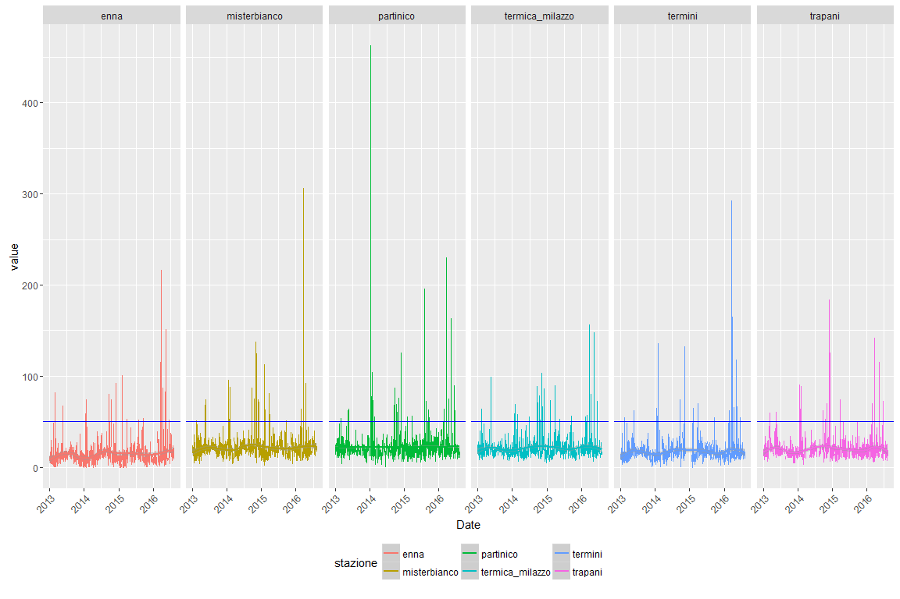
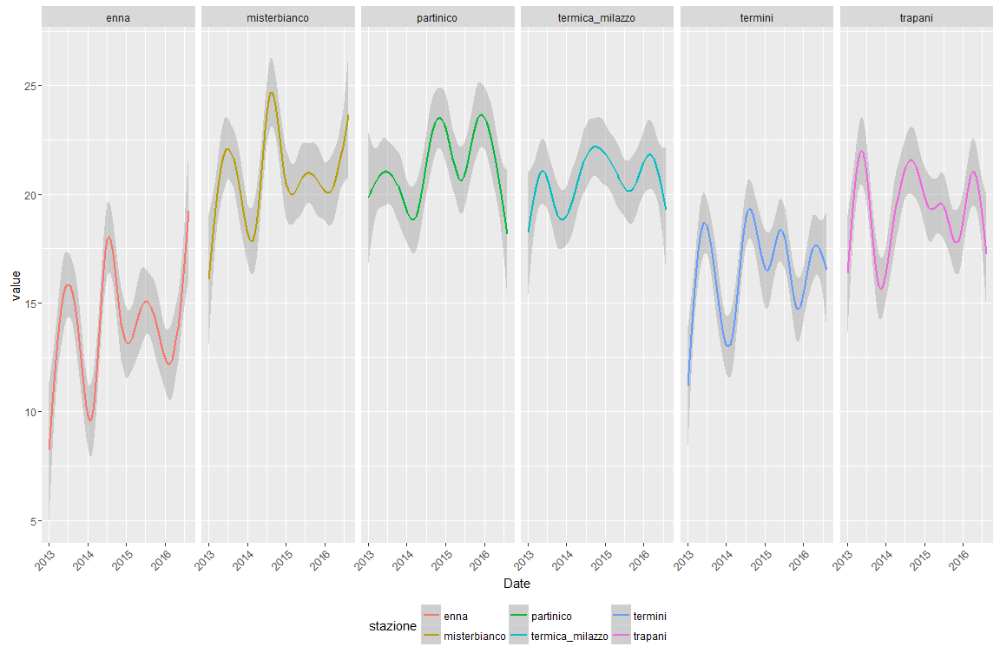
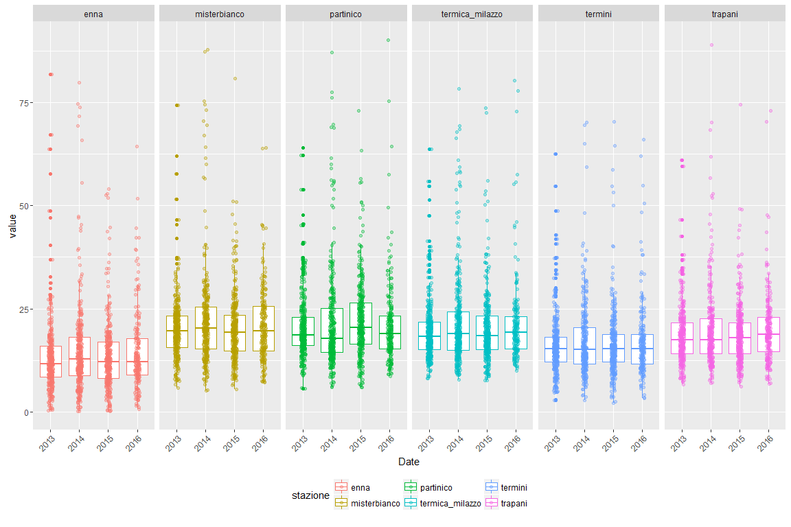
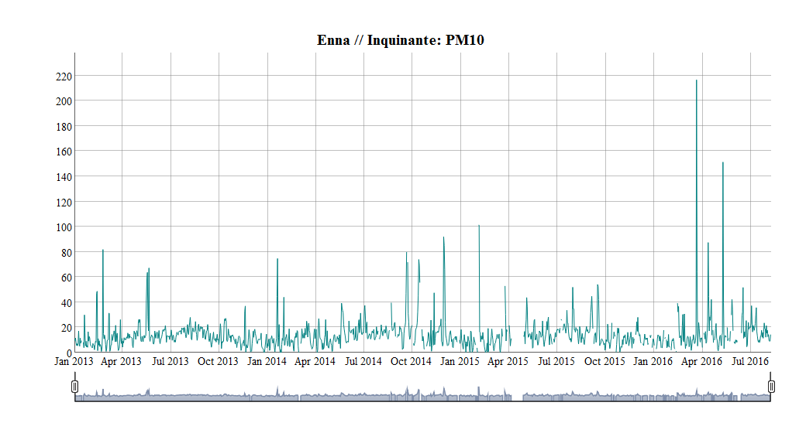
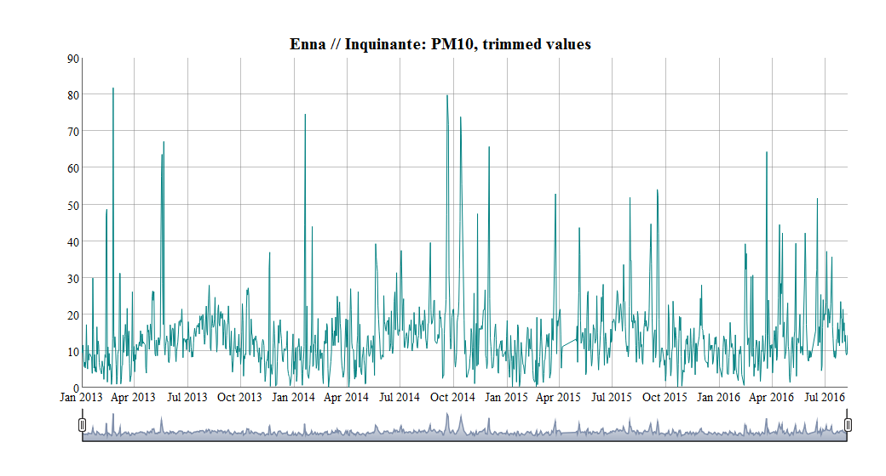
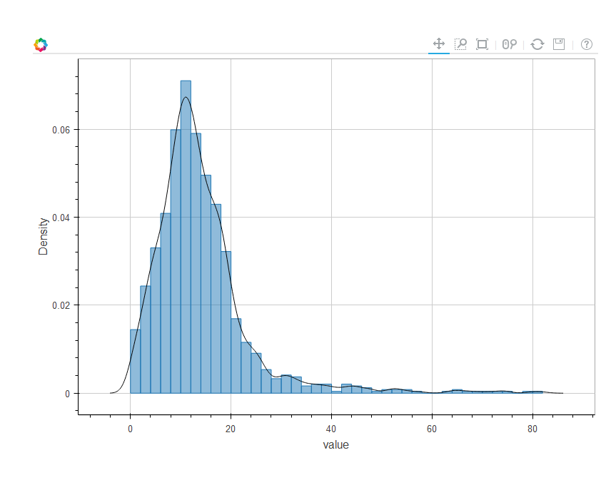
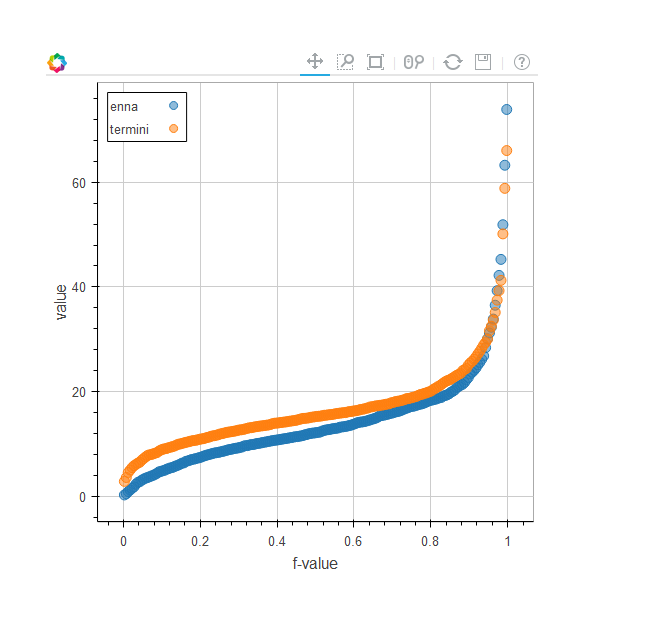
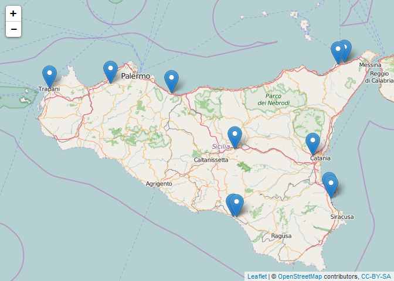

Maria\_report
================
Patrick Hausmann

-   [Todo](#todo)
-   [Load some libraries](#load-some-libraries)
-   [Import the data](#import-the-data)
-   [Overview](#overview)
-   [Export csv file (gzipped)](#export-csv-file-gzipped)
-   [PM10](#pm10)
-   [O3](#o3)
-   [Number of missing observations by stazione, year and month (PM10)](#number-of-missing-observations-by-stazione-year-and-month-pm10)
-   [Highcharter](#highcharter)
-   [Vegalite](#vegalite)
-   [Dygraph](#dygraph)
-   [Dygraph, trimmed values](#dygraph-trimmed-values)
-   [rbokeh](#rbokeh)
-   [Maximum per year (PM10)](#maximum-per-year-pm10)
-   [Days per year with a PM10 value over 50 mg/m3 (max. 35 excedances allowed per year)](#days-per-year-with-a-pm10-value-over-50-mgm3-max.-35-excedances-allowed-per-year)
-   [Mappa stazioni](#mappa-stazioni)

Todo
====

Load some libraries
===================

``` r
library('stringr')
library('tidyr')
library('ggplot2')
library('dplyr')
library('highcharter')
library('vegalite')
library('lubridate')
library('leaflet')
library('dygraphs')
library('xts')
library('rbokeh')
```

``` r
ma_theme <- function(base_size=12, base_family="helvetica") {
                      theme(axis.text.x = element_text(angle = 45, vjust = 1, hjust=1),
                      legend.position = 'bottom')
}

split_names <- function(m) {
   stazione <- zz$stazione[which(str_detect(m, zz$stazione))]
   inq      <- zz$inq[which(str_detect(m, zz$inq))]
   tdm      <- zz$tdm[which(str_detect(m, zz$tdm))]
   out <- paste(stazione, inq, tdm, sep = "__")
   out
}

# tdm -> tipo di misura

zz <- read.table(header = TRUE, sep = ";", text = "
stazione;inq;tdm
partinico;SO2;Max_orario
sasol;CO;Media_24_h
enna;NO2;Max_media_8h
ex_autoparco;O3;NA
trapani;Benzene;NA
termini;PM10;NA
cda_gabbia;PM2.5;NA
termica_milazzo;NA;NA
boccetta;NA;NA
misterbianco;NA;NA
megara;NA;NA
lab_mobile1;NA;NA
porto_empedocle;NA;NA
villa_augusta;NA;NA
parcheggio_agip;NA;NA
")

zz %>% knitr::kable()
```

| stazione         | inq     | tdm            |
|:-----------------|:--------|:---------------|
| partinico        | SO2     | Max\_orario    |
| sasol            | CO      | Media\_24\_h   |
| enna             | NO2     | Max\_media\_8h |
| ex\_autoparco    | O3      | NA             |
| trapani          | Benzene | NA             |
| termini          | PM10    | NA             |
| cda\_gabbia      | PM2.5   | NA             |
| termica\_milazzo | NA      | NA             |
| boccetta         | NA      | NA             |
| misterbianco     | NA      | NA             |
| megara           | NA      | NA             |
| lab\_mobile1     | NA      | NA             |
| porto\_empedocle | NA      | NA             |
| villa\_augusta   | NA      | NA             |
| parcheggio\_agip | NA      | NA             |

Import the data
===============

``` r
# http://www.arpa.sicilia.it/storage/MAria_report.xls
x <- read.csv("http://blog.spaziogis.it/static/ods/data/mariareport/MAria_report.csv")

colnames(x) <- c("date", unlist(lapply(colnames(x), split_names)))

xm <- gather(x, variable, value, -date)
#xm$variable <- as.character(xm$variable)

u <- data.frame(do.call("rbind", strsplit(xm$variable, "__")), stringsAsFactors = FALSE)
colnames(u) <- c("stazione", "inq", "tdm")
fin <- data.frame(u, date = xm$date, value = xm$value)

knitr::kable(head(fin))
```

| stazione  | inq | tdm         | date       |     value|
|:----------|:----|:------------|:-----------|---------:|
| partinico | SO2 | Max\_orario | 2013-01-01 |  2.227614|
| partinico | SO2 | Max\_orario | 2013-01-02 |  1.331977|
| partinico | SO2 | Max\_orario | 2013-01-03 |  4.150291|
| partinico | SO2 | Max\_orario | 2013-01-04 |  7.960566|
| partinico | SO2 | Max\_orario | 2013-01-05 |  3.602461|
| partinico | SO2 | Max\_orario | 2013-01-06 |  1.674221|

``` r
knitr::kable(tail(fin))
```

|        | stazione | inq | tdm          | date       |      value|
|:-------|:---------|:----|:-------------|:-----------|----------:|
| 123511 |          |     | Media\_24\_h | 2016-08-01 |  0.0984469|
| 123512 |          |     | Media\_24\_h | 2016-08-02 |  0.0175628|
| 123513 |          |     | Media\_24\_h | 2016-08-03 |  0.0122055|
| 123514 |          |     | Media\_24\_h | 2016-08-04 |         NA|
| 123515 |          |     | Media\_24\_h | 2016-08-05 |         NA|
| 123516 |          |     | Media\_24\_h | 2016-08-06 |         NA|

``` r
# most recent day
max(as.Date(fin[!is.na(fin$value), "date"]))
```

    ## [1] "2016-08-03"

``` r
addmargins(table(fin$inq, fin$tdm, useNA = "always")) %>% knitr::kable()
```

|         |  Max\_media\_8h|  Max\_orario|  Media\_24\_h|   NA|     Sum|
|:--------|---------------:|------------:|-------------:|----:|-------:|
|         |               0|         2628|          5256|    0|    7884|
| Benzene |               0|        18396|             0|    0|   18396|
| CO      |           11826|        11826|             0|    0|   23652|
| NO2     |               0|        14454|             0|    0|   14454|
| O3      |           11826|        11826|             0|    0|   23652|
| PM10    |               0|            0|         13140|    0|   13140|
| SO2     |               0|        10512|         11826|    0|   22338|
| NA      |               0|            0|             0|    0|       0|
| Sum     |           23652|        69642|         30222|    0|  123516|

Read the data

-   [Cloudant-DB](https://opps.cloudant.com/maria/)

-   <https://opps.cloudant.com/maria/_design/stats/_view/q1?limit=50&reduce=false>

-   [Q2](https://opps.cloudant.com/maria/_design/stats/_view/q2?descending=false&limit=10&include_docs=true)

Overview
========

``` r
addmargins(table(fin$stazione, !is.na(fin$value), useNA= "always")) %>% knitr::kable()
```

|                  |  FALSE|   TRUE|   NA|     Sum|
|:-----------------|------:|------:|----:|-------:|
|                  |  13800|    654|    0|   14454|
| boccetta         |   7152|    732|    0|    7884|
| cda\_gabbia      |    631|   4625|    0|    5256|
| enna             |   1232|  10594|    0|   11826|
| ex\_autoparco    |    325|    989|    0|    1314|
| lab\_mobile1     |   8720|    478|    0|    9198|
| megara           |    254|   1060|    0|    1314|
| misterbianco     |    780|  11046|    0|   11826|
| parcheggio\_agip |    308|   1006|    0|    1314|
| partinico        |    558|  11268|    0|   11826|
| porto\_empedocle |  11009|    817|    0|   11826|
| sasol            |    517|    797|    0|    1314|
| termica\_milazzo |   1285|   7913|    0|    9198|
| termini          |    931|  10895|    0|   11826|
| trapani          |   1230|  10596|    0|   11826|
| villa\_augusta   |   1012|    302|    0|    1314|
| NA               |      0|      0|    0|       0|
| Sum              |  49744|  73772|    0|  123516|

``` r
addmargins(with(fin[!is.na(fin$value), ], table(stazione, inq, useNA= "always"))) %>% knitr::kable()
```

|                  |     |  Benzene|     CO|   NO2|     O3|  PM10|    SO2|   NA|    Sum|
|:-----------------|----:|--------:|------:|-----:|------:|-----:|------:|----:|------:|
|                  |  354|        0|    123|    64|      0|    54|     59|    0|    654|
| boccetta         |    0|        0|      0|   138|    278|    40|    276|    0|    732|
| cda\_gabbia      |    0|     1090|      0|  1183|      0|     0|   2352|    0|   4625|
| enna             |    0|      965|   2529|  1259|   2472|  1219|   2150|    0|  10594|
| ex\_autoparco    |    0|      989|      0|     0|      0|     0|      0|    0|    989|
| lab\_mobile1     |    0|       60|    125|   140|     99|    54|      0|    0|    478|
| megara           |    0|     1060|      0|     0|      0|     0|      0|    0|   1060|
| misterbianco     |    0|     1112|   2551|  1170|   2483|  1270|   2460|    0|  11046|
| parcheggio\_agip |    0|     1006|      0|     0|      0|     0|      0|    0|   1006|
| partinico        |    0|     1109|   2582|  1298|   2481|  1254|   2544|    0|  11268|
| porto\_empedocle |    0|       82|    117|   107|    214|    83|    214|    0|    817|
| sasol            |    0|      797|      0|     0|      0|     0|      0|    0|    797|
| termica\_milazzo |    0|     1128|   1836|  1292|   2417|  1240|      0|    0|   7913|
| termini          |    0|     1044|   2529|  1277|   2526|  1205|   2314|    0|  10895|
| trapani          |    0|     1138|   2331|  1224|   2404|  1149|   2350|    0|  10596|
| villa\_augusta   |    0|      302|      0|     0|      0|     0|      0|    0|    302|
| NA               |    0|        0|      0|     0|      0|     0|      0|    0|      0|
| Sum              |  354|    11882|  14723|  9152|  15374|  7568|  14719|    0|  73772|

Export csv file (gzipped)
=========================

``` r
con_out <- gzfile("maria_report_04_long.csv.gz", open = "wb")
   write.csv(fin, file = con_out, row.names = FALSE)
close(con_out)
```

PM10
====

``` r
fin_pm10 <- subset(fin, subset = stazione %in% c("enna", "trapani", "partinico", 
                                                 "misterbianco", "termini", 
                                                 "termica_milazzo") & 
                        inq == "PM10" & tdm == "Media_24_h")
p1 <- ggplot(fin_pm10, aes(x=as.Date(date), y=value, col= stazione)) + geom_line()
p1 <- p1 + geom_smooth()
p1 <- p1 + facet_wrap( ~ stazione, nrow = 1)
p1 <- p1 + geom_hline(yintercept = 50, col = "blue")
p1 <- p1 + labs(x = "Date", y = "value")
p1 <- p1 + ma_theme()
p1
```

    ## Warning: Removed 547 rows containing non-finite values (stat_smooth).

    ## Warning: Removed 21 rows containing missing values (geom_path).



O3
==

``` r
fin_o3 <- subset(fin, subset = stazione %in% c("enna", "trapani", "partinico", 
                                               "misterbianco", "termini", 
                                               "termica_milazzo") & 
                        inq == "O3" & tdm == "Max_media_8h")
p1 <- ggplot(fin_o3, aes(x=as.Date(date), y=value, col= stazione)) + geom_line()
p1 <- p1 + geom_smooth()
p1 <- p1 + facet_wrap( ~ stazione, nrow = 1)
#p1 <- p1 + geom_hline(yintercept = 50, col = "blue")
p1 <- p1 + labs(x = "Date", y = "value")
p1 <- p1 + ma_theme()
p1
```

    ## Warning: Removed 495 rows containing non-finite values (stat_smooth).

    ## Warning: Removed 20 rows containing missing values (geom_path).


Number of missing observations by stazione, year and month (PM10)
=================================================================

``` r
missing_by_yr_month <- function(x) {
  z <- tbl_df(x) %>%
       dplyr::filter(is.na(value)) %>%
       mutate(yr = year(ymd(date)), month = month(ymd(date))) %>%
       select(stazione, yr, month) %>% 
       ungroup()
  with(z, table(yr, month, stazione))
}

(kx1 <- missing_by_yr_month(fin_pm10))
```

    ## , , stazione = enna
    ## 
    ##       month
    ## yr      1  2  3  4  5  6  7  8  9 10 11 12
    ##   2013  2  0  0  0  0  0  0  0  0  0  0  1
    ##   2014  0  0  3  0  0  0  1  2  3  6  0  4
    ##   2015  1  2  4 23  0  2  2  0  1  3  2  5
    ##   2016  6  4  0  4  4  7  0  3  0  0  0  0
    ## 
    ## , , stazione = misterbianco
    ## 
    ##       month
    ## yr      1  2  3  4  5  6  7  8  9 10 11 12
    ##   2013  0  1  0  1  0  0  0  0  0  0  1  1
    ##   2014  7  0  6  0  0  0  0  0  1  3  0  0
    ##   2015  0  0  1  1  0  0  3  2  0  2  1  5
    ##   2016  0  0  0  1  2  0  2  3  0  0  0  0
    ## 
    ## , , stazione = partinico
    ## 
    ##       month
    ## yr      1  2  3  4  5  6  7  8  9 10 11 12
    ##   2013  3  0  0  0  0  0  0  0  2  9  4  1
    ##   2014  8  1  0  0  1  0  1  0  1  0  0  0
    ##   2015  0  1  1  1  0  0  1  6  4  2  2  2
    ##   2016  2  0  1  0  2  0  0  4  0  0  0  0
    ## 
    ## , , stazione = termica_milazzo
    ## 
    ##       month
    ## yr      1  2  3  4  5  6  7  8  9 10 11 12
    ##   2013  0  1  0  0  0  0  0  3  0  0  0  1
    ##   2014  0  0  0  0  0  0  0  0  0  0  0  0
    ##   2015  0  0  0  0  0  2  0 10  0  0 17 11
    ##   2016  7  6  5  0  1  0  5  5  0  0  0  0
    ## 
    ## , , stazione = termini
    ## 
    ##       month
    ## yr      1  2  3  4  5  6  7  8  9 10 11 12
    ##   2013  0  2  0  0  0  0  0  0  0  0  1  4
    ##   2014  0  0  7  0  0  0  0  0  0  5 11 31
    ##   2015 21  0  1  0  0  1  1  2  2  0  4  1
    ##   2016  0  1  0  6  2  0  2  4  0  0  0  0
    ## 
    ## , , stazione = trapani
    ## 
    ##       month
    ## yr      1  2  3  4  5  6  7  8  9 10 11 12
    ##   2013  0  0  8 14  0  0  7 12  0  0  1  0
    ##   2014  0  0  3 30  5  1 13 16  7  3  0  0
    ##   2015 10  4  1  4  4  1  3  0  1  3  1  2
    ##   2016  0  0  1  3  4  0  0  3  0  0  0  0

``` r
# year 2016
addmargins(t(kx1["2016",1:12,]), 1)
```

    ##                  month
    ## stazione           1  2  3  4  5  6  7  8  9 10 11 12
    ##   enna             6  4  0  4  4  7  0  3  0  0  0  0
    ##   misterbianco     0  0  0  1  2  0  2  3  0  0  0  0
    ##   partinico        2  0  1  0  2  0  0  4  0  0  0  0
    ##   termica_milazzo  7  6  5  0  1  0  5  5  0  0  0  0
    ##   termini          0  1  0  6  2  0  2  4  0  0  0  0
    ##   trapani          0  0  1  3  4  0  0  3  0  0  0  0
    ##   Sum             15 11  7 14 15  7  9 22  0  0  0  0

``` r
# Trim observations from each end before the computation
trim_obs <- function(x, trim) {
  m <- c(quantile(x, probs = trim, na.rm = TRUE), 
         quantile(x, probs = 1 - trim, na.rm = TRUE))
  print(m)
  out <- (x >= m[1] & x <= m[2])
  return(out)
}

fin_pm10_trim <- tbl_df(fin_pm10) %>%
                 group_by(stazione) %>%
                 mutate(ixd = trim_obs(value, 0.5/100)) %>%
                 ungroup() 
```

    ##     0.5%    99.5% 
    ##  0.15636 84.75051 
    ##     0.5%    99.5% 
    ##  5.08166 90.90610 
    ##     0.5%    99.5% 
    ##   5.4795 100.4106 
    ##     0.5%    99.5% 
    ##  7.49696 84.98849 
    ##     0.5%    99.5% 
    ##  1.18864 74.17688 
    ##     0.5%    99.5% 
    ##  6.07696 89.37207

``` r
table(fin_pm10_trim$stazione, fin_pm10_trim$ixd)
```

    ##                  
    ##                   FALSE TRUE
    ##   enna               14 1205
    ##   misterbianco       14 1256
    ##   partinico          14 1240
    ##   termica_milazzo    14 1226
    ##   termini            14 1191
    ##   trapani            12 1137

``` r
fin_pm10_trim <- dplyr::filter(fin_pm10_trim, ixd == TRUE)

p2 <- ggplot(fin_pm10_trim, aes(x=as.Date(date), y=value, col = stazione))
p2 <- p2 + geom_smooth()
p2 <- p2 + facet_wrap( ~ stazione, nrow = 1)
p2 <- p2 + labs(x = "Date", y = "value")
p2 <- p2 + ma_theme()
p2
```



``` r
fin_pm10_trim$date <- as.character(year(as.Date(fin_pm10_trim$date)))

p3 <- ggplot(fin_pm10_trim, aes(x = date, y = value, group = stazione, col = stazione))
p3 <- p3 + geom_boxplot(group = 2) + geom_jitter(width = 0.2, alpha = 0.35)
p3 <- p3 + facet_wrap( ~ stazione, nrow = 1)
p3 <- p3 + labs(x = "Date", y = "value")
p3 <- p3 + ma_theme()
p3
```



Highcharter
===========

``` r
fin_hc <- tbl_df(fin) %>% 
          dplyr::filter(stazione %in% c("enna", "trapani", "termica_milazzo", 
                                        "partinico", "termini"), 
                        inq == "PM10", tdm == "Media_24_h") %>%
          mutate(year_month = format(as.Date(date), "%Y-%m")) %>%
          group_by(stazione, year_month) %>%
          summarise(mean_val = round(mean(value, na.rm = TRUE), 2)) %>%
          ungroup()

fin_hc <- data.frame(fin_hc)

hc1 <- highchart() %>% 
        hc_xAxis(categories = fin_hc$year_month) %>% 
        hc_add_series(name = "Enna", data = fin_hc[fin_hc$stazione=="enna", "mean_val"]) %>%
        hc_add_series(name = "Partinico", data = fin_hc[fin_hc$stazione=="partinico", "mean_val"]) %>%
        hc_add_series(name = "Termica Milazzo", data = fin_hc[fin_hc$stazione=="termica_milazzo", "mean_val"]) %>%
        hc_add_series(name = "Termini", data = fin_hc[fin_hc$stazione=="termini", "mean_val"]) %>%
        hc_add_series(name = "Trapani", data = fin_hc[fin_hc$stazione=="trapani", "mean_val"])

hc1
```


Vegalite
========

``` r
vegalite(export=TRUE) %>%
  cell_size(400, 400) %>% 
  add_data(fin_hc) %>%
  encode_x("year_month", "temporal") %>%
  encode_y("mean_val", "quantitative") %>%
  encode_color("stazione", "nominal") %>% 
  axis_x(axisWidth=0, format="%Y", labelAngle=0) %>%
  mark_line() -> vl

vl
```


Dygraph
=======

``` r
xdy <- fin_pm10[fin_pm10$stazione == "enna", ]
dygraph(xts(xdy$value, order.by = as.POSIXct(xdy$date)), 
            main = "Enna // Inquinante: PM10")  %>% 
        dyRangeSelector()
```



Dygraph, trimmed values
=======================

``` r
fin_pm10_trim <- tbl_df(fin_pm10) %>%
                 group_by(stazione) %>%
                 mutate(ixd = trim_obs(value, 0.5/100)) %>%
                 ungroup() 
```

    ##     0.5%    99.5% 
    ##  0.15636 84.75051 
    ##     0.5%    99.5% 
    ##  5.08166 90.90610 
    ##     0.5%    99.5% 
    ##   5.4795 100.4106 
    ##     0.5%    99.5% 
    ##  7.49696 84.98849 
    ##     0.5%    99.5% 
    ##  1.18864 74.17688 
    ##     0.5%    99.5% 
    ##  6.07696 89.37207

``` r
fin_pm10_trim <- dplyr::filter(fin_pm10_trim, ixd == TRUE)

xdy1 <- fin_pm10_trim[fin_pm10_trim$stazione == "enna", ]
dygraph(xts(xdy1$value, order.by = as.POSIXct(xdy1$date)), 
            main = "Enna // Inquinante: PM10, trimmed values")  %>% 
        dyRangeSelector()
```



rbokeh
======

``` r
# Trimmed values, PM10, Enna

figure(width = 800, height = 600) %>%
       ly_hist(value, data = xdy1, breaks = 40, freq = FALSE) %>%
       ly_density(value, data = xdy1)
```



``` r
xdy2 <- fin_pm10_trim[fin_pm10_trim$stazione %in% c("enna", "termini"), ]

figure(legend_location = "top_left") %>%
  ly_quantile(value, group = stazione, data = xdy2)
```



Maximum per year (PM10)
=======================

``` r
tbl_df(fin) %>% 
          mutate(year = format(as.Date(date), "%Y")) %>%
          dplyr::filter(inq == "PM10", tdm == "Media_24_h") %>%
          group_by(stazione, year) %>%
          summarise(max_val = round(max(value, na.rm = TRUE), 2)) %>%
          ungroup() %>%
          spread(year, max_val) %>% knitr::kable()
```

| stazione         |   2013|    2014|    2015|    2016|
|:-----------------|------:|-------:|-------:|-------:|
|                  |     NA|      NA|      NA|   76.90|
| boccetta         |  28.22|   37.60|      NA|      NA|
| enna             |  81.86|   91.95|  101.20|  216.60|
| lab\_mobile1     |     NA|      NA|      NA|   74.80|
| misterbianco     |  74.32|  137.28|  112.88|  306.40|
| partinico        |  64.08|  462.20|  195.80|  229.72|
| porto\_empedocle |     NA|      NA|   75.10|   49.90|
| termica\_milazzo |  99.03|  103.10|   89.70|  156.00|
| termini          |  62.62|  135.90|   70.30|  292.70|
| trapani          |  61.04|  183.87|   74.50|  141.60|

Days per year with a PM10 value over 50 mg/m3 (max. 35 excedances allowed per year)
===================================================================================

``` r
m <- tbl_df(fin) %>%
       dplyr::filter(inq == "PM10") %>%
       mutate(year = format(as.Date(date), "%Y")) %>%
       group_by(stazione, year) %>%
       mutate(days_gt50 = cumsum(ifelse(!is.na(value) & value > 50, 1, 0))) %>%
       select(stazione, year, days_gt50) %>%
       top_n(1, days_gt50)
       #distinct(stazione, year)

spread(unique(m), year, days_gt50) %>% knitr::kable()
```

| stazione         |  2013|  2014|  2015|  2016|
|:-----------------|-----:|-----:|-----:|-----:|
|                  |     0|     0|     0|     1|
| boccetta         |     0|     0|     0|     0|
| enna             |     4|     9|     6|     5|
| lab\_mobile1     |     0|     0|     0|     1|
| misterbianco     |     4|    16|     5|     4|
| partinico        |     4|    21|     9|     6|
| porto\_empedocle |     0|     0|    29|     0|
| termica\_milazzo |     5|    18|     8|     8|
| termini          |     2|     9|     6|     6|
| trapani          |     2|    12|     1|     4|

Mappa stazioni
==============

``` r
geo_stazioni <- read.csv("http://www.covimo.de/arpa/stazioni.csv")
leaflet(data = geo_stazioni[1:11, ]) %>% 
        addTiles() %>%
        addMarkers(~longitude, ~latitude, popup = ~as.character(Cartella))
```



``` r
devtools::session_info()
```

    ## Session info --------------------------------------------------------------

    ##  setting  value                                      
    ##  version  R version 3.3.1 Patched (2016-06-24 r70831)
    ##  system   x86_64, mingw32                            
    ##  ui       RTerm                                      
    ##  language (EN)                                       
    ##  collate  German_Germany.1252                        
    ##  tz       Europe/Berlin                              
    ##  date     2016-08-07

    ## Packages ------------------------------------------------------------------

    ##  package     * version    date       source                            
    ##  assertthat    0.1        2013-12-06 CRAN (R 3.3.1)                    
    ##  base64        2.0        2016-05-10 CRAN (R 3.3.1)                    
    ##  broom         0.4.1      2016-06-24 CRAN (R 3.3.1)                    
    ##  chron         2.3-47     2015-06-24 CRAN (R 3.3.1)                    
    ##  clipr         0.2.1      2016-06-23 CRAN (R 3.3.1)                    
    ##  codetools     0.2-14     2015-07-15 CRAN (R 3.3.1)                    
    ##  colorspace    1.2-6      2015-03-11 CRAN (R 3.3.1)                    
    ##  data.table    1.9.6      2015-09-19 CRAN (R 3.3.1)                    
    ##  DBI           0.4-1      2016-05-08 CRAN (R 3.3.1)                    
    ##  devtools      1.12.0     2016-06-24 CRAN (R 3.3.1)                    
    ##  digest        0.6.10     2016-08-02 CRAN (R 3.3.1)                    
    ##  dplyr       * 0.5.0      2016-06-24 CRAN (R 3.3.1)                    
    ##  dygraphs    * 1.1.1.0    2016-08-01 CRAN (R 3.3.1)                    
    ##  evaluate      0.9        2016-04-29 CRAN (R 3.3.1)                    
    ##  formatR       1.4        2016-05-09 CRAN (R 3.3.1)                    
    ##  ggplot2     * 2.1.0      2016-03-01 CRAN (R 3.3.1)                    
    ##  gistr         0.3.6      2015-12-22 CRAN (R 3.3.1)                    
    ##  gtable        0.2.0      2016-02-26 CRAN (R 3.3.1)                    
    ##  hexbin        1.27.1     2015-08-19 CRAN (R 3.3.1)                    
    ##  highcharter * 0.4.0      2016-07-15 CRAN (R 3.3.1)                    
    ##  highr         0.6        2016-05-09 CRAN (R 3.3.1)                    
    ##  htmltools     0.3.5      2016-03-21 CRAN (R 3.3.1)                    
    ##  htmlwidgets   0.7        2016-08-02 CRAN (R 3.3.1)                    
    ##  httr          1.2.1      2016-07-03 CRAN (R 3.3.1)                    
    ##  igraph        1.0.1      2015-06-26 CRAN (R 3.3.0)                    
    ##  jsonlite      1.0        2016-07-01 CRAN (R 3.3.1)                    
    ##  knitr         1.13       2016-05-09 CRAN (R 3.3.1)                    
    ##  labeling      0.3        2014-08-23 CRAN (R 3.3.0)                    
    ##  lattice       0.20-33    2015-07-14 CRAN (R 3.3.1)                    
    ##  lazyeval      0.2.0      2016-06-12 CRAN (R 3.3.1)                    
    ##  leaflet     * 1.0.1.9004 2016-06-26 Github (rstudio/leaflet@e2751ff)  
    ##  lubridate   * 1.5.6      2016-04-06 CRAN (R 3.3.1)                    
    ##  magrittr      1.5        2014-11-22 CRAN (R 3.3.1)                    
    ##  maps          3.1.1      2016-07-27 CRAN (R 3.3.1)                    
    ##  Matrix        1.2-6      2016-05-02 CRAN (R 3.3.1)                    
    ##  memoise       1.0.0      2016-01-29 CRAN (R 3.3.1)                    
    ##  mgcv          1.8-13     2016-07-21 CRAN (R 3.3.1)                    
    ##  mnormt        1.5-4      2016-03-09 CRAN (R 3.3.0)                    
    ##  munsell       0.4.3      2016-02-13 CRAN (R 3.3.1)                    
    ##  nlme          3.1-128    2016-05-10 CRAN (R 3.3.1)                    
    ##  openssl       0.9.4      2016-05-25 CRAN (R 3.3.1)                    
    ##  plyr          1.8.4      2016-06-08 CRAN (R 3.3.1)                    
    ##  pryr          0.1.2      2015-06-20 CRAN (R 3.3.1)                    
    ##  psych         1.6.6      2016-06-28 CRAN (R 3.3.1)                    
    ##  purrr         0.2.2      2016-06-18 CRAN (R 3.3.1)                    
    ##  quantmod      0.4-5      2015-07-24 CRAN (R 3.3.1)                    
    ##  R6            2.1.2      2016-01-26 CRAN (R 3.3.1)                    
    ##  rbokeh      * 0.4.2      2016-07-09 Github (bokeh/rbokeh@1a73a42)     
    ##  Rcpp          0.12.6     2016-07-19 CRAN (R 3.3.1)                    
    ##  reshape2      1.4.1      2014-12-06 CRAN (R 3.3.1)                    
    ##  rlist         0.4.6.1    2016-04-04 CRAN (R 3.3.1)                    
    ##  rmarkdown     1.0.9002   2016-08-06 Github (rstudio/rmarkdown@4f66e62)
    ##  scales        0.4.0      2016-02-26 CRAN (R 3.3.1)                    
    ##  stringi       1.1.1      2016-05-27 CRAN (R 3.3.0)                    
    ##  stringr     * 1.0.0      2015-04-30 CRAN (R 3.3.1)                    
    ##  tibble        1.1        2016-07-04 CRAN (R 3.3.1)                    
    ##  tidyr       * 0.5.1      2016-06-14 CRAN (R 3.3.1)                    
    ##  TTR           0.23-1     2016-03-21 CRAN (R 3.3.1)                    
    ##  vegalite    * 0.6.1      2016-06-26 Github (hrbrmstr/vegalite@8c31c1b)
    ##  viridisLite   0.1.3      2016-03-12 CRAN (R 3.3.1)                    
    ##  webshot       0.3.2      2016-06-23 CRAN (R 3.3.1)                    
    ##  withr         1.0.2      2016-06-20 CRAN (R 3.3.1)                    
    ##  xts         * 0.9-7      2014-01-02 CRAN (R 3.3.1)                    
    ##  yaml          2.1.13     2014-06-12 CRAN (R 3.3.1)                    
    ##  zoo         * 1.7-13     2016-05-03 CRAN (R 3.3.1)
