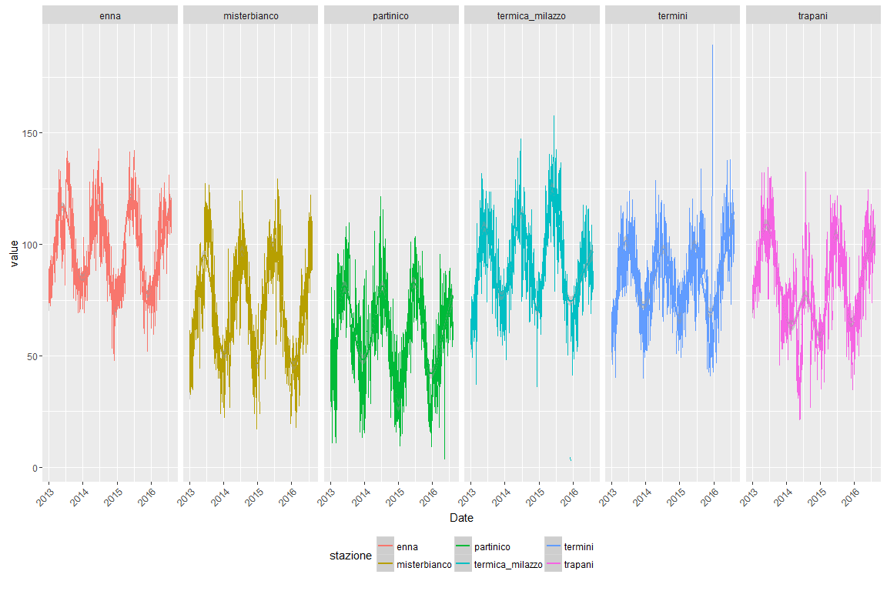
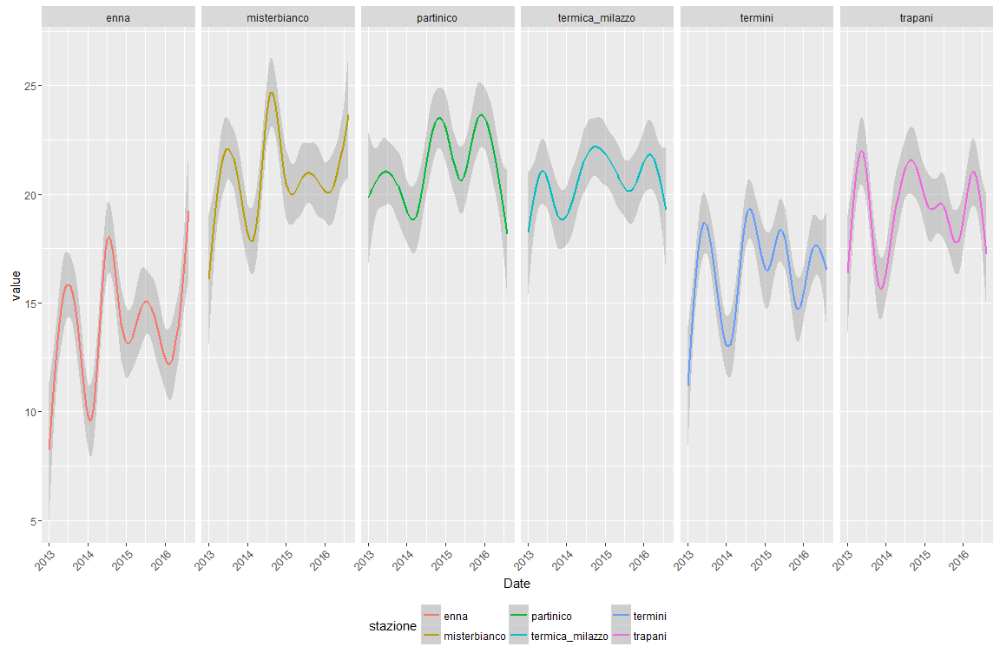

# Maria_report
Patrick Hausmann  


# Todo

# Load some libraries


```r
library('readr')
library('stringr')
library('tidyr')
library('ggplot2')
library('dplyr')
library('highcharter')
library('vegalite')
library('lubridate')
library('leaflet')
library('dygraphs')
library('xts')
library('rbokeh')
```


```r
ma_theme <- function(base_size=12, base_family="helvetica") {
                      theme(axis.text.x = element_text(angle = 45, vjust = 1, hjust=1),
                      legend.position = 'bottom')
}

split_names <- function(m) {

   stazione <- zz$stazione[which(str_detect(m, zz$stazione))]
   inq      <- zz$inq[which(str_detect(m, zz$inq))]
   tdm      <- zz$tdm[which(str_detect(m, zz$tdm))]
   out <- paste(stazione, inq, tdm, sep = "__")
   out
}

# tdm -> tipo di misura

zz <- read.table(header = TRUE, sep = ";", text = "
stazione;inq;tdm
partinico;SO2;Maxorario
sasol;CO;Media24h
enna;NO2;Maxmedia8h
ex_autoparco;O3;NA
trapani;Benzene;NA
termini;PM 10;NA
cda_gabbia;PM 2e5;NA
termica_milazzo;NA;NA
boccetta;NA;NA
Marcellino;NA;NA
misterbianco;NA;NA
megara;NA;NA
lab_mobile1;NA;NA
PORTO EMPEDOCLE;NA;NA
VILLA AUGUSTA;NA;NA
parcheggio_agip;NA;NA
CAPACI;NA;NA
ISOLA DELLE FEMMINE;NA;NA
")

zz %>% knitr::kable()
```


|stazione            |inq     |tdm        |
|:-------------------|:-------|:----------|
|partinico           |SO2     |Maxorario  |
|sasol               |CO      |Media24h   |
|enna                |NO2     |Maxmedia8h |
|ex_autoparco        |O3      |NA         |
|trapani             |Benzene |NA         |
|termini             |PM 10   |NA         |
|cda_gabbia          |PM 2e5  |NA         |
|termica_milazzo     |NA      |NA         |
|boccetta            |NA      |NA         |
|Marcellino          |NA      |NA         |
|misterbianco        |NA      |NA         |
|megara              |NA      |NA         |
|lab_mobile1         |NA      |NA         |
|PORTO EMPEDOCLE     |NA      |NA         |
|VILLA AUGUSTA       |NA      |NA         |
|parcheggio_agip     |NA      |NA         |
|CAPACI              |NA      |NA         |
|ISOLA DELLE FEMMINE |NA      |NA         |

# Import the data


```r
# http://www.arpa.sicilia.it/storage/MAria_report.xls
x <- read_csv("http://blog.spaziogis.it/static/ods/data/mariareport/MAria_report_02.csv")
```

```
## Parsed with column specification:
## cols(
##   .default = col_double(),
##   data = col_date(format = ""),
##   CAPACI_SO2_Maxorario = col_character(),
##   CAPACI_SO2_Media24h = col_character(),
##   CAPACI_CO_Maxorario = col_character(),
##   CAPACI_CO_Maxmedia8h = col_character(),
##   `CAPACI_PM 10_Media24h` = col_character(),
##   `CAPACI_PM 2e5_Media24h` = col_character(),
##   `ISOLA DELLE FEMMINE_SO2_Maxorario` = col_character(),
##   `ISOLA DELLE FEMMINE SO2_Media24h` = col_character(),
##   `ISOLA DELLE FEMMINE CO_Maxorario` = col_character(),
##   `ISOLA DELLE FEMMINE CO_Maxmedia8h` = col_character(),
##   `ISOLA DELLE FEMMINE NO2_Maxorario` = col_character(),
##   `ISOLA DELLE FEMMINE PM 10_Media24h` = col_character(),
##   `ISOLA DELLE FEMMINE PM 2e5_Media24h` = col_character()
## )
```

```
## See spec(...) for full column specifications.
```

```r
colnames(x) <- c("date", unlist(lapply(colnames(x), split_names)))

xm <- gather(x, variable, value, -date)

u <- data.frame(do.call("rbind", strsplit(xm$variable, "__")), stringsAsFactors = FALSE)
colnames(u) <- c("stazione", "inq", "tdm")
fin <- data.frame(u, date = xm$date, value = as.numeric(xm$value))
fin$inq <- gsub("PM 2e5", "PM 2.5", fin$inq)

knitr::kable(head(fin))
```


|stazione  |inq |tdm       |date       |    value|
|:---------|:---|:---------|:----------|--------:|
|partinico |SO2 |Maxorario |2013-01-01 | 2.227614|
|partinico |SO2 |Maxorario |2013-01-02 | 1.331977|
|partinico |SO2 |Maxorario |2013-01-03 | 4.150291|
|partinico |SO2 |Maxorario |2013-01-04 | 7.960566|
|partinico |SO2 |Maxorario |2013-01-05 | 3.602461|
|partinico |SO2 |Maxorario |2013-01-06 | 1.674221|

```r
knitr::kable(tail(fin))
```


|       |stazione            |inq    |tdm      |date       | value|
|:------|:-------------------|:------|:--------|:----------|-----:|
|123887 |ISOLA DELLE FEMMINE |PM 2.5 |Media24h |2016-08-05 |  13.4|
|123888 |ISOLA DELLE FEMMINE |PM 2.5 |Media24h |2016-08-06 |   9.1|
|123889 |ISOLA DELLE FEMMINE |PM 2.5 |Media24h |2016-08-07 |   7.7|
|123890 |ISOLA DELLE FEMMINE |PM 2.5 |Media24h |2016-08-08 |   9.0|
|123891 |ISOLA DELLE FEMMINE |PM 2.5 |Media24h |2016-08-09 |   9.4|
|123892 |ISOLA DELLE FEMMINE |PM 2.5 |Media24h |2016-08-10 |    NA|

```r
# most recent day
max(as.Date(fin[!is.na(fin$value), "date"]))
```

```
## [1] "2016-08-09"
```


```r
addmargins(table(fin$inq, fin$tdm, useNA = "always")) %>% knitr::kable()
```


|        | Maxmedia8h| Maxorario| Media24h| NA|    Sum|
|:-------|----------:|---------:|--------:|--:|------:|
|Benzene |          0|     18452|        0|  0|  18452|
|CO      |      11862|     11862|        0|  0|  23724|
|NO2     |          0|     14498|        0|  0|  14498|
|O3      |      11862|     11862|        0|  0|  23724|
|PM 10   |          0|         0|    13180|  0|  13180|
|PM 2.5  |          0|         0|     3954|  0|   3954|
|SO2     |          0|     13180|    13180|  0|  26360|
|NA      |          0|         0|        0|  0|      0|
|Sum     |      23724|     69854|    30314|  0| 123892|

Read the data

 - [Cloudant-DB](https://opps.cloudant.com/maria/)

 - [https://opps.cloudant.com/maria/_design/stats/_view/q1?limit=50&reduce=false](https://opps.cloudant.com/maria/_design/stats/_view/q1?limit=50&reduce=false)
 
 - [Q2](https://opps.cloudant.com/maria/_design/stats/_view/q2?descending=false&limit=10&include_docs=true)
 
# Overview


```r
addmargins(table(fin$stazione, !is.na(fin$value), useNA= "always")) %>% knitr::kable()
```


|                    | FALSE|  TRUE| NA|    Sum|
|:-------------------|-----:|-----:|--:|------:|
|boccetta            |  7176|   732|  0|   7908|
|CAPACI              | 12486|   694|  0|  13180|
|cda_gabbia          |   629|  4643|  0|   5272|
|enna                |  1214| 10648|  0|  11862|
|ex_autoparco        |   323|   995|  0|   1318|
|ISOLA DELLE FEMMINE |  8784|   442|  0|   9226|
|Marcellino          |   520|   798|  0|   1318|
|megara              |   257|  1061|  0|   1318|
|misterbianco        |   762| 11100|  0|  11862|
|parcheggio_agip     |   306|  1012|  0|   1318|
|partinico           |   540| 11322|  0|  11862|
|PORTO EMPEDOCLE     | 12239|   941|  0|  13180|
|termica_milazzo     |  1313|  7913|  0|   9226|
|termini             |   913| 10949|  0|  11862|
|trapani             |  1221| 10641|  0|  11862|
|VILLA AUGUSTA       |  1015|   303|  0|   1318|
|NA                  |     0|     0|  0|      0|
|Sum                 | 49698| 74194|  0| 123892|


```r
addmargins(with(fin[!is.na(fin$value), ], table(stazione, inq, useNA= "always"))) %>% knitr::kable()
```


|                    | Benzene|    CO|  NO2|    O3| PM 10| PM 2.5|   SO2| NA|   Sum|
|:-------------------|-------:|-----:|----:|-----:|-----:|------:|-----:|--:|-----:|
|boccetta            |       0|     0|  138|   278|    40|      0|   276|  0|   732|
|CAPACI              |      60|   137|  146|    99|    60|     62|   130|  0|   694|
|cda_gabbia          |    1093|     0| 1188|     0|     0|      0|  2362|  0|  4643|
|enna                |     971|  2541| 1265|  2484|  1225|      0|  2162|  0| 10648|
|ex_autoparco        |     995|     0|    0|     0|     0|      0|     0|  0|   995|
|ISOLA DELLE FEMMINE |       0|   134|   70|     0|    59|     51|   128|  0|   442|
|Marcellino          |     798|     0|    0|     0|     0|      0|     0|  0|   798|
|megara              |    1061|     0|    0|     0|     0|      0|     0|  0|  1061|
|misterbianco        |    1118|  2563| 1176|  2495|  1276|      0|  2472|  0| 11100|
|parcheggio_agip     |    1012|     0|    0|     0|     0|      0|     0|  0|  1012|
|partinico           |    1115|  2594| 1304|  2493|  1260|      0|  2556|  0| 11322|
|PORTO EMPEDOCLE     |      86|   127|  112|   222|    87|     83|   224|  0|   941|
|termica_milazzo     |    1128|  1836| 1292|  2417|  1240|      0|     0|  0|  7913|
|termini             |    1050|  2541| 1283|  2538|  1211|      0|  2326|  0| 10949|
|trapani             |    1143|  2341| 1229|  2414|  1154|      0|  2360|  0| 10641|
|VILLA AUGUSTA       |     303|     0|    0|     0|     0|      0|     0|  0|   303|
|NA                  |       0|     0|    0|     0|     0|      0|     0|  0|     0|
|Sum                 |   11933| 14814| 9203| 15440|  7612|    196| 14996|  0| 74194|

# Export csv file (gzipped)


```r
con_out <- gzfile("maria_report_04_long.csv.gz", open = "wb")
   write.csv(fin, file = con_out, row.names = FALSE)
close(con_out)
```

# PM10


```r
fin_pm10 <- subset(fin, subset = stazione %in% c("enna", "trapani", "partinico", 
                                                 "misterbianco", "termini", 
                                                 "termica_milazzo") & 
                        inq == "PM 10" & tdm == "Media24h")
p1 <- ggplot(fin_pm10, aes(x=as.Date(date), y=value, col= stazione)) + geom_line()
p1 <- p1 + geom_smooth()
p1 <- p1 + facet_wrap( ~ stazione, nrow = 1)
p1 <- p1 + geom_hline(yintercept = 50, col = "blue")
p1 <- p1 + labs(x = "Date", y = "value")
p1 <- p1 + ma_theme()
p1
```

```
## Warning: Removed 542 rows containing non-finite values (stat_smooth).
```

```
## Warning: Removed 15 rows containing missing values (geom_path).
```

<!-- -->

# O3


```r
fin_o3 <- subset(fin, subset = stazione %in% c("enna", "trapani", "partinico", 
                                               "misterbianco", "termini", 
                                               "termica_milazzo") & 
                        inq == "O3" & tdm == "Maxmedia8h")
p1 <- ggplot(fin_o3, aes(x=as.Date(date), y=value, col= stazione)) + geom_line()
p1 <- p1 + geom_smooth()
p1 <- p1 + facet_wrap( ~ stazione, nrow = 1)
p1 <- p1 + labs(x = "Date", y = "value")
p1 <- p1 + ma_theme()
p1
```

```
## Warning: Removed 490 rows containing non-finite values (stat_smooth).
```

```
## Warning: Removed 15 rows containing missing values (geom_path).
```

<!-- -->

# Number of missing observations by stazione, year and month (PM10)


```r
missing_by_yr_month <- function(x) {
  z <- tbl_df(x) %>%
       dplyr::filter(is.na(value)) %>%
       mutate(yr = year(ymd(date)), month = month(ymd(date))) %>%
       select(stazione, yr, month) %>% 
       ungroup()
  with(z, table(yr, month, stazione))
}

(kx1 <- missing_by_yr_month(fin_pm10))
```

```
## , , stazione = enna
## 
##       month
## yr      1  2  3  4  5  6  7  8  9 10 11 12
##   2013  2  0  0  0  0  0  0  0  0  0  0  1
##   2014  0  0  3  0  0  0  1  2  3  6  0  4
##   2015  1  2  4 23  0  2  2  0  1  3  2  5
##   2016  6  4  0  4  4  7  0  1  0  0  0  0
## 
## , , stazione = misterbianco
## 
##       month
## yr      1  2  3  4  5  6  7  8  9 10 11 12
##   2013  0  1  0  1  0  0  0  0  0  0  1  1
##   2014  7  0  6  0  0  0  0  0  1  3  0  0
##   2015  0  0  1  1  0  0  3  2  0  2  1  5
##   2016  0  0  0  1  2  0  2  1  0  0  0  0
## 
## , , stazione = partinico
## 
##       month
## yr      1  2  3  4  5  6  7  8  9 10 11 12
##   2013  3  0  0  0  0  0  0  0  2  9  4  1
##   2014  8  1  0  0  1  0  1  0  1  0  0  0
##   2015  0  1  1  1  0  0  1  6  4  2  2  2
##   2016  2  0  1  0  2  0  0  2  0  0  0  0
## 
## , , stazione = termica_milazzo
## 
##       month
## yr      1  2  3  4  5  6  7  8  9 10 11 12
##   2013  0  1  0  0  0  0  0  3  0  0  0  1
##   2014  0  0  0  0  0  0  0  0  0  0  0  0
##   2015  0  0  0  0  0  2  0 10  0  0 17 11
##   2016  7  6  5  0  1  0  5  9  0  0  0  0
## 
## , , stazione = termini
## 
##       month
## yr      1  2  3  4  5  6  7  8  9 10 11 12
##   2013  0  2  0  0  0  0  0  0  0  0  1  4
##   2014  0  0  7  0  0  0  0  0  0  5 11 31
##   2015 21  0  1  0  0  1  1  2  2  0  4  1
##   2016  0  1  0  6  2  0  2  2  0  0  0  0
## 
## , , stazione = trapani
## 
##       month
## yr      1  2  3  4  5  6  7  8  9 10 11 12
##   2013  0  0  8 14  0  0  7 12  0  0  1  0
##   2014  0  0  3 30  5  1 13 16  7  3  0  0
##   2015 10  4  1  4  4  1  3  0  1  3  1  2
##   2016  0  0  1  3  4  0  0  2  0  0  0  0
```

```r
# year 2016
addmargins(t(kx1["2016",1:12,]), 1)
```

```
##                  month
## stazione           1  2  3  4  5  6  7  8  9 10 11 12
##   enna             6  4  0  4  4  7  0  1  0  0  0  0
##   misterbianco     0  0  0  1  2  0  2  1  0  0  0  0
##   partinico        2  0  1  0  2  0  0  2  0  0  0  0
##   termica_milazzo  7  6  5  0  1  0  5  9  0  0  0  0
##   termini          0  1  0  6  2  0  2  2  0  0  0  0
##   trapani          0  0  1  3  4  0  0  2  0  0  0  0
##   Sum             15 11  7 14 15  7  9 17  0  0  0  0
```


```r
# Trim observations from each end before the computation
trim_obs <- function(x, trim) {
  m <- c(quantile(x, probs = trim, na.rm = TRUE), 
         quantile(x, probs = 1 - trim, na.rm = TRUE))
  print(m)
  out <- (x >= m[1] & x <= m[2])
  return(out)
}

fin_pm10_trim <- tbl_df(fin_pm10) %>%
                 group_by(stazione) %>%
                 mutate(ixd = trim_obs(value, 0.5/100)) %>%
                 ungroup() 
```

```
##     0.5%    99.5% 
##  0.15648 84.65535 
##    0.5%   99.5% 
##  5.0825 90.7675 
##     0.5%    99.5% 
##  5.48850 99.98974 
##     0.5%    99.5% 
##  7.49696 84.98849 
##    0.5%   99.5% 
##  1.2196 74.0582 
##     0.5%    99.5% 
##  6.07956 89.34437
```

```r
table(fin_pm10_trim$stazione, fin_pm10_trim$ixd)
```

```
##                  
##                   FALSE TRUE
##   enna               14 1211
##   misterbianco       14 1262
##   partinico          14 1246
##   termica_milazzo    14 1226
##   termini            14 1197
##   trapani            12 1142
```

```r
fin_pm10_trim <- dplyr::filter(fin_pm10_trim, ixd == TRUE)

p2 <- ggplot(fin_pm10_trim, aes(x=as.Date(date), y=value, col = stazione))
p2 <- p2 + geom_smooth()
p2 <- p2 + facet_wrap( ~ stazione, nrow = 1)
p2 <- p2 + labs(x = "Date", y = "value")
p2 <- p2 + ma_theme()
p2
```

<!-- -->


```r
fin_pm10_trim$date <- as.character(year(as.Date(fin_pm10_trim$date)))

p3 <- ggplot(fin_pm10_trim, aes(x = date, y = value, group = stazione, col = stazione))
p3 <- p3 + geom_boxplot(group = 2) + geom_jitter(width = 0.2, alpha = 0.35)
p3 <- p3 + facet_wrap( ~ stazione, nrow = 1)
p3 <- p3 + labs(x = "Date", y = "value")
p3 <- p3 + ma_theme()
p3
```

<!-- -->

# Highcharter


```r
fin_hc <- tbl_df(fin) %>% 
          dplyr::filter(stazione %in% c("enna", "trapani", "termica_milazzo", 
                                        "partinico", "termini"), 
                        inq == "PM 10", tdm == "Media24h") %>%
          mutate(year_month = format(as.Date(date), "%Y-%m")) %>%
          group_by(stazione, year_month) %>%
          summarise(mean_val = round(mean(value, na.rm = TRUE), 2)) %>%
          ungroup()

fin_hc <- data.frame(fin_hc)

hc1 <- highchart() %>% 
        hc_xAxis(categories = fin_hc$year_month) %>% 
        hc_add_series(name = "Enna", data = fin_hc[fin_hc$stazione=="enna", "mean_val"]) %>%
        hc_add_series(name = "Partinico", data = fin_hc[fin_hc$stazione=="partinico", "mean_val"]) %>%
        hc_add_series(name = "Termica Milazzo", data = fin_hc[fin_hc$stazione=="termica_milazzo", "mean_val"]) %>%
        hc_add_series(name = "Termini", data = fin_hc[fin_hc$stazione=="termini", "mean_val"]) %>%
        hc_add_series(name = "Trapani", data = fin_hc[fin_hc$stazione=="trapani", "mean_val"])

hc1
```

<!--html_preserve--><div id="htmlwidget-957ee2a0143ee425d295" style="width:100%;height:500px;" class="highchart html-widget"></div>
<script type="application/json" data-for="htmlwidget-957ee2a0143ee425d295">{"x":{"hc_opts":{"title":{"text":null},"yAxis":{"title":{"text":null}},"credits":{"enabled":false},"exporting":{"enabled":false},"plotOptions":{"series":{"turboThreshold":0}},"xAxis":{"categories":["2013-01","2013-02","2013-03","2013-04","2013-05","2013-06","2013-07","2013-08","2013-09","2013-10","2013-11","2013-12","2014-01","2014-02","2014-03","2014-04","2014-05","2014-06","2014-07","2014-08","2014-09","2014-10","2014-11","2014-12","2015-01","2015-02","2015-03","2015-04","2015-05","2015-06","2015-07","2015-08","2015-09","2015-10","2015-11","2015-12","2016-01","2016-02","2016-03","2016-04","2016-05","2016-06","2016-07","2016-08","2013-01","2013-02","2013-03","2013-04","2013-05","2013-06","2013-07","2013-08","2013-09","2013-10","2013-11","2013-12","2014-01","2014-02","2014-03","2014-04","2014-05","2014-06","2014-07","2014-08","2014-09","2014-10","2014-11","2014-12","2015-01","2015-02","2015-03","2015-04","2015-05","2015-06","2015-07","2015-08","2015-09","2015-10","2015-11","2015-12","2016-01","2016-02","2016-03","2016-04","2016-05","2016-06","2016-07","2016-08","2013-01","2013-02","2013-03","2013-04","2013-05","2013-06","2013-07","2013-08","2013-09","2013-10","2013-11","2013-12","2014-01","2014-02","2014-03","2014-04","2014-05","2014-06","2014-07","2014-08","2014-09","2014-10","2014-11","2014-12","2015-01","2015-02","2015-03","2015-04","2015-05","2015-06","2015-07","2015-08","2015-09","2015-10","2015-11","2015-12","2016-01","2016-02","2016-03","2016-04","2016-05","2016-06","2016-07","2016-08","2013-01","2013-02","2013-03","2013-04","2013-05","2013-06","2013-07","2013-08","2013-09","2013-10","2013-11","2013-12","2014-01","2014-02","2014-03","2014-04","2014-05","2014-06","2014-07","2014-08","2014-09","2014-10","2014-11","2014-12","2015-01","2015-02","2015-03","2015-04","2015-05","2015-06","2015-07","2015-08","2015-09","2015-10","2015-11","2015-12","2016-01","2016-02","2016-03","2016-04","2016-05","2016-06","2016-07","2016-08","2013-01","2013-02","2013-03","2013-04","2013-05","2013-06","2013-07","2013-08","2013-09","2013-10","2013-11","2013-12","2014-01","2014-02","2014-03","2014-04","2014-05","2014-06","2014-07","2014-08","2014-09","2014-10","2014-11","2014-12","2015-01","2015-02","2015-03","2015-04","2015-05","2015-06","2015-07","2015-08","2015-09","2015-10","2015-11","2015-12","2016-01","2016-02","2016-03","2016-04","2016-05","2016-06","2016-07","2016-08"]},"series":[{"name":"Enna","data":[9.51,12.58,10.82,11.7,19.82,13.88,14.85,18.06,12.48,13.89,9.73,8.99,11.32,11.03,12.85,10.38,13.72,16.32,16.8,17.62,21.32,20.55,17.27,15.52,8.03,15.01,12.76,13.67,15.48,13.9,18.27,17.27,19.33,10.28,10.89,11.37,9.11,13.96,18.45,20.4,19.71,16.32,17.94,13.72]},{"name":"Partinico","data":[19.23,19.41,20.16,21.45,24.98,19.84,18.77,20.25,18.36,23.14,15.54,22.76,46.29,19.87,18.39,15.78,18.53,18.36,19.73,19.98,27.29,28.56,31.33,21.2,23.38,18.95,21.67,21.74,21.08,18.64,19.07,32.68,25.47,21.06,21.29,28.47,21.4,25.19,25.24,24.38,24.7,20.83,18.57,15.47]},{"name":"Termica Milazzo","data":[18.02,18.59,20.95,20.08,28.77,18.43,18.99,21.38,18.81,21.17,14.88,16.27,21.94,22.04,20.14,18.52,18.98,22.57,19.9,21.76,26.81,25.24,28.71,19.36,16.88,17.95,23.94,24.35,22.5,18.32,21.37,20.64,23.87,16.73,16.77,19.7,19.3,27.2,26.02,25.2,24.27,19.34,18.28,17.4]},{"name":"Termini","data":[13.23,13.25,14.57,16.05,23.34,17.15,17.11,18.55,16.02,18.12,10.26,12.38,17.68,18.2,14.02,13.24,16.96,17.74,18.22,17.94,24.2,17.7,29.43,null,9.18,14.24,18.12,19.81,17.51,16.62,17.79,16.78,19.4,14.69,13.55,14.38,13.39,20.07,24.48,20.46,21.17,16.84,16.68,14.29]},{"name":"Trapani","data":[17.55,15.35,24.63,20.04,25.46,20.94,17.98,18,16.56,17.56,13.11,15.27,22.41,17.02,18.81,null,20.1,18.73,20.38,18.63,24.35,21.33,29.48,21.95,18.62,16.95,21.02,22.27,19.36,18.57,19.89,17.22,18.69,17.53,17.5,18.14,19.54,24.39,21.31,22.16,24.39,17.9,18.9,16.65]}]},"theme":{"chart":{"backgroundColor":"transparent"}},"conf_opts":{"global":{"Date":null,"VMLRadialGradientURL":"http =//code.highcharts.com/list(version)/gfx/vml-radial-gradient.png","canvasToolsURL":"http =//code.highcharts.com/list(version)/modules/canvas-tools.js","getTimezoneOffset":null,"timezoneOffset":0,"useUTC":true},"lang":{"contextButtonTitle":"Chart context menu","decimalPoint":".","downloadJPEG":"Download JPEG image","downloadPDF":"Download PDF document","downloadPNG":"Download PNG image","downloadSVG":"Download SVG vector image","drillUpText":"Back to {series.name}","invalidDate":null,"loading":"Loading...","months":["January","February","March","April","May","June","July","August","September","October","November","December"],"noData":"No data to display","numericSymbols":["k","M","G","T","P","E"],"printChart":"Print chart","resetZoom":"Reset zoom","resetZoomTitle":"Reset zoom level 1:1","shortMonths":["Jan","Feb","Mar","Apr","May","Jun","Jul","Aug","Sep","Oct","Nov","Dec"],"thousandsSep":" ","weekdays":["Sunday","Monday","Tuesday","Wednesday","Thursday","Friday","Saturday"]}},"type":"chart","fonts":[],"debug":false},"evals":[],"jsHooks":[]}</script><!--/html_preserve-->

# Vegalite


```r
vegalite(export=TRUE) %>%
  cell_size(400, 400) %>% 
  add_data(fin_hc) %>%
  encode_x("year_month", "temporal") %>%
  encode_y("mean_val", "quantitative") %>%
  encode_color("stazione", "nominal") %>% 
  axis_x(axisWidth=0, format="%Y", labelAngle=0) %>%
  mark_line() -> vl

vl
```

<!--html_preserve--><div id="htmlwidget-69eff1be56a530404979" style="width:672px;height:480px;" class="vegalite html-widget"></div>
<script type="application/json" data-for="htmlwidget-69eff1be56a530404979">{"x":{"description":"","data":{"values":{"stazione":["enna","enna","enna","enna","enna","enna","enna","enna","enna","enna","enna","enna","enna","enna","enna","enna","enna","enna","enna","enna","enna","enna","enna","enna","enna","enna","enna","enna","enna","enna","enna","enna","enna","enna","enna","enna","enna","enna","enna","enna","enna","enna","enna","enna","partinico","partinico","partinico","partinico","partinico","partinico","partinico","partinico","partinico","partinico","partinico","partinico","partinico","partinico","partinico","partinico","partinico","partinico","partinico","partinico","partinico","partinico","partinico","partinico","partinico","partinico","partinico","partinico","partinico","partinico","partinico","partinico","partinico","partinico","partinico","partinico","partinico","partinico","partinico","partinico","partinico","partinico","partinico","partinico","termica_milazzo","termica_milazzo","termica_milazzo","termica_milazzo","termica_milazzo","termica_milazzo","termica_milazzo","termica_milazzo","termica_milazzo","termica_milazzo","termica_milazzo","termica_milazzo","termica_milazzo","termica_milazzo","termica_milazzo","termica_milazzo","termica_milazzo","termica_milazzo","termica_milazzo","termica_milazzo","termica_milazzo","termica_milazzo","termica_milazzo","termica_milazzo","termica_milazzo","termica_milazzo","termica_milazzo","termica_milazzo","termica_milazzo","termica_milazzo","termica_milazzo","termica_milazzo","termica_milazzo","termica_milazzo","termica_milazzo","termica_milazzo","termica_milazzo","termica_milazzo","termica_milazzo","termica_milazzo","termica_milazzo","termica_milazzo","termica_milazzo","termica_milazzo","termini","termini","termini","termini","termini","termini","termini","termini","termini","termini","termini","termini","termini","termini","termini","termini","termini","termini","termini","termini","termini","termini","termini","termini","termini","termini","termini","termini","termini","termini","termini","termini","termini","termini","termini","termini","termini","termini","termini","termini","termini","termini","termini","termini","trapani","trapani","trapani","trapani","trapani","trapani","trapani","trapani","trapani","trapani","trapani","trapani","trapani","trapani","trapani","trapani","trapani","trapani","trapani","trapani","trapani","trapani","trapani","trapani","trapani","trapani","trapani","trapani","trapani","trapani","trapani","trapani","trapani","trapani","trapani","trapani","trapani","trapani","trapani","trapani","trapani","trapani","trapani","trapani"],"year_month":["2013-01","2013-02","2013-03","2013-04","2013-05","2013-06","2013-07","2013-08","2013-09","2013-10","2013-11","2013-12","2014-01","2014-02","2014-03","2014-04","2014-05","2014-06","2014-07","2014-08","2014-09","2014-10","2014-11","2014-12","2015-01","2015-02","2015-03","2015-04","2015-05","2015-06","2015-07","2015-08","2015-09","2015-10","2015-11","2015-12","2016-01","2016-02","2016-03","2016-04","2016-05","2016-06","2016-07","2016-08","2013-01","2013-02","2013-03","2013-04","2013-05","2013-06","2013-07","2013-08","2013-09","2013-10","2013-11","2013-12","2014-01","2014-02","2014-03","2014-04","2014-05","2014-06","2014-07","2014-08","2014-09","2014-10","2014-11","2014-12","2015-01","2015-02","2015-03","2015-04","2015-05","2015-06","2015-07","2015-08","2015-09","2015-10","2015-11","2015-12","2016-01","2016-02","2016-03","2016-04","2016-05","2016-06","2016-07","2016-08","2013-01","2013-02","2013-03","2013-04","2013-05","2013-06","2013-07","2013-08","2013-09","2013-10","2013-11","2013-12","2014-01","2014-02","2014-03","2014-04","2014-05","2014-06","2014-07","2014-08","2014-09","2014-10","2014-11","2014-12","2015-01","2015-02","2015-03","2015-04","2015-05","2015-06","2015-07","2015-08","2015-09","2015-10","2015-11","2015-12","2016-01","2016-02","2016-03","2016-04","2016-05","2016-06","2016-07","2016-08","2013-01","2013-02","2013-03","2013-04","2013-05","2013-06","2013-07","2013-08","2013-09","2013-10","2013-11","2013-12","2014-01","2014-02","2014-03","2014-04","2014-05","2014-06","2014-07","2014-08","2014-09","2014-10","2014-11","2014-12","2015-01","2015-02","2015-03","2015-04","2015-05","2015-06","2015-07","2015-08","2015-09","2015-10","2015-11","2015-12","2016-01","2016-02","2016-03","2016-04","2016-05","2016-06","2016-07","2016-08","2013-01","2013-02","2013-03","2013-04","2013-05","2013-06","2013-07","2013-08","2013-09","2013-10","2013-11","2013-12","2014-01","2014-02","2014-03","2014-04","2014-05","2014-06","2014-07","2014-08","2014-09","2014-10","2014-11","2014-12","2015-01","2015-02","2015-03","2015-04","2015-05","2015-06","2015-07","2015-08","2015-09","2015-10","2015-11","2015-12","2016-01","2016-02","2016-03","2016-04","2016-05","2016-06","2016-07","2016-08"],"mean_val":[9.51,12.58,10.82,11.7,19.82,13.88,14.85,18.06,12.48,13.89,9.73,8.99,11.32,11.03,12.85,10.38,13.72,16.32,16.8,17.62,21.32,20.55,17.27,15.52,8.03,15.01,12.76,13.67,15.48,13.9,18.27,17.27,19.33,10.28,10.89,11.37,9.11,13.96,18.45,20.4,19.71,16.32,17.94,13.72,19.23,19.41,20.16,21.45,24.98,19.84,18.77,20.25,18.36,23.14,15.54,22.76,46.29,19.87,18.39,15.78,18.53,18.36,19.73,19.98,27.29,28.56,31.33,21.2,23.38,18.95,21.67,21.74,21.08,18.64,19.07,32.68,25.47,21.06,21.29,28.47,21.4,25.19,25.24,24.38,24.7,20.83,18.57,15.47,18.02,18.59,20.95,20.08,28.77,18.43,18.99,21.38,18.81,21.17,14.88,16.27,21.94,22.04,20.14,18.52,18.98,22.57,19.9,21.76,26.81,25.24,28.71,19.36,16.88,17.95,23.94,24.35,22.5,18.32,21.37,20.64,23.87,16.73,16.77,19.7,19.3,27.2,26.02,25.2,24.27,19.34,18.28,17.4,13.23,13.25,14.57,16.05,23.34,17.15,17.11,18.55,16.02,18.12,10.26,12.38,17.68,18.2,14.02,13.24,16.96,17.74,18.22,17.94,24.2,17.7,29.43,null,9.18,14.24,18.12,19.81,17.51,16.62,17.79,16.78,19.4,14.69,13.55,14.38,13.39,20.07,24.48,20.46,21.17,16.84,16.68,14.29,17.55,15.35,24.63,20.04,25.46,20.94,17.98,18,16.56,17.56,13.11,15.27,22.41,17.02,18.81,null,20.1,18.73,20.38,18.63,24.35,21.33,29.48,21.95,18.62,16.95,21.02,22.27,19.36,18.57,19.89,17.22,18.69,17.53,17.5,18.14,19.54,24.39,21.31,22.16,24.39,17.9,18.9,16.65]}},"mark":"line","encoding":{"x":{"field":"year_month","type":"temporal","axis":{"axisWidth":0,"labels":true,"labelAngle":0,"labelMaxLength":25,"title":"","characterWidth":6,"format":"%Y"}},"y":{"field":"mean_val","type":"quantitative"},"color":{"field":"stazione","type":"nominal"}},"config":{"cell":{"width":400,"height":400}},"embed":{"renderer":"svg","actions":{"export":true,"source":false,"editor":false}}},"evals":[],"jsHooks":[]}</script><!--/html_preserve-->

# Dygraph


```r
xdy <- fin_pm10[fin_pm10$stazione == "enna", ]
dygraph(xts(xdy$value, order.by = as.POSIXct(xdy$date)), 
            main = "Enna // Inquinante: PM10")  %>% 
        dyRangeSelector()
```

<!--html_preserve--><div id="htmlwidget-3b09d873852a714c7405" style="width:960px;height:480px;" class="dygraphs html-widget"></div>
<script type="application/json" data-for="htmlwidget-3b09d873852a714c7405">{"x":{"attrs":{"title":"Enna // Inquinante: PM10","labels":["day","V1"],"legend":"auto","retainDateWindow":false,"axes":{"x":{"pixelsPerLabel":60}},"showRangeSelector":true,"rangeSelectorHeight":40,"rangeSelectorPlotFillColor":" #A7B1C4","rangeSelectorPlotStrokeColor":"#808FAB","interactionModel":"Dygraph.Interaction.defaultModel"},"scale":"daily","annotations":[],"shadings":[],"events":[],"format":"date","data":[["2013-01-01T00:00:00.000Z","2013-01-02T00:00:00.000Z","2013-01-03T00:00:00.000Z","2013-01-04T00:00:00.000Z","2013-01-05T00:00:00.000Z","2013-01-06T00:00:00.000Z","2013-01-07T00:00:00.000Z","2013-01-08T00:00:00.000Z","2013-01-09T00:00:00.000Z","2013-01-10T00:00:00.000Z","2013-01-11T00:00:00.000Z","2013-01-12T00:00:00.000Z","2013-01-13T00:00:00.000Z","2013-01-14T00:00:00.000Z","2013-01-15T00:00:00.000Z","2013-01-16T00:00:00.000Z","2013-01-17T00:00:00.000Z","2013-01-18T00:00:00.000Z","2013-01-19T00:00:00.000Z","2013-01-20T00:00:00.000Z","2013-01-21T00:00:00.000Z","2013-01-22T00:00:00.000Z","2013-01-23T00:00:00.000Z","2013-01-24T00:00:00.000Z","2013-01-25T00:00:00.000Z","2013-01-26T00:00:00.000Z","2013-01-27T00:00:00.000Z","2013-01-28T00:00:00.000Z","2013-01-29T00:00:00.000Z","2013-01-30T00:00:00.000Z","2013-01-31T00:00:00.000Z","2013-02-01T00:00:00.000Z","2013-02-02T00:00:00.000Z","2013-02-03T00:00:00.000Z","2013-02-04T00:00:00.000Z","2013-02-05T00:00:00.000Z","2013-02-06T00:00:00.000Z","2013-02-07T00:00:00.000Z","2013-02-08T00:00:00.000Z","2013-02-09T00:00:00.000Z","2013-02-10T00:00:00.000Z","2013-02-11T00:00:00.000Z","2013-02-12T00:00:00.000Z","2013-02-13T00:00:00.000Z","2013-02-14T00:00:00.000Z","2013-02-15T00:00:00.000Z","2013-02-16T00:00:00.000Z","2013-02-17T00:00:00.000Z","2013-02-18T00:00:00.000Z","2013-02-19T00:00:00.000Z","2013-02-20T00:00:00.000Z","2013-02-21T00:00:00.000Z","2013-02-22T00:00:00.000Z","2013-02-23T00:00:00.000Z","2013-02-24T00:00:00.000Z","2013-02-25T00:00:00.000Z","2013-02-26T00:00:00.000Z","2013-02-27T00:00:00.000Z","2013-02-28T00:00:00.000Z","2013-03-01T00:00:00.000Z","2013-03-02T00:00:00.000Z","2013-03-03T00:00:00.000Z","2013-03-04T00:00:00.000Z","2013-03-05T00:00:00.000Z","2013-03-06T00:00:00.000Z","2013-03-07T00:00:00.000Z","2013-03-08T00:00:00.000Z","2013-03-09T00:00:00.000Z","2013-03-10T00:00:00.000Z","2013-03-11T00:00:00.000Z","2013-03-12T00:00:00.000Z","2013-03-13T00:00:00.000Z","2013-03-14T00:00:00.000Z","2013-03-15T00:00:00.000Z","2013-03-16T00:00:00.000Z","2013-03-17T00:00:00.000Z","2013-03-18T00:00:00.000Z","2013-03-19T00:00:00.000Z","2013-03-20T00:00:00.000Z","2013-03-21T00:00:00.000Z","2013-03-22T00:00:00.000Z","2013-03-23T00:00:00.000Z","2013-03-24T00:00:00.000Z","2013-03-25T00:00:00.000Z","2013-03-26T00:00:00.000Z","2013-03-27T00:00:00.000Z","2013-03-28T00:00:00.000Z","2013-03-29T00:00:00.000Z","2013-03-30T00:00:00.000Z","2013-03-31T00:00:00.000Z","2013-04-01T00:00:00.000Z","2013-04-02T00:00:00.000Z","2013-04-03T00:00:00.000Z","2013-04-04T00:00:00.000Z","2013-04-05T00:00:00.000Z","2013-04-06T00:00:00.000Z","2013-04-07T00:00:00.000Z","2013-04-08T00:00:00.000Z","2013-04-09T00:00:00.000Z","2013-04-10T00:00:00.000Z","2013-04-11T00:00:00.000Z","2013-04-12T00:00:00.000Z","2013-04-13T00:00:00.000Z","2013-04-14T00:00:00.000Z","2013-04-15T00:00:00.000Z","2013-04-16T00:00:00.000Z","2013-04-17T00:00:00.000Z","2013-04-18T00:00:00.000Z","2013-04-19T00:00:00.000Z","2013-04-20T00:00:00.000Z","2013-04-21T00:00:00.000Z","2013-04-22T00:00:00.000Z","2013-04-23T00:00:00.000Z","2013-04-24T00:00:00.000Z","2013-04-25T00:00:00.000Z","2013-04-26T00:00:00.000Z","2013-04-27T00:00:00.000Z","2013-04-28T00:00:00.000Z","2013-04-29T00:00:00.000Z","2013-04-30T00:00:00.000Z","2013-05-01T00:00:00.000Z","2013-05-02T00:00:00.000Z","2013-05-03T00:00:00.000Z","2013-05-04T00:00:00.000Z","2013-05-05T00:00:00.000Z","2013-05-06T00:00:00.000Z","2013-05-07T00:00:00.000Z","2013-05-08T00:00:00.000Z","2013-05-09T00:00:00.000Z","2013-05-10T00:00:00.000Z","2013-05-11T00:00:00.000Z","2013-05-12T00:00:00.000Z","2013-05-13T00:00:00.000Z","2013-05-14T00:00:00.000Z","2013-05-15T00:00:00.000Z","2013-05-16T00:00:00.000Z","2013-05-17T00:00:00.000Z","2013-05-18T00:00:00.000Z","2013-05-19T00:00:00.000Z","2013-05-20T00:00:00.000Z","2013-05-21T00:00:00.000Z","2013-05-22T00:00:00.000Z","2013-05-23T00:00:00.000Z","2013-05-24T00:00:00.000Z","2013-05-25T00:00:00.000Z","2013-05-26T00:00:00.000Z","2013-05-27T00:00:00.000Z","2013-05-28T00:00:00.000Z","2013-05-29T00:00:00.000Z","2013-05-30T00:00:00.000Z","2013-05-31T00:00:00.000Z","2013-06-01T00:00:00.000Z","2013-06-02T00:00:00.000Z","2013-06-03T00:00:00.000Z","2013-06-04T00:00:00.000Z","2013-06-05T00:00:00.000Z","2013-06-06T00:00:00.000Z","2013-06-07T00:00:00.000Z","2013-06-08T00:00:00.000Z","2013-06-09T00:00:00.000Z","2013-06-10T00:00:00.000Z","2013-06-11T00:00:00.000Z","2013-06-12T00:00:00.000Z","2013-06-13T00:00:00.000Z","2013-06-14T00:00:00.000Z","2013-06-15T00:00:00.000Z","2013-06-16T00:00:00.000Z","2013-06-17T00:00:00.000Z","2013-06-18T00:00:00.000Z","2013-06-19T00:00:00.000Z","2013-06-20T00:00:00.000Z","2013-06-21T00:00:00.000Z","2013-06-22T00:00:00.000Z","2013-06-23T00:00:00.000Z","2013-06-24T00:00:00.000Z","2013-06-25T00:00:00.000Z","2013-06-26T00:00:00.000Z","2013-06-27T00:00:00.000Z","2013-06-28T00:00:00.000Z","2013-06-29T00:00:00.000Z","2013-06-30T00:00:00.000Z","2013-07-01T00:00:00.000Z","2013-07-02T00:00:00.000Z","2013-07-03T00:00:00.000Z","2013-07-04T00:00:00.000Z","2013-07-05T00:00:00.000Z","2013-07-06T00:00:00.000Z","2013-07-07T00:00:00.000Z","2013-07-08T00:00:00.000Z","2013-07-09T00:00:00.000Z","2013-07-10T00:00:00.000Z","2013-07-11T00:00:00.000Z","2013-07-12T00:00:00.000Z","2013-07-13T00:00:00.000Z","2013-07-14T00:00:00.000Z","2013-07-15T00:00:00.000Z","2013-07-16T00:00:00.000Z","2013-07-17T00:00:00.000Z","2013-07-18T00:00:00.000Z","2013-07-19T00:00:00.000Z","2013-07-20T00:00:00.000Z","2013-07-21T00:00:00.000Z","2013-07-22T00:00:00.000Z","2013-07-23T00:00:00.000Z","2013-07-24T00:00:00.000Z","2013-07-25T00:00:00.000Z","2013-07-26T00:00:00.000Z","2013-07-27T00:00:00.000Z","2013-07-28T00:00:00.000Z","2013-07-29T00:00:00.000Z","2013-07-30T00:00:00.000Z","2013-07-31T00:00:00.000Z","2013-08-01T00:00:00.000Z","2013-08-02T00:00:00.000Z","2013-08-03T00:00:00.000Z","2013-08-04T00:00:00.000Z","2013-08-05T00:00:00.000Z","2013-08-06T00:00:00.000Z","2013-08-07T00:00:00.000Z","2013-08-08T00:00:00.000Z","2013-08-09T00:00:00.000Z","2013-08-10T00:00:00.000Z","2013-08-11T00:00:00.000Z","2013-08-12T00:00:00.000Z","2013-08-13T00:00:00.000Z","2013-08-14T00:00:00.000Z","2013-08-15T00:00:00.000Z","2013-08-16T00:00:00.000Z","2013-08-17T00:00:00.000Z","2013-08-18T00:00:00.000Z","2013-08-19T00:00:00.000Z","2013-08-20T00:00:00.000Z","2013-08-21T00:00:00.000Z","2013-08-22T00:00:00.000Z","2013-08-23T00:00:00.000Z","2013-08-24T00:00:00.000Z","2013-08-25T00:00:00.000Z","2013-08-26T00:00:00.000Z","2013-08-27T00:00:00.000Z","2013-08-28T00:00:00.000Z","2013-08-29T00:00:00.000Z","2013-08-30T00:00:00.000Z","2013-08-31T00:00:00.000Z","2013-09-01T00:00:00.000Z","2013-09-02T00:00:00.000Z","2013-09-03T00:00:00.000Z","2013-09-04T00:00:00.000Z","2013-09-05T00:00:00.000Z","2013-09-06T00:00:00.000Z","2013-09-07T00:00:00.000Z","2013-09-08T00:00:00.000Z","2013-09-09T00:00:00.000Z","2013-09-10T00:00:00.000Z","2013-09-11T00:00:00.000Z","2013-09-12T00:00:00.000Z","2013-09-13T00:00:00.000Z","2013-09-14T00:00:00.000Z","2013-09-15T00:00:00.000Z","2013-09-16T00:00:00.000Z","2013-09-17T00:00:00.000Z","2013-09-18T00:00:00.000Z","2013-09-19T00:00:00.000Z","2013-09-20T00:00:00.000Z","2013-09-21T00:00:00.000Z","2013-09-22T00:00:00.000Z","2013-09-23T00:00:00.000Z","2013-09-24T00:00:00.000Z","2013-09-25T00:00:00.000Z","2013-09-26T00:00:00.000Z","2013-09-27T00:00:00.000Z","2013-09-28T00:00:00.000Z","2013-09-29T00:00:00.000Z","2013-09-30T00:00:00.000Z","2013-10-01T00:00:00.000Z","2013-10-02T00:00:00.000Z","2013-10-03T00:00:00.000Z","2013-10-04T00:00:00.000Z","2013-10-05T00:00:00.000Z","2013-10-06T00:00:00.000Z","2013-10-07T00:00:00.000Z","2013-10-08T00:00:00.000Z","2013-10-09T00:00:00.000Z","2013-10-10T00:00:00.000Z","2013-10-11T00:00:00.000Z","2013-10-12T00:00:00.000Z","2013-10-13T00:00:00.000Z","2013-10-14T00:00:00.000Z","2013-10-15T00:00:00.000Z","2013-10-16T00:00:00.000Z","2013-10-17T00:00:00.000Z","2013-10-18T00:00:00.000Z","2013-10-19T00:00:00.000Z","2013-10-20T00:00:00.000Z","2013-10-21T00:00:00.000Z","2013-10-22T00:00:00.000Z","2013-10-23T00:00:00.000Z","2013-10-24T00:00:00.000Z","2013-10-25T00:00:00.000Z","2013-10-26T00:00:00.000Z","2013-10-27T00:00:00.000Z","2013-10-28T00:00:00.000Z","2013-10-29T00:00:00.000Z","2013-10-30T00:00:00.000Z","2013-10-31T00:00:00.000Z","2013-11-01T00:00:00.000Z","2013-11-02T00:00:00.000Z","2013-11-03T00:00:00.000Z","2013-11-04T00:00:00.000Z","2013-11-05T00:00:00.000Z","2013-11-06T00:00:00.000Z","2013-11-07T00:00:00.000Z","2013-11-08T00:00:00.000Z","2013-11-09T00:00:00.000Z","2013-11-10T00:00:00.000Z","2013-11-11T00:00:00.000Z","2013-11-12T00:00:00.000Z","2013-11-13T00:00:00.000Z","2013-11-14T00:00:00.000Z","2013-11-15T00:00:00.000Z","2013-11-16T00:00:00.000Z","2013-11-17T00:00:00.000Z","2013-11-18T00:00:00.000Z","2013-11-19T00:00:00.000Z","2013-11-20T00:00:00.000Z","2013-11-21T00:00:00.000Z","2013-11-22T00:00:00.000Z","2013-11-23T00:00:00.000Z","2013-11-24T00:00:00.000Z","2013-11-25T00:00:00.000Z","2013-11-26T00:00:00.000Z","2013-11-27T00:00:00.000Z","2013-11-28T00:00:00.000Z","2013-11-29T00:00:00.000Z","2013-11-30T00:00:00.000Z","2013-12-01T00:00:00.000Z","2013-12-02T00:00:00.000Z","2013-12-03T00:00:00.000Z","2013-12-04T00:00:00.000Z","2013-12-05T00:00:00.000Z","2013-12-06T00:00:00.000Z","2013-12-07T00:00:00.000Z","2013-12-08T00:00:00.000Z","2013-12-09T00:00:00.000Z","2013-12-10T00:00:00.000Z","2013-12-11T00:00:00.000Z","2013-12-12T00:00:00.000Z","2013-12-13T00:00:00.000Z","2013-12-14T00:00:00.000Z","2013-12-15T00:00:00.000Z","2013-12-16T00:00:00.000Z","2013-12-17T00:00:00.000Z","2013-12-18T00:00:00.000Z","2013-12-19T00:00:00.000Z","2013-12-20T00:00:00.000Z","2013-12-21T00:00:00.000Z","2013-12-22T00:00:00.000Z","2013-12-23T00:00:00.000Z","2013-12-24T00:00:00.000Z","2013-12-25T00:00:00.000Z","2013-12-26T00:00:00.000Z","2013-12-27T00:00:00.000Z","2013-12-28T00:00:00.000Z","2013-12-29T00:00:00.000Z","2013-12-30T00:00:00.000Z","2013-12-31T00:00:00.000Z","2014-01-01T00:00:00.000Z","2014-01-02T00:00:00.000Z","2014-01-03T00:00:00.000Z","2014-01-04T00:00:00.000Z","2014-01-05T00:00:00.000Z","2014-01-06T00:00:00.000Z","2014-01-07T00:00:00.000Z","2014-01-08T00:00:00.000Z","2014-01-09T00:00:00.000Z","2014-01-10T00:00:00.000Z","2014-01-11T00:00:00.000Z","2014-01-12T00:00:00.000Z","2014-01-13T00:00:00.000Z","2014-01-14T00:00:00.000Z","2014-01-15T00:00:00.000Z","2014-01-16T00:00:00.000Z","2014-01-17T00:00:00.000Z","2014-01-18T00:00:00.000Z","2014-01-19T00:00:00.000Z","2014-01-20T00:00:00.000Z","2014-01-21T00:00:00.000Z","2014-01-22T00:00:00.000Z","2014-01-23T00:00:00.000Z","2014-01-24T00:00:00.000Z","2014-01-25T00:00:00.000Z","2014-01-26T00:00:00.000Z","2014-01-27T00:00:00.000Z","2014-01-28T00:00:00.000Z","2014-01-29T00:00:00.000Z","2014-01-30T00:00:00.000Z","2014-01-31T00:00:00.000Z","2014-02-01T00:00:00.000Z","2014-02-02T00:00:00.000Z","2014-02-03T00:00:00.000Z","2014-02-04T00:00:00.000Z","2014-02-05T00:00:00.000Z","2014-02-06T00:00:00.000Z","2014-02-07T00:00:00.000Z","2014-02-08T00:00:00.000Z","2014-02-09T00:00:00.000Z","2014-02-10T00:00:00.000Z","2014-02-11T00:00:00.000Z","2014-02-12T00:00:00.000Z","2014-02-13T00:00:00.000Z","2014-02-14T00:00:00.000Z","2014-02-15T00:00:00.000Z","2014-02-16T00:00:00.000Z","2014-02-17T00:00:00.000Z","2014-02-18T00:00:00.000Z","2014-02-19T00:00:00.000Z","2014-02-20T00:00:00.000Z","2014-02-21T00:00:00.000Z","2014-02-22T00:00:00.000Z","2014-02-23T00:00:00.000Z","2014-02-24T00:00:00.000Z","2014-02-25T00:00:00.000Z","2014-02-26T00:00:00.000Z","2014-02-27T00:00:00.000Z","2014-02-28T00:00:00.000Z","2014-03-01T00:00:00.000Z","2014-03-02T00:00:00.000Z","2014-03-03T00:00:00.000Z","2014-03-04T00:00:00.000Z","2014-03-05T00:00:00.000Z","2014-03-06T00:00:00.000Z","2014-03-07T00:00:00.000Z","2014-03-08T00:00:00.000Z","2014-03-09T00:00:00.000Z","2014-03-10T00:00:00.000Z","2014-03-11T00:00:00.000Z","2014-03-12T00:00:00.000Z","2014-03-13T00:00:00.000Z","2014-03-14T00:00:00.000Z","2014-03-15T00:00:00.000Z","2014-03-16T00:00:00.000Z","2014-03-17T00:00:00.000Z","2014-03-18T00:00:00.000Z","2014-03-19T00:00:00.000Z","2014-03-20T00:00:00.000Z","2014-03-21T00:00:00.000Z","2014-03-22T00:00:00.000Z","2014-03-23T00:00:00.000Z","2014-03-24T00:00:00.000Z","2014-03-25T00:00:00.000Z","2014-03-26T00:00:00.000Z","2014-03-27T00:00:00.000Z","2014-03-28T00:00:00.000Z","2014-03-29T00:00:00.000Z","2014-03-30T00:00:00.000Z","2014-03-31T00:00:00.000Z","2014-04-01T00:00:00.000Z","2014-04-02T00:00:00.000Z","2014-04-03T00:00:00.000Z","2014-04-04T00:00:00.000Z","2014-04-05T00:00:00.000Z","2014-04-06T00:00:00.000Z","2014-04-07T00:00:00.000Z","2014-04-08T00:00:00.000Z","2014-04-09T00:00:00.000Z","2014-04-10T00:00:00.000Z","2014-04-11T00:00:00.000Z","2014-04-12T00:00:00.000Z","2014-04-13T00:00:00.000Z","2014-04-14T00:00:00.000Z","2014-04-15T00:00:00.000Z","2014-04-16T00:00:00.000Z","2014-04-17T00:00:00.000Z","2014-04-18T00:00:00.000Z","2014-04-19T00:00:00.000Z","2014-04-20T00:00:00.000Z","2014-04-21T00:00:00.000Z","2014-04-22T00:00:00.000Z","2014-04-23T00:00:00.000Z","2014-04-24T00:00:00.000Z","2014-04-25T00:00:00.000Z","2014-04-26T00:00:00.000Z","2014-04-27T00:00:00.000Z","2014-04-28T00:00:00.000Z","2014-04-29T00:00:00.000Z","2014-04-30T00:00:00.000Z","2014-05-01T00:00:00.000Z","2014-05-02T00:00:00.000Z","2014-05-03T00:00:00.000Z","2014-05-04T00:00:00.000Z","2014-05-05T00:00:00.000Z","2014-05-06T00:00:00.000Z","2014-05-07T00:00:00.000Z","2014-05-08T00:00:00.000Z","2014-05-09T00:00:00.000Z","2014-05-10T00:00:00.000Z","2014-05-11T00:00:00.000Z","2014-05-12T00:00:00.000Z","2014-05-13T00:00:00.000Z","2014-05-14T00:00:00.000Z","2014-05-15T00:00:00.000Z","2014-05-16T00:00:00.000Z","2014-05-17T00:00:00.000Z","2014-05-18T00:00:00.000Z","2014-05-19T00:00:00.000Z","2014-05-20T00:00:00.000Z","2014-05-21T00:00:00.000Z","2014-05-22T00:00:00.000Z","2014-05-23T00:00:00.000Z","2014-05-24T00:00:00.000Z","2014-05-25T00:00:00.000Z","2014-05-26T00:00:00.000Z","2014-05-27T00:00:00.000Z","2014-05-28T00:00:00.000Z","2014-05-29T00:00:00.000Z","2014-05-30T00:00:00.000Z","2014-05-31T00:00:00.000Z","2014-06-01T00:00:00.000Z","2014-06-02T00:00:00.000Z","2014-06-03T00:00:00.000Z","2014-06-04T00:00:00.000Z","2014-06-05T00:00:00.000Z","2014-06-06T00:00:00.000Z","2014-06-07T00:00:00.000Z","2014-06-08T00:00:00.000Z","2014-06-09T00:00:00.000Z","2014-06-10T00:00:00.000Z","2014-06-11T00:00:00.000Z","2014-06-12T00:00:00.000Z","2014-06-13T00:00:00.000Z","2014-06-14T00:00:00.000Z","2014-06-15T00:00:00.000Z","2014-06-16T00:00:00.000Z","2014-06-17T00:00:00.000Z","2014-06-18T00:00:00.000Z","2014-06-19T00:00:00.000Z","2014-06-20T00:00:00.000Z","2014-06-21T00:00:00.000Z","2014-06-22T00:00:00.000Z","2014-06-23T00:00:00.000Z","2014-06-24T00:00:00.000Z","2014-06-25T00:00:00.000Z","2014-06-26T00:00:00.000Z","2014-06-27T00:00:00.000Z","2014-06-28T00:00:00.000Z","2014-06-29T00:00:00.000Z","2014-06-30T00:00:00.000Z","2014-07-01T00:00:00.000Z","2014-07-02T00:00:00.000Z","2014-07-03T00:00:00.000Z","2014-07-04T00:00:00.000Z","2014-07-05T00:00:00.000Z","2014-07-06T00:00:00.000Z","2014-07-07T00:00:00.000Z","2014-07-08T00:00:00.000Z","2014-07-09T00:00:00.000Z","2014-07-10T00:00:00.000Z","2014-07-11T00:00:00.000Z","2014-07-12T00:00:00.000Z","2014-07-13T00:00:00.000Z","2014-07-14T00:00:00.000Z","2014-07-15T00:00:00.000Z","2014-07-16T00:00:00.000Z","2014-07-17T00:00:00.000Z","2014-07-18T00:00:00.000Z","2014-07-19T00:00:00.000Z","2014-07-20T00:00:00.000Z","2014-07-21T00:00:00.000Z","2014-07-22T00:00:00.000Z","2014-07-23T00:00:00.000Z","2014-07-24T00:00:00.000Z","2014-07-25T00:00:00.000Z","2014-07-26T00:00:00.000Z","2014-07-27T00:00:00.000Z","2014-07-28T00:00:00.000Z","2014-07-29T00:00:00.000Z","2014-07-30T00:00:00.000Z","2014-07-31T00:00:00.000Z","2014-08-01T00:00:00.000Z","2014-08-02T00:00:00.000Z","2014-08-03T00:00:00.000Z","2014-08-04T00:00:00.000Z","2014-08-05T00:00:00.000Z","2014-08-06T00:00:00.000Z","2014-08-07T00:00:00.000Z","2014-08-08T00:00:00.000Z","2014-08-09T00:00:00.000Z","2014-08-10T00:00:00.000Z","2014-08-11T00:00:00.000Z","2014-08-12T00:00:00.000Z","2014-08-13T00:00:00.000Z","2014-08-14T00:00:00.000Z","2014-08-15T00:00:00.000Z","2014-08-16T00:00:00.000Z","2014-08-17T00:00:00.000Z","2014-08-18T00:00:00.000Z","2014-08-19T00:00:00.000Z","2014-08-20T00:00:00.000Z","2014-08-21T00:00:00.000Z","2014-08-22T00:00:00.000Z","2014-08-23T00:00:00.000Z","2014-08-24T00:00:00.000Z","2014-08-25T00:00:00.000Z","2014-08-26T00:00:00.000Z","2014-08-27T00:00:00.000Z","2014-08-28T00:00:00.000Z","2014-08-29T00:00:00.000Z","2014-08-30T00:00:00.000Z","2014-08-31T00:00:00.000Z","2014-09-01T00:00:00.000Z","2014-09-02T00:00:00.000Z","2014-09-03T00:00:00.000Z","2014-09-04T00:00:00.000Z","2014-09-05T00:00:00.000Z","2014-09-06T00:00:00.000Z","2014-09-07T00:00:00.000Z","2014-09-08T00:00:00.000Z","2014-09-09T00:00:00.000Z","2014-09-10T00:00:00.000Z","2014-09-11T00:00:00.000Z","2014-09-12T00:00:00.000Z","2014-09-13T00:00:00.000Z","2014-09-14T00:00:00.000Z","2014-09-15T00:00:00.000Z","2014-09-16T00:00:00.000Z","2014-09-17T00:00:00.000Z","2014-09-18T00:00:00.000Z","2014-09-19T00:00:00.000Z","2014-09-20T00:00:00.000Z","2014-09-21T00:00:00.000Z","2014-09-22T00:00:00.000Z","2014-09-23T00:00:00.000Z","2014-09-24T00:00:00.000Z","2014-09-25T00:00:00.000Z","2014-09-26T00:00:00.000Z","2014-09-27T00:00:00.000Z","2014-09-28T00:00:00.000Z","2014-09-29T00:00:00.000Z","2014-09-30T00:00:00.000Z","2014-10-01T00:00:00.000Z","2014-10-02T00:00:00.000Z","2014-10-03T00:00:00.000Z","2014-10-04T00:00:00.000Z","2014-10-05T00:00:00.000Z","2014-10-06T00:00:00.000Z","2014-10-07T00:00:00.000Z","2014-10-08T00:00:00.000Z","2014-10-09T00:00:00.000Z","2014-10-10T00:00:00.000Z","2014-10-11T00:00:00.000Z","2014-10-12T00:00:00.000Z","2014-10-13T00:00:00.000Z","2014-10-14T00:00:00.000Z","2014-10-15T00:00:00.000Z","2014-10-16T00:00:00.000Z","2014-10-17T00:00:00.000Z","2014-10-18T00:00:00.000Z","2014-10-19T00:00:00.000Z","2014-10-20T00:00:00.000Z","2014-10-21T00:00:00.000Z","2014-10-22T00:00:00.000Z","2014-10-23T00:00:00.000Z","2014-10-24T00:00:00.000Z","2014-10-25T00:00:00.000Z","2014-10-26T00:00:00.000Z","2014-10-27T00:00:00.000Z","2014-10-28T00:00:00.000Z","2014-10-29T00:00:00.000Z","2014-10-30T00:00:00.000Z","2014-10-31T00:00:00.000Z","2014-11-01T00:00:00.000Z","2014-11-02T00:00:00.000Z","2014-11-03T00:00:00.000Z","2014-11-04T00:00:00.000Z","2014-11-05T00:00:00.000Z","2014-11-06T00:00:00.000Z","2014-11-07T00:00:00.000Z","2014-11-08T00:00:00.000Z","2014-11-09T00:00:00.000Z","2014-11-10T00:00:00.000Z","2014-11-11T00:00:00.000Z","2014-11-12T00:00:00.000Z","2014-11-13T00:00:00.000Z","2014-11-14T00:00:00.000Z","2014-11-15T00:00:00.000Z","2014-11-16T00:00:00.000Z","2014-11-17T00:00:00.000Z","2014-11-18T00:00:00.000Z","2014-11-19T00:00:00.000Z","2014-11-20T00:00:00.000Z","2014-11-21T00:00:00.000Z","2014-11-22T00:00:00.000Z","2014-11-23T00:00:00.000Z","2014-11-24T00:00:00.000Z","2014-11-25T00:00:00.000Z","2014-11-26T00:00:00.000Z","2014-11-27T00:00:00.000Z","2014-11-28T00:00:00.000Z","2014-11-29T00:00:00.000Z","2014-11-30T00:00:00.000Z","2014-12-01T00:00:00.000Z","2014-12-02T00:00:00.000Z","2014-12-03T00:00:00.000Z","2014-12-04T00:00:00.000Z","2014-12-05T00:00:00.000Z","2014-12-06T00:00:00.000Z","2014-12-07T00:00:00.000Z","2014-12-08T00:00:00.000Z","2014-12-09T00:00:00.000Z","2014-12-10T00:00:00.000Z","2014-12-11T00:00:00.000Z","2014-12-12T00:00:00.000Z","2014-12-13T00:00:00.000Z","2014-12-14T00:00:00.000Z","2014-12-15T00:00:00.000Z","2014-12-16T00:00:00.000Z","2014-12-17T00:00:00.000Z","2014-12-18T00:00:00.000Z","2014-12-19T00:00:00.000Z","2014-12-20T00:00:00.000Z","2014-12-21T00:00:00.000Z","2014-12-22T00:00:00.000Z","2014-12-23T00:00:00.000Z","2014-12-24T00:00:00.000Z","2014-12-25T00:00:00.000Z","2014-12-26T00:00:00.000Z","2014-12-27T00:00:00.000Z","2014-12-28T00:00:00.000Z","2014-12-29T00:00:00.000Z","2014-12-30T00:00:00.000Z","2014-12-31T00:00:00.000Z","2015-01-01T00:00:00.000Z","2015-01-02T00:00:00.000Z","2015-01-03T00:00:00.000Z","2015-01-04T00:00:00.000Z","2015-01-05T00:00:00.000Z","2015-01-06T00:00:00.000Z","2015-01-07T00:00:00.000Z","2015-01-08T00:00:00.000Z","2015-01-09T00:00:00.000Z","2015-01-10T00:00:00.000Z","2015-01-11T00:00:00.000Z","2015-01-12T00:00:00.000Z","2015-01-13T00:00:00.000Z","2015-01-14T00:00:00.000Z","2015-01-15T00:00:00.000Z","2015-01-16T00:00:00.000Z","2015-01-17T00:00:00.000Z","2015-01-18T00:00:00.000Z","2015-01-19T00:00:00.000Z","2015-01-20T00:00:00.000Z","2015-01-21T00:00:00.000Z","2015-01-22T00:00:00.000Z","2015-01-23T00:00:00.000Z","2015-01-24T00:00:00.000Z","2015-01-25T00:00:00.000Z","2015-01-26T00:00:00.000Z","2015-01-27T00:00:00.000Z","2015-01-28T00:00:00.000Z","2015-01-29T00:00:00.000Z","2015-01-30T00:00:00.000Z","2015-01-31T00:00:00.000Z","2015-02-01T00:00:00.000Z","2015-02-02T00:00:00.000Z","2015-02-03T00:00:00.000Z","2015-02-04T00:00:00.000Z","2015-02-05T00:00:00.000Z","2015-02-06T00:00:00.000Z","2015-02-07T00:00:00.000Z","2015-02-08T00:00:00.000Z","2015-02-09T00:00:00.000Z","2015-02-10T00:00:00.000Z","2015-02-11T00:00:00.000Z","2015-02-12T00:00:00.000Z","2015-02-13T00:00:00.000Z","2015-02-14T00:00:00.000Z","2015-02-15T00:00:00.000Z","2015-02-16T00:00:00.000Z","2015-02-17T00:00:00.000Z","2015-02-18T00:00:00.000Z","2015-02-19T00:00:00.000Z","2015-02-20T00:00:00.000Z","2015-02-21T00:00:00.000Z","2015-02-22T00:00:00.000Z","2015-02-23T00:00:00.000Z","2015-02-24T00:00:00.000Z","2015-02-25T00:00:00.000Z","2015-02-26T00:00:00.000Z","2015-02-27T00:00:00.000Z","2015-02-28T00:00:00.000Z","2015-03-01T00:00:00.000Z","2015-03-02T00:00:00.000Z","2015-03-03T00:00:00.000Z","2015-03-04T00:00:00.000Z","2015-03-05T00:00:00.000Z","2015-03-06T00:00:00.000Z","2015-03-07T00:00:00.000Z","2015-03-08T00:00:00.000Z","2015-03-09T00:00:00.000Z","2015-03-10T00:00:00.000Z","2015-03-11T00:00:00.000Z","2015-03-12T00:00:00.000Z","2015-03-13T00:00:00.000Z","2015-03-14T00:00:00.000Z","2015-03-15T00:00:00.000Z","2015-03-16T00:00:00.000Z","2015-03-17T00:00:00.000Z","2015-03-18T00:00:00.000Z","2015-03-19T00:00:00.000Z","2015-03-20T00:00:00.000Z","2015-03-21T00:00:00.000Z","2015-03-22T00:00:00.000Z","2015-03-23T00:00:00.000Z","2015-03-24T00:00:00.000Z","2015-03-25T00:00:00.000Z","2015-03-26T00:00:00.000Z","2015-03-27T00:00:00.000Z","2015-03-28T00:00:00.000Z","2015-03-29T00:00:00.000Z","2015-03-30T00:00:00.000Z","2015-03-31T00:00:00.000Z","2015-04-01T00:00:00.000Z","2015-04-02T00:00:00.000Z","2015-04-03T00:00:00.000Z","2015-04-04T00:00:00.000Z","2015-04-05T00:00:00.000Z","2015-04-06T00:00:00.000Z","2015-04-07T00:00:00.000Z","2015-04-08T00:00:00.000Z","2015-04-09T00:00:00.000Z","2015-04-10T00:00:00.000Z","2015-04-11T00:00:00.000Z","2015-04-12T00:00:00.000Z","2015-04-13T00:00:00.000Z","2015-04-14T00:00:00.000Z","2015-04-15T00:00:00.000Z","2015-04-16T00:00:00.000Z","2015-04-17T00:00:00.000Z","2015-04-18T00:00:00.000Z","2015-04-19T00:00:00.000Z","2015-04-20T00:00:00.000Z","2015-04-21T00:00:00.000Z","2015-04-22T00:00:00.000Z","2015-04-23T00:00:00.000Z","2015-04-24T00:00:00.000Z","2015-04-25T00:00:00.000Z","2015-04-26T00:00:00.000Z","2015-04-27T00:00:00.000Z","2015-04-28T00:00:00.000Z","2015-04-29T00:00:00.000Z","2015-04-30T00:00:00.000Z","2015-05-01T00:00:00.000Z","2015-05-02T00:00:00.000Z","2015-05-03T00:00:00.000Z","2015-05-04T00:00:00.000Z","2015-05-05T00:00:00.000Z","2015-05-06T00:00:00.000Z","2015-05-07T00:00:00.000Z","2015-05-08T00:00:00.000Z","2015-05-09T00:00:00.000Z","2015-05-10T00:00:00.000Z","2015-05-11T00:00:00.000Z","2015-05-12T00:00:00.000Z","2015-05-13T00:00:00.000Z","2015-05-14T00:00:00.000Z","2015-05-15T00:00:00.000Z","2015-05-16T00:00:00.000Z","2015-05-17T00:00:00.000Z","2015-05-18T00:00:00.000Z","2015-05-19T00:00:00.000Z","2015-05-20T00:00:00.000Z","2015-05-21T00:00:00.000Z","2015-05-22T00:00:00.000Z","2015-05-23T00:00:00.000Z","2015-05-24T00:00:00.000Z","2015-05-25T00:00:00.000Z","2015-05-26T00:00:00.000Z","2015-05-27T00:00:00.000Z","2015-05-28T00:00:00.000Z","2015-05-29T00:00:00.000Z","2015-05-30T00:00:00.000Z","2015-05-31T00:00:00.000Z","2015-06-01T00:00:00.000Z","2015-06-02T00:00:00.000Z","2015-06-03T00:00:00.000Z","2015-06-04T00:00:00.000Z","2015-06-05T00:00:00.000Z","2015-06-06T00:00:00.000Z","2015-06-07T00:00:00.000Z","2015-06-08T00:00:00.000Z","2015-06-09T00:00:00.000Z","2015-06-10T00:00:00.000Z","2015-06-11T00:00:00.000Z","2015-06-12T00:00:00.000Z","2015-06-13T00:00:00.000Z","2015-06-14T00:00:00.000Z","2015-06-15T00:00:00.000Z","2015-06-16T00:00:00.000Z","2015-06-17T00:00:00.000Z","2015-06-18T00:00:00.000Z","2015-06-19T00:00:00.000Z","2015-06-20T00:00:00.000Z","2015-06-21T00:00:00.000Z","2015-06-22T00:00:00.000Z","2015-06-23T00:00:00.000Z","2015-06-24T00:00:00.000Z","2015-06-25T00:00:00.000Z","2015-06-26T00:00:00.000Z","2015-06-27T00:00:00.000Z","2015-06-28T00:00:00.000Z","2015-06-29T00:00:00.000Z","2015-06-30T00:00:00.000Z","2015-07-01T00:00:00.000Z","2015-07-02T00:00:00.000Z","2015-07-03T00:00:00.000Z","2015-07-04T00:00:00.000Z","2015-07-05T00:00:00.000Z","2015-07-06T00:00:00.000Z","2015-07-07T00:00:00.000Z","2015-07-08T00:00:00.000Z","2015-07-09T00:00:00.000Z","2015-07-10T00:00:00.000Z","2015-07-11T00:00:00.000Z","2015-07-12T00:00:00.000Z","2015-07-13T00:00:00.000Z","2015-07-14T00:00:00.000Z","2015-07-15T00:00:00.000Z","2015-07-16T00:00:00.000Z","2015-07-17T00:00:00.000Z","2015-07-18T00:00:00.000Z","2015-07-19T00:00:00.000Z","2015-07-20T00:00:00.000Z","2015-07-21T00:00:00.000Z","2015-07-22T00:00:00.000Z","2015-07-23T00:00:00.000Z","2015-07-24T00:00:00.000Z","2015-07-25T00:00:00.000Z","2015-07-26T00:00:00.000Z","2015-07-27T00:00:00.000Z","2015-07-28T00:00:00.000Z","2015-07-29T00:00:00.000Z","2015-07-30T00:00:00.000Z","2015-07-31T00:00:00.000Z","2015-08-01T00:00:00.000Z","2015-08-02T00:00:00.000Z","2015-08-03T00:00:00.000Z","2015-08-04T00:00:00.000Z","2015-08-05T00:00:00.000Z","2015-08-06T00:00:00.000Z","2015-08-07T00:00:00.000Z","2015-08-08T00:00:00.000Z","2015-08-09T00:00:00.000Z","2015-08-10T00:00:00.000Z","2015-08-11T00:00:00.000Z","2015-08-12T00:00:00.000Z","2015-08-13T00:00:00.000Z","2015-08-14T00:00:00.000Z","2015-08-15T00:00:00.000Z","2015-08-16T00:00:00.000Z","2015-08-17T00:00:00.000Z","2015-08-18T00:00:00.000Z","2015-08-19T00:00:00.000Z","2015-08-20T00:00:00.000Z","2015-08-21T00:00:00.000Z","2015-08-22T00:00:00.000Z","2015-08-23T00:00:00.000Z","2015-08-24T00:00:00.000Z","2015-08-25T00:00:00.000Z","2015-08-26T00:00:00.000Z","2015-08-27T00:00:00.000Z","2015-08-28T00:00:00.000Z","2015-08-29T00:00:00.000Z","2015-08-30T00:00:00.000Z","2015-08-31T00:00:00.000Z","2015-09-01T00:00:00.000Z","2015-09-02T00:00:00.000Z","2015-09-03T00:00:00.000Z","2015-09-04T00:00:00.000Z","2015-09-05T00:00:00.000Z","2015-09-06T00:00:00.000Z","2015-09-07T00:00:00.000Z","2015-09-08T00:00:00.000Z","2015-09-09T00:00:00.000Z","2015-09-10T00:00:00.000Z","2015-09-11T00:00:00.000Z","2015-09-12T00:00:00.000Z","2015-09-13T00:00:00.000Z","2015-09-14T00:00:00.000Z","2015-09-15T00:00:00.000Z","2015-09-16T00:00:00.000Z","2015-09-17T00:00:00.000Z","2015-09-18T00:00:00.000Z","2015-09-19T00:00:00.000Z","2015-09-20T00:00:00.000Z","2015-09-21T00:00:00.000Z","2015-09-22T00:00:00.000Z","2015-09-23T00:00:00.000Z","2015-09-24T00:00:00.000Z","2015-09-25T00:00:00.000Z","2015-09-26T00:00:00.000Z","2015-09-27T00:00:00.000Z","2015-09-28T00:00:00.000Z","2015-09-29T00:00:00.000Z","2015-09-30T00:00:00.000Z","2015-10-01T00:00:00.000Z","2015-10-02T00:00:00.000Z","2015-10-03T00:00:00.000Z","2015-10-04T00:00:00.000Z","2015-10-05T00:00:00.000Z","2015-10-06T00:00:00.000Z","2015-10-07T00:00:00.000Z","2015-10-08T00:00:00.000Z","2015-10-09T00:00:00.000Z","2015-10-10T00:00:00.000Z","2015-10-11T00:00:00.000Z","2015-10-12T00:00:00.000Z","2015-10-13T00:00:00.000Z","2015-10-14T00:00:00.000Z","2015-10-15T00:00:00.000Z","2015-10-16T00:00:00.000Z","2015-10-17T00:00:00.000Z","2015-10-18T00:00:00.000Z","2015-10-19T00:00:00.000Z","2015-10-20T00:00:00.000Z","2015-10-21T00:00:00.000Z","2015-10-22T00:00:00.000Z","2015-10-23T00:00:00.000Z","2015-10-24T00:00:00.000Z","2015-10-25T00:00:00.000Z","2015-10-26T00:00:00.000Z","2015-10-27T00:00:00.000Z","2015-10-28T00:00:00.000Z","2015-10-29T00:00:00.000Z","2015-10-30T00:00:00.000Z","2015-10-31T00:00:00.000Z","2015-11-01T00:00:00.000Z","2015-11-02T00:00:00.000Z","2015-11-03T00:00:00.000Z","2015-11-04T00:00:00.000Z","2015-11-05T00:00:00.000Z","2015-11-06T00:00:00.000Z","2015-11-07T00:00:00.000Z","2015-11-08T00:00:00.000Z","2015-11-09T00:00:00.000Z","2015-11-10T00:00:00.000Z","2015-11-11T00:00:00.000Z","2015-11-12T00:00:00.000Z","2015-11-13T00:00:00.000Z","2015-11-14T00:00:00.000Z","2015-11-15T00:00:00.000Z","2015-11-16T00:00:00.000Z","2015-11-17T00:00:00.000Z","2015-11-18T00:00:00.000Z","2015-11-19T00:00:00.000Z","2015-11-20T00:00:00.000Z","2015-11-21T00:00:00.000Z","2015-11-22T00:00:00.000Z","2015-11-23T00:00:00.000Z","2015-11-24T00:00:00.000Z","2015-11-25T00:00:00.000Z","2015-11-26T00:00:00.000Z","2015-11-27T00:00:00.000Z","2015-11-28T00:00:00.000Z","2015-11-29T00:00:00.000Z","2015-11-30T00:00:00.000Z","2015-12-01T00:00:00.000Z","2015-12-02T00:00:00.000Z","2015-12-03T00:00:00.000Z","2015-12-04T00:00:00.000Z","2015-12-05T00:00:00.000Z","2015-12-06T00:00:00.000Z","2015-12-07T00:00:00.000Z","2015-12-08T00:00:00.000Z","2015-12-09T00:00:00.000Z","2015-12-10T00:00:00.000Z","2015-12-11T00:00:00.000Z","2015-12-12T00:00:00.000Z","2015-12-13T00:00:00.000Z","2015-12-14T00:00:00.000Z","2015-12-15T00:00:00.000Z","2015-12-16T00:00:00.000Z","2015-12-17T00:00:00.000Z","2015-12-18T00:00:00.000Z","2015-12-19T00:00:00.000Z","2015-12-20T00:00:00.000Z","2015-12-21T00:00:00.000Z","2015-12-22T00:00:00.000Z","2015-12-23T00:00:00.000Z","2015-12-24T00:00:00.000Z","2015-12-25T00:00:00.000Z","2015-12-26T00:00:00.000Z","2015-12-27T00:00:00.000Z","2015-12-28T00:00:00.000Z","2015-12-29T00:00:00.000Z","2015-12-30T00:00:00.000Z","2015-12-31T00:00:00.000Z","2016-01-01T00:00:00.000Z","2016-01-02T00:00:00.000Z","2016-01-03T00:00:00.000Z","2016-01-04T00:00:00.000Z","2016-01-05T00:00:00.000Z","2016-01-06T00:00:00.000Z","2016-01-07T00:00:00.000Z","2016-01-08T00:00:00.000Z","2016-01-09T00:00:00.000Z","2016-01-10T00:00:00.000Z","2016-01-11T00:00:00.000Z","2016-01-12T00:00:00.000Z","2016-01-13T00:00:00.000Z","2016-01-14T00:00:00.000Z","2016-01-15T00:00:00.000Z","2016-01-16T00:00:00.000Z","2016-01-17T00:00:00.000Z","2016-01-18T00:00:00.000Z","2016-01-19T00:00:00.000Z","2016-01-20T00:00:00.000Z","2016-01-21T00:00:00.000Z","2016-01-22T00:00:00.000Z","2016-01-23T00:00:00.000Z","2016-01-24T00:00:00.000Z","2016-01-25T00:00:00.000Z","2016-01-26T00:00:00.000Z","2016-01-27T00:00:00.000Z","2016-01-28T00:00:00.000Z","2016-01-29T00:00:00.000Z","2016-01-30T00:00:00.000Z","2016-01-31T00:00:00.000Z","2016-02-01T00:00:00.000Z","2016-02-02T00:00:00.000Z","2016-02-03T00:00:00.000Z","2016-02-04T00:00:00.000Z","2016-02-05T00:00:00.000Z","2016-02-06T00:00:00.000Z","2016-02-07T00:00:00.000Z","2016-02-08T00:00:00.000Z","2016-02-09T00:00:00.000Z","2016-02-10T00:00:00.000Z","2016-02-11T00:00:00.000Z","2016-02-12T00:00:00.000Z","2016-02-13T00:00:00.000Z","2016-02-14T00:00:00.000Z","2016-02-15T00:00:00.000Z","2016-02-16T00:00:00.000Z","2016-02-17T00:00:00.000Z","2016-02-18T00:00:00.000Z","2016-02-19T00:00:00.000Z","2016-02-20T00:00:00.000Z","2016-02-21T00:00:00.000Z","2016-02-22T00:00:00.000Z","2016-02-23T00:00:00.000Z","2016-02-24T00:00:00.000Z","2016-02-25T00:00:00.000Z","2016-02-26T00:00:00.000Z","2016-02-27T00:00:00.000Z","2016-02-28T00:00:00.000Z","2016-02-29T00:00:00.000Z","2016-03-01T00:00:00.000Z","2016-03-02T00:00:00.000Z","2016-03-03T00:00:00.000Z","2016-03-04T00:00:00.000Z","2016-03-05T00:00:00.000Z","2016-03-06T00:00:00.000Z","2016-03-07T00:00:00.000Z","2016-03-08T00:00:00.000Z","2016-03-09T00:00:00.000Z","2016-03-10T00:00:00.000Z","2016-03-11T00:00:00.000Z","2016-03-12T00:00:00.000Z","2016-03-13T00:00:00.000Z","2016-03-14T00:00:00.000Z","2016-03-15T00:00:00.000Z","2016-03-16T00:00:00.000Z","2016-03-17T00:00:00.000Z","2016-03-18T00:00:00.000Z","2016-03-19T00:00:00.000Z","2016-03-20T00:00:00.000Z","2016-03-21T00:00:00.000Z","2016-03-22T00:00:00.000Z","2016-03-23T00:00:00.000Z","2016-03-24T00:00:00.000Z","2016-03-25T00:00:00.000Z","2016-03-26T00:00:00.000Z","2016-03-27T00:00:00.000Z","2016-03-28T00:00:00.000Z","2016-03-29T00:00:00.000Z","2016-03-30T00:00:00.000Z","2016-03-31T00:00:00.000Z","2016-04-01T00:00:00.000Z","2016-04-02T00:00:00.000Z","2016-04-03T00:00:00.000Z","2016-04-04T00:00:00.000Z","2016-04-05T00:00:00.000Z","2016-04-06T00:00:00.000Z","2016-04-07T00:00:00.000Z","2016-04-08T00:00:00.000Z","2016-04-09T00:00:00.000Z","2016-04-10T00:00:00.000Z","2016-04-11T00:00:00.000Z","2016-04-12T00:00:00.000Z","2016-04-13T00:00:00.000Z","2016-04-14T00:00:00.000Z","2016-04-15T00:00:00.000Z","2016-04-16T00:00:00.000Z","2016-04-17T00:00:00.000Z","2016-04-18T00:00:00.000Z","2016-04-19T00:00:00.000Z","2016-04-20T00:00:00.000Z","2016-04-21T00:00:00.000Z","2016-04-22T00:00:00.000Z","2016-04-23T00:00:00.000Z","2016-04-24T00:00:00.000Z","2016-04-25T00:00:00.000Z","2016-04-26T00:00:00.000Z","2016-04-27T00:00:00.000Z","2016-04-28T00:00:00.000Z","2016-04-29T00:00:00.000Z","2016-04-30T00:00:00.000Z","2016-05-01T00:00:00.000Z","2016-05-02T00:00:00.000Z","2016-05-03T00:00:00.000Z","2016-05-04T00:00:00.000Z","2016-05-05T00:00:00.000Z","2016-05-06T00:00:00.000Z","2016-05-07T00:00:00.000Z","2016-05-08T00:00:00.000Z","2016-05-09T00:00:00.000Z","2016-05-10T00:00:00.000Z","2016-05-11T00:00:00.000Z","2016-05-12T00:00:00.000Z","2016-05-13T00:00:00.000Z","2016-05-14T00:00:00.000Z","2016-05-15T00:00:00.000Z","2016-05-16T00:00:00.000Z","2016-05-17T00:00:00.000Z","2016-05-18T00:00:00.000Z","2016-05-19T00:00:00.000Z","2016-05-20T00:00:00.000Z","2016-05-21T00:00:00.000Z","2016-05-22T00:00:00.000Z","2016-05-23T00:00:00.000Z","2016-05-24T00:00:00.000Z","2016-05-25T00:00:00.000Z","2016-05-26T00:00:00.000Z","2016-05-27T00:00:00.000Z","2016-05-28T00:00:00.000Z","2016-05-29T00:00:00.000Z","2016-05-30T00:00:00.000Z","2016-05-31T00:00:00.000Z","2016-06-01T00:00:00.000Z","2016-06-02T00:00:00.000Z","2016-06-03T00:00:00.000Z","2016-06-04T00:00:00.000Z","2016-06-05T00:00:00.000Z","2016-06-06T00:00:00.000Z","2016-06-07T00:00:00.000Z","2016-06-08T00:00:00.000Z","2016-06-09T00:00:00.000Z","2016-06-10T00:00:00.000Z","2016-06-11T00:00:00.000Z","2016-06-12T00:00:00.000Z","2016-06-13T00:00:00.000Z","2016-06-14T00:00:00.000Z","2016-06-15T00:00:00.000Z","2016-06-16T00:00:00.000Z","2016-06-17T00:00:00.000Z","2016-06-18T00:00:00.000Z","2016-06-19T00:00:00.000Z","2016-06-20T00:00:00.000Z","2016-06-21T00:00:00.000Z","2016-06-22T00:00:00.000Z","2016-06-23T00:00:00.000Z","2016-06-24T00:00:00.000Z","2016-06-25T00:00:00.000Z","2016-06-26T00:00:00.000Z","2016-06-27T00:00:00.000Z","2016-06-28T00:00:00.000Z","2016-06-29T00:00:00.000Z","2016-06-30T00:00:00.000Z","2016-07-01T00:00:00.000Z","2016-07-02T00:00:00.000Z","2016-07-03T00:00:00.000Z","2016-07-04T00:00:00.000Z","2016-07-05T00:00:00.000Z","2016-07-06T00:00:00.000Z","2016-07-07T00:00:00.000Z","2016-07-08T00:00:00.000Z","2016-07-09T00:00:00.000Z","2016-07-10T00:00:00.000Z","2016-07-11T00:00:00.000Z","2016-07-12T00:00:00.000Z","2016-07-13T00:00:00.000Z","2016-07-14T00:00:00.000Z","2016-07-15T00:00:00.000Z","2016-07-16T00:00:00.000Z","2016-07-17T00:00:00.000Z","2016-07-18T00:00:00.000Z","2016-07-19T00:00:00.000Z","2016-07-20T00:00:00.000Z","2016-07-21T00:00:00.000Z","2016-07-22T00:00:00.000Z","2016-07-23T00:00:00.000Z","2016-07-24T00:00:00.000Z","2016-07-25T00:00:00.000Z","2016-07-26T00:00:00.000Z","2016-07-27T00:00:00.000Z","2016-07-28T00:00:00.000Z","2016-07-29T00:00:00.000Z","2016-07-30T00:00:00.000Z","2016-07-31T00:00:00.000Z","2016-08-01T00:00:00.000Z","2016-08-02T00:00:00.000Z","2016-08-03T00:00:00.000Z","2016-08-04T00:00:00.000Z","2016-08-05T00:00:00.000Z","2016-08-06T00:00:00.000Z","2016-08-07T00:00:00.000Z","2016-08-08T00:00:00.000Z","2016-08-09T00:00:00.000Z","2016-08-10T00:00:00.000Z"],[10.5840003572,9.5440000152,11.6119998176,8.33999981,5.7039998964,6.943999996,5.3680001824,7.4120000076,17.1960003648,7.3280001112,5.076000004,11.5280001824,7.48000019,9.1239998252,9.19999981,null,null,8.10000038,3.8760000632,29.908000002,15.8319998176,5.3120000884,9.0279998216,4.39999981,5.63999981,4.1639998964,16.5800003608,9.1320001976,12.7359996428,11.6520003496,6.8959998328,5.4520000884,4.7279998216,4.4120000884,3.728000052,7.252000098,6.056000004,5.52,2.235999904,6.228000092,8.9920003688,8.2359998328,47.080000722,48.70000076,1.5,11.1,5.9319998176,9.3479999924,4.795999904,6.423999996,4.7719998176,0.8599999828,2.7159999516,13.3600001804,81.86398243,15.0999990852,10.9519996276,13.8759999848,11.12,6.3919998176,0.9199999828,3.1000000476,9.1519996372,10.1679998024,10.19999981,31.20000076,31.20000076,1,2.152000048,5.943999906,6.0999999,14.39999962,9.59999962,12.27999962,14.0320003496,17.2679996504,14.51999962,8.5440001672,21.6440007372,8.6640003952,13.5720001976,15.4320000076,6.6680001824,1.5959999884,2.6480000472,3.372000098,10.5040001864,26.1599901196,9.9039994056,7.1839998964,11.2279996312,4.2959999848,8.9919998176,7.6639998964,11.823999996,10.2719998176,10.7760001748,10.1280003724,11.6359998328,12.4679999924,11.3480001824,15.5239998252,13.4919996276,11.1920003496,14.6520001976,12.0159996428,12.4759999848,12.02,12,11.69999981,5.45999981,3.9520000884,10.0440001864,17.1159996428,15.1920003496,15.6759998328,10.41999981,14.2319996276,17.3759999848,15.8680001824,12.92000019,24.8959996428,26.35999962,23.8080007144,26.1959901424,13.051999588,9.14,8.6160003648,13.0159998328,10.8960001748,8.6880003724,13.1120001976,13.6839998252,11.5879999924,12.5560003648,13.7520001976,40.3920000076,57.7240014688,63.68000153,28.3799996964,17.2039900968,67.200002516,11.3159997572,8.89999962,11.39999962,12.6479998024,14.13999981,12.6640003572,12.6959998328,7.0360001748,6.80000019,8.5280003724,17.1440000152,13.4680001824,11.38000019,15.5239998252,16.2759901044,16.011999588,11.2,13.2080001824,17.5240007372,9.3480000304,7.08,9.88,11.1519998176,12.3519996276,14.6079998024,17.9640003572,18.1960007448,16.8559901424,18.5279999528,17.8319901272,21.4479999528,16.9919901272,8.1599997704,13.3680003724,13.4079996504,13.0159999848,12.4239996352,13.1679998024,10.31999981,13.2719996276,13.0159999848,17.9920007296,14.839999848,9.7079999924,12.9560003648,13.8679996504,11.01999962,8.3079998024,9.8319996276,8.3640001672,12.14000019,14.5080003724,16.2319901272,14.8599997704,13.9359996428,15.7240001672,16.9520000076,17,16.52,17.5560003648,14.6240000152,19.587990112,18.4559992232,18.5920003496,19.56000038,15.8559998328,19.9240003572,18.8519901272,14.5759992232,11.8079998024,13.3319996276,18.7759999848,22.2639996352,15.5840001672,14.34000019,20.0599901196,24.331999588,27.9560003648,21.5719901272,10.8359992232,10.1120003496,16.1479996504,19.75999962,17.49999962,16.43999962,16.7839900968,18.7199897,24.6559992232,16.9320003496,14.3920001976,9.6920000076,12.0919998176,21.2240003572,22.56000038,17.6079996504,16.8239900968,19.9679999528,20.7719901272,18.8799897,19.3759992232,20.2639900968,11.5639994056,15.4240003572,18.48000038,17.7360007448,10.7880000304,10.5,14.2439996352,17.1839900968,17.6840003176,22.3080000304,18.18,11.3760003648,8.7959998328,11.3879999924,15.4360003648,7.3440000152,4.215999904,6.4999999,9.2879996312,12.9520003496,16.2679996504,10.63999962,10.39999962,9.5,11.3239996352,8.3279998024,11.4640003572,14.5759998328,9.8040003572,10.7520001976,6.3839998252,8.7919996276,15.2359999848,22.8920007296,18.40000076,3.1280000304,8.6439996352,7.8440001672,9.24000019,9.0120000076,21.767990112,26.7159992232,25.2680007144,27.2159901424,25.2840003176,9.6480000304,8.8080001824,9.9520000076,18.7360003648,15.0679996504,14.1320003496,11.70000038,13.2320001976,8.4039998252,13.5760001748,12.9359996428,14.1479998024,12.9519996276,12.2279998024,9.7040003572,9.60000038,6.9120001976,10.8615383008,8.5119996276,3.9839999368,8.2159996332,7.7279998024,12.1160001748,13.150000095,12.75,11.5,6.75,1.649999975,3.55000007,7.099999905,7.349999905,8,9.900000095,5.30000019,32.75,36.94999981,0.3559999848,6.335999904,4.583999996,3.635999904,5.7120001784,12.2320000076,18.1639996352,14.7520003496,10.5679996504,0.4159999848,null,0.8639999808,7.0440001816,12.099999905,16.9959999848,12.1039996352,17.17999962,18.5520003496,15.0479996504,13.3640001672,9.94000019,7.40000019,7.0120000076,9.5919998176,10.65999981,10.5079999924,10.1160003648,10.2920001976,11.5480003724,15.44000038,5.0399999192,3.831999948,3.127999902,2.908000092,0.5000000136,0.0160000004,2.5999999,6.728000092,10.9320003688,14.6520001976,3.6640000556,7.1360001844,4.9960001036,9.8920003688,10.9640000152,1.687999952,3.316000094,11.176000004,11.150000095,13.3920000076,10.80000019,7.400000095,8.400000095,11.2520001976,3.8120000076,0.62,4.915999904,7.788000092,11.2599996392,44.5200014536,74.70000153,4.9560000612,11.9839996352,22.2880007144,3.6920001264,0.116000004,2.495999904,0.103999996,6.335999904,11.4000003608,9.5840000152,18.8120007296,43.9680000304,5.735999904,6.10000014,11.8440000152,12,14.39999962,9.4079998024,5.2639998964,6.443999996,11.1080001824,18.8840007372,4.7039999344,7.268,9.416,10.364,7.9040001672,9.3359996428,9.4959999848,3.164000096,1.076000004,9.3519998176,12.6760001748,11.9359996428,15.6440001672,12.0559996428,17.4680007144,16.6440003952,5.1759998328,0.1879999924,null,null,null,7.104,9.8,19.02,14.984,11.44,12.74,15.488,11.472,19.268,14.128,14.188,24.952,21.848,12.292,19.772,23.364,17.5479904,15.5719996,8.588,5.996,4.748,2.78,3.372,4.744,9.984,15.768,18.784,11.028,13.772,18.508,4.588,0.16,2.208,19.004,26.9959904,21.2519996,12.264,10.652,10.504,10.2,4.95,2.304,7.584,2.808,4.328,11.888,14.216,26.204,11.724,5.532,17.2999904,5.5119996,4.04,3.52,8.108,9.356,11.032,7.548,5.96,1.004,1.0880000196,8.588,11.05,14.05,14.228,9.304,8.524,8.884,9.956,12.88,10.792,11.468,6.892,14.188,11.428,3.332,19.75,39.284,35.55,33.499995,31.699995,22.3,18.7,15.428,13,9.25,7.7,7.85,8.9,8.9,8.3,25.1119904,17.9279996,17.216,15.856,15.416,17.8,18.092,18.388,14.464,19.196,9.992,10.7,12.184,20.9359904,11.5079996,9.276,10.352,15.872,23.588,26.108,15.736,20.868,31.3719904,20.8559996,14.736,14.212,15.832,15.324,20.0999904,32.9719996,37.4359904,29.4399996,15.564,22.104,24.25,11.22,10.888,12.82,14.052,14.964,14.04,10.736,11.944,15.072,17.2159904,15.6679996,15.6,18.48,10.344,10,12.112,12.2,20.52000076,15.9960002128,14.36000019,17.2759996428,null,11.2359999848,10.808,13.392,14.268,22.076,17.6,16.44,13.328,17.1359904,17.3959996,18.36,15.424,15.684,21.172,18.9039904,13.4239996,12.144,10.66000038,12.808,17.412,17.6,null,null,39.59999,21.1679992688,17.3280007144,17.60000038,18.56,20.2319904,23.7559996,23.9,12.80000019,null,null,12,12.5760003648,14.52000038,13.3520001976,13.5880003724,20.9919904,18.8040003176,19.2759904,16.3239996,16.2,2.5,3.29999995,3.29999995,14.8,20.0799904,20.5879996,24.056,47.1439904,79.8759804,null,71.77999,30.7999999984,24.396,13.544,10.508,12.128,19.208,20.076,21.348,21.4,null,7.30000019,5.5720000076,7.2280001824,9.6039998252,17.860000722,19.16000076,20.0640003952,23.46000038,32.3360007448,45.3720014992,73.9319912676,69.33999084,55.5639996336,null,null,null,18.4919996656,9.1840001672,12.900000095,10.45000005,2.843999956,2.79999995,null,null,4.9000001,5.30000019,7.9880003724,9.3479996504,16.11999962,14.95999962,9.9079998024,4.89999981,11.0360001748,25.7959996428,1.0559999848,5.76,13.68,17.5520007296,5.8920001264,47.4480007336,6.2880000304,11.4119998176,16.1159901044,16.2040003176,15.8160002128,15.8959996428,16.9559999848,15.9439996352,18.29999962,21.1839900968,21.2999897,21.2999897,26.70000076,8.7480000304,8,5.19999981,6.7360001748,91.9520000076,85.0359912064,65.80000305,24.232000122,13.5,11.19999981,8.5,5.30000019,null,5.6840001864,8.3920000076,13.5880001824,16.1999901196,17.3559992232,13.1759999848,8.68,10.5160003648,4.3599999192,3.908000092,10.4279998216,11.4679999924,11.98,12.7680001824,10.1120000076,12.88,8.5839996352,8.39999962,null,null,null,9.89999962,7.2119998888,14.0120001784,18.3320000076,10.4360003648,7.7959998328,5.0120000884,2.788000052,8.0760001844,14.2520000076,9.7,7.1,0.28,8.64,5.16,5,12.9680001824,10.1320000076,8.8480001824,1.5040000556,0.048000002,17.1839996352,16.5559999848,8.34,0.32,1.3439999808,4.0879998168,12.35999981,9.81999981,8.3560001748,6.2839998252,6.19999981,null,3.744000096,0.156000004,null,101.19979858,101.19979858,16.5,15.9239996352,8.5079998024,13.2879999924,10.7160003648,10.5040000152,16.067990112,10.731999588,9.7319998176,4.8039998964,2.391999948,0.091999998,1.5360000192,1.60000002,7.5,0.3,19.2,0.8,null,6.72,5.7519998176,8.4840003572,12.7279996504,18.7559999848,13.7384617138,10.1320000076,3.472000048,1.375999954,3.796000094,7.451999908,7.6959998136,10.2919996276,11.83999962,14.4920003496,13.0307689092,11.0759999848,14.36,14.7880001824,2.6079999116,0.083999996,4.224000096,8.6240001864,18.8799901196,13.1559992232,12.89999962,null,null,null,52.90000153,30.5,9.19999981,18.2999897,16.7999897,null,null,20.7999897,21.39999962,14.60000038,5.30000019,9.19999981,11.19999981,null,null,null,null,null,null,null,null,null,null,null,null,null,null,null,null,null,null,null,null,null,null,13.19999981,12.69999981,16.7999897,6.9000001,19,25.89999962,43.70000076,36.29999161,18.20000076,12.10000038,12.69999981,14.69999981,15.10000038,13.30000019,10.5,13.69999981,16.20000076,3.5,4.0999999,19.39999962,25.39999962,26.2999897,10.10000038,10.10000038,12.10000038,14.80000019,9.19999981,5.9000001,7.30000019,10.80000019,17.20000076,16,16.10000038,12.10000038,12.80000019,13.39999962,25.10000038,14.89999962,8.39999962,4.80000019,8.69999981,10.80000019,14.19999981,17.20000076,24.70000076,18,25.20000076,28.20000076,14.10000038,6.0999999,13,14.89999962,12.60000038,9.19999981,6.5999999,null,null,10.89999962,8.19999981,10.69999981,16,12.39999962,13,18.10000038,17.7999897,18.70000076,18.20000076,18,15.5,19.5,null,26.5,25.60000038,null,17.60000038,18.5,22.20000076,22.89999962,20.89999962,18.39999962,15.39999962,19.5,33.59999084,23.70000076,23.39999962,16.60000038,12.80000019,11.10000038,9.80000019,11.39999962,8.39999962,10.5,22.20000076,51.90000153,34.70000076,34.70000076,18,18.2999897,16.20000076,19.89999962,19.20000076,17.60000038,18.2999897,11.5,6.9000001,10.80000019,20.7999897,19.39999962,12.60000038,7.9000001,12.30000019,15.19999981,11.10000038,11.80000019,7.30000019,6.4000001,10.80000019,16.10000038,17.7999897,20.7999897,16.70000076,18.2999897,16.7999897,15.39999962,16,16.89999962,21.60000038,31.60000038,38.20000076,44.70000076,33.79999161,19,null,6.9000001,13,14.89999962,15.80000019,8.10000038,9.69999981,20.60000038,54.09999084,52.59999084,42.09999084,18.70000076,5.5,7.19999981,7.19999981,10.60000038,10.89999962,10.30000019,9.10000038,7.9000001,6.0999999,7.5,1.79999995,3.5999999,10.30000019,8.89999962,8.80000019,22.60000038,19.2999897,7.69999981,8.10000038,3.20000005,4.69999981,9.89999962,10.89999962,23.60000038,null,null,11,16.39999962,14.30000019,12.80000019,null,0.2,6.4000001,13.30000019,19.5,15.60000038,19.20000076,8.5,0.40000001,2.0999999,4.80000019,4.5999999,4.19999981,10.30000019,6.4000001,12.80000019,13.30000019,11.80000019,14.19999981,8.69999981,6.69999981,7.9000001,10.39999962,16.10000038,12,5.4000001,7.9000001,10.69999981,13.80000019,16.2999897,9.69999981,3.5,12.10000038,12.10000038,7.0999999,11,null,null,14.10000038,17.39999962,24.39999962,16.89999962,28,16.10000038,15.69999981,13.19999981,14.30000019,9.10000038,7.5,null,null,6.69999981,6.9000001,5.5,10,14.69999981,11.39999962,10.19999981,11.60000038,10.60000038,11.60000038,6.4000001,7.19999981,null,null,13.69999981,11.80000019,13.89999962,null,3.9000001,7.80000019,11,10.19999981,5.69999981,null,null,null,2.79999995,5.4000001,11,14.10000038,13.5,12.30000019,9.10000038,13.19999981,11.10000038,3.79999995,null,3.5999999,8.19999981,10.69999981,17.7999897,null,11,12.10000038,null,10.30000019,3.70000005,9.10000038,4.69999981,14.39999962,5.80000019,4.0999999,null,null,1.89999998,7.9000001,10.30000019,9.19999981,11.30000019,9,3.5999999,2.79999995,null,1.20000005,0.60000002,null,39.2640014688,32.29999161,36.59999084,17.8799999984,11.69999981,12.60000038,13.56000038,5.69999981,10.19999981,21.1440003572,30.2999897,9.69999981,8.5,30.70000076,11.04999995,3.0999999,6.4000001,5.5,10.39999962,13,12.60000038,10.69999981,4.5999999,6.9000001,12.69999981,7.69999981,1.70000005,4.9000001,10.19999981,9.89999962,14.19999981,12.19999981,7.0999999,7.5,9.69999981,14.80000019,216.6000061,64.40000153,5.19999981,14.19999981,23.89999962,19.2999897,11.80000019,8.30000019,11.60000038,10.69999981,11.80000019,4,null,null,15.60000038,13.80000019,10.80000019,16.70000076,7.4000001,8.30000019,15.60000038,24.5,87.40000153,44.5,17.20000076,28.39999962,25.60000038,30.39999962,42.20000076,13.80000019,null,17.89999962,7.9000001,null,9.80000019,13,19.39999962,23.10000038,11.30000019,9.89999962,2.9000001,1.39999998,4,9,12.80000019,13.80000019,9.19999981,5.4000001,13.60000038,15.5,151.30000305,39.40000153,3.0999999,11.5,13.5,13.30000019,12.19999981,null,20,9.39999962,10.60000038,11.30000019,null,8.89999962,17,null,29.7999897,42.20000076,33.90000153,17.2999897,null,8.69999981,7.4000001,7.19999981,10.10000038,8.10000038,9.89999962,8.30000019,null,null,null,null,null,null,null,15.5,29.7999897,32.09999084,51.70000076,11.39999962,12.5,16.60000038,12.30000019,18.89999962,25.39999962,4.5999999,5.9000001,16.39999962,24,18.39999962,20.10000038,20.20000076,19.89999962,23.2999897,37.20000076,22.70000076,16.39999962,21.5,20.39999962,17.60000038,19.60000038,22.89999962,29.60000038,35.70000076,16.60000038,13.30000019,9.69999981,8.30000019,10,8,9,13.19999981,13.30000019,17.70000076,12.19999981,15.89999962,11.39999962,17.10000038,23.5,18.89999962,18.70000076,12.19999981,21.39999962,15.5,17.70000076,12.60000038,14.30000019,9.60000038,8.89999962,9.19999981,14.30000019,null]]},"evals":["attrs.interactionModel"],"jsHooks":[]}</script><!--/html_preserve-->

# Dygraph, trimmed values


```r
fin_pm10_trim <- tbl_df(fin_pm10) %>%
                 group_by(stazione) %>%
                 mutate(ixd = trim_obs(value, 0.5/100)) %>%
                 ungroup() 
```

```
##     0.5%    99.5% 
##  0.15648 84.65535 
##    0.5%   99.5% 
##  5.0825 90.7675 
##     0.5%    99.5% 
##  5.48850 99.98974 
##     0.5%    99.5% 
##  7.49696 84.98849 
##    0.5%   99.5% 
##  1.2196 74.0582 
##     0.5%    99.5% 
##  6.07956 89.34437
```

```r
fin_pm10_trim <- dplyr::filter(fin_pm10_trim, ixd == TRUE)

xdy1 <- fin_pm10_trim[fin_pm10_trim$stazione == "enna", ]
dygraph(xts(xdy1$value, order.by = as.POSIXct(xdy1$date)), 
            main = "Enna // Inquinante: PM10, trimmed values")  %>% 
        dyRangeSelector()
```

<!--html_preserve--><div id="htmlwidget-b9d79c5bdae176cbe235" style="width:960px;height:480px;" class="dygraphs html-widget"></div>
<script type="application/json" data-for="htmlwidget-b9d79c5bdae176cbe235">{"x":{"attrs":{"title":"Enna // Inquinante: PM10, trimmed values","labels":["day","V1"],"legend":"auto","retainDateWindow":false,"axes":{"x":{"pixelsPerLabel":60}},"showRangeSelector":true,"rangeSelectorHeight":40,"rangeSelectorPlotFillColor":" #A7B1C4","rangeSelectorPlotStrokeColor":"#808FAB","interactionModel":"Dygraph.Interaction.defaultModel"},"scale":"daily","annotations":[],"shadings":[],"events":[],"format":"date","data":[["2013-01-01T00:00:00.000Z","2013-01-02T00:00:00.000Z","2013-01-03T00:00:00.000Z","2013-01-04T00:00:00.000Z","2013-01-05T00:00:00.000Z","2013-01-06T00:00:00.000Z","2013-01-07T00:00:00.000Z","2013-01-08T00:00:00.000Z","2013-01-09T00:00:00.000Z","2013-01-10T00:00:00.000Z","2013-01-11T00:00:00.000Z","2013-01-12T00:00:00.000Z","2013-01-13T00:00:00.000Z","2013-01-14T00:00:00.000Z","2013-01-15T00:00:00.000Z","2013-01-18T00:00:00.000Z","2013-01-19T00:00:00.000Z","2013-01-20T00:00:00.000Z","2013-01-21T00:00:00.000Z","2013-01-22T00:00:00.000Z","2013-01-23T00:00:00.000Z","2013-01-24T00:00:00.000Z","2013-01-25T00:00:00.000Z","2013-01-26T00:00:00.000Z","2013-01-27T00:00:00.000Z","2013-01-28T00:00:00.000Z","2013-01-29T00:00:00.000Z","2013-01-30T00:00:00.000Z","2013-01-31T00:00:00.000Z","2013-02-01T00:00:00.000Z","2013-02-02T00:00:00.000Z","2013-02-03T00:00:00.000Z","2013-02-04T00:00:00.000Z","2013-02-05T00:00:00.000Z","2013-02-06T00:00:00.000Z","2013-02-07T00:00:00.000Z","2013-02-08T00:00:00.000Z","2013-02-09T00:00:00.000Z","2013-02-10T00:00:00.000Z","2013-02-11T00:00:00.000Z","2013-02-12T00:00:00.000Z","2013-02-13T00:00:00.000Z","2013-02-14T00:00:00.000Z","2013-02-15T00:00:00.000Z","2013-02-16T00:00:00.000Z","2013-02-17T00:00:00.000Z","2013-02-18T00:00:00.000Z","2013-02-19T00:00:00.000Z","2013-02-20T00:00:00.000Z","2013-02-21T00:00:00.000Z","2013-02-22T00:00:00.000Z","2013-02-23T00:00:00.000Z","2013-02-24T00:00:00.000Z","2013-02-25T00:00:00.000Z","2013-02-26T00:00:00.000Z","2013-02-27T00:00:00.000Z","2013-02-28T00:00:00.000Z","2013-03-01T00:00:00.000Z","2013-03-02T00:00:00.000Z","2013-03-03T00:00:00.000Z","2013-03-04T00:00:00.000Z","2013-03-05T00:00:00.000Z","2013-03-06T00:00:00.000Z","2013-03-07T00:00:00.000Z","2013-03-08T00:00:00.000Z","2013-03-09T00:00:00.000Z","2013-03-10T00:00:00.000Z","2013-03-11T00:00:00.000Z","2013-03-12T00:00:00.000Z","2013-03-13T00:00:00.000Z","2013-03-14T00:00:00.000Z","2013-03-15T00:00:00.000Z","2013-03-16T00:00:00.000Z","2013-03-17T00:00:00.000Z","2013-03-18T00:00:00.000Z","2013-03-19T00:00:00.000Z","2013-03-20T00:00:00.000Z","2013-03-21T00:00:00.000Z","2013-03-22T00:00:00.000Z","2013-03-23T00:00:00.000Z","2013-03-24T00:00:00.000Z","2013-03-25T00:00:00.000Z","2013-03-26T00:00:00.000Z","2013-03-27T00:00:00.000Z","2013-03-28T00:00:00.000Z","2013-03-29T00:00:00.000Z","2013-03-30T00:00:00.000Z","2013-03-31T00:00:00.000Z","2013-04-01T00:00:00.000Z","2013-04-02T00:00:00.000Z","2013-04-03T00:00:00.000Z","2013-04-04T00:00:00.000Z","2013-04-05T00:00:00.000Z","2013-04-06T00:00:00.000Z","2013-04-07T00:00:00.000Z","2013-04-08T00:00:00.000Z","2013-04-09T00:00:00.000Z","2013-04-10T00:00:00.000Z","2013-04-11T00:00:00.000Z","2013-04-12T00:00:00.000Z","2013-04-13T00:00:00.000Z","2013-04-14T00:00:00.000Z","2013-04-15T00:00:00.000Z","2013-04-16T00:00:00.000Z","2013-04-17T00:00:00.000Z","2013-04-18T00:00:00.000Z","2013-04-19T00:00:00.000Z","2013-04-20T00:00:00.000Z","2013-04-21T00:00:00.000Z","2013-04-22T00:00:00.000Z","2013-04-23T00:00:00.000Z","2013-04-24T00:00:00.000Z","2013-04-25T00:00:00.000Z","2013-04-26T00:00:00.000Z","2013-04-27T00:00:00.000Z","2013-04-28T00:00:00.000Z","2013-04-29T00:00:00.000Z","2013-04-30T00:00:00.000Z","2013-05-01T00:00:00.000Z","2013-05-02T00:00:00.000Z","2013-05-03T00:00:00.000Z","2013-05-04T00:00:00.000Z","2013-05-05T00:00:00.000Z","2013-05-06T00:00:00.000Z","2013-05-07T00:00:00.000Z","2013-05-08T00:00:00.000Z","2013-05-09T00:00:00.000Z","2013-05-10T00:00:00.000Z","2013-05-11T00:00:00.000Z","2013-05-12T00:00:00.000Z","2013-05-13T00:00:00.000Z","2013-05-14T00:00:00.000Z","2013-05-15T00:00:00.000Z","2013-05-16T00:00:00.000Z","2013-05-17T00:00:00.000Z","2013-05-18T00:00:00.000Z","2013-05-19T00:00:00.000Z","2013-05-20T00:00:00.000Z","2013-05-21T00:00:00.000Z","2013-05-22T00:00:00.000Z","2013-05-23T00:00:00.000Z","2013-05-24T00:00:00.000Z","2013-05-25T00:00:00.000Z","2013-05-26T00:00:00.000Z","2013-05-27T00:00:00.000Z","2013-05-28T00:00:00.000Z","2013-05-29T00:00:00.000Z","2013-05-30T00:00:00.000Z","2013-05-31T00:00:00.000Z","2013-06-01T00:00:00.000Z","2013-06-02T00:00:00.000Z","2013-06-03T00:00:00.000Z","2013-06-04T00:00:00.000Z","2013-06-05T00:00:00.000Z","2013-06-06T00:00:00.000Z","2013-06-07T00:00:00.000Z","2013-06-08T00:00:00.000Z","2013-06-09T00:00:00.000Z","2013-06-10T00:00:00.000Z","2013-06-11T00:00:00.000Z","2013-06-12T00:00:00.000Z","2013-06-13T00:00:00.000Z","2013-06-14T00:00:00.000Z","2013-06-15T00:00:00.000Z","2013-06-16T00:00:00.000Z","2013-06-17T00:00:00.000Z","2013-06-18T00:00:00.000Z","2013-06-19T00:00:00.000Z","2013-06-20T00:00:00.000Z","2013-06-21T00:00:00.000Z","2013-06-22T00:00:00.000Z","2013-06-23T00:00:00.000Z","2013-06-24T00:00:00.000Z","2013-06-25T00:00:00.000Z","2013-06-26T00:00:00.000Z","2013-06-27T00:00:00.000Z","2013-06-28T00:00:00.000Z","2013-06-29T00:00:00.000Z","2013-06-30T00:00:00.000Z","2013-07-01T00:00:00.000Z","2013-07-02T00:00:00.000Z","2013-07-03T00:00:00.000Z","2013-07-04T00:00:00.000Z","2013-07-05T00:00:00.000Z","2013-07-06T00:00:00.000Z","2013-07-07T00:00:00.000Z","2013-07-08T00:00:00.000Z","2013-07-09T00:00:00.000Z","2013-07-10T00:00:00.000Z","2013-07-11T00:00:00.000Z","2013-07-12T00:00:00.000Z","2013-07-13T00:00:00.000Z","2013-07-14T00:00:00.000Z","2013-07-15T00:00:00.000Z","2013-07-16T00:00:00.000Z","2013-07-17T00:00:00.000Z","2013-07-18T00:00:00.000Z","2013-07-19T00:00:00.000Z","2013-07-20T00:00:00.000Z","2013-07-21T00:00:00.000Z","2013-07-22T00:00:00.000Z","2013-07-23T00:00:00.000Z","2013-07-24T00:00:00.000Z","2013-07-25T00:00:00.000Z","2013-07-26T00:00:00.000Z","2013-07-27T00:00:00.000Z","2013-07-28T00:00:00.000Z","2013-07-29T00:00:00.000Z","2013-07-30T00:00:00.000Z","2013-07-31T00:00:00.000Z","2013-08-01T00:00:00.000Z","2013-08-02T00:00:00.000Z","2013-08-03T00:00:00.000Z","2013-08-04T00:00:00.000Z","2013-08-05T00:00:00.000Z","2013-08-06T00:00:00.000Z","2013-08-07T00:00:00.000Z","2013-08-08T00:00:00.000Z","2013-08-09T00:00:00.000Z","2013-08-10T00:00:00.000Z","2013-08-11T00:00:00.000Z","2013-08-12T00:00:00.000Z","2013-08-13T00:00:00.000Z","2013-08-14T00:00:00.000Z","2013-08-15T00:00:00.000Z","2013-08-16T00:00:00.000Z","2013-08-17T00:00:00.000Z","2013-08-18T00:00:00.000Z","2013-08-19T00:00:00.000Z","2013-08-20T00:00:00.000Z","2013-08-21T00:00:00.000Z","2013-08-22T00:00:00.000Z","2013-08-23T00:00:00.000Z","2013-08-24T00:00:00.000Z","2013-08-25T00:00:00.000Z","2013-08-26T00:00:00.000Z","2013-08-27T00:00:00.000Z","2013-08-28T00:00:00.000Z","2013-08-29T00:00:00.000Z","2013-08-30T00:00:00.000Z","2013-08-31T00:00:00.000Z","2013-09-01T00:00:00.000Z","2013-09-02T00:00:00.000Z","2013-09-03T00:00:00.000Z","2013-09-04T00:00:00.000Z","2013-09-05T00:00:00.000Z","2013-09-06T00:00:00.000Z","2013-09-07T00:00:00.000Z","2013-09-08T00:00:00.000Z","2013-09-09T00:00:00.000Z","2013-09-10T00:00:00.000Z","2013-09-11T00:00:00.000Z","2013-09-12T00:00:00.000Z","2013-09-13T00:00:00.000Z","2013-09-14T00:00:00.000Z","2013-09-15T00:00:00.000Z","2013-09-16T00:00:00.000Z","2013-09-17T00:00:00.000Z","2013-09-18T00:00:00.000Z","2013-09-19T00:00:00.000Z","2013-09-20T00:00:00.000Z","2013-09-21T00:00:00.000Z","2013-09-22T00:00:00.000Z","2013-09-23T00:00:00.000Z","2013-09-24T00:00:00.000Z","2013-09-25T00:00:00.000Z","2013-09-26T00:00:00.000Z","2013-09-27T00:00:00.000Z","2013-09-28T00:00:00.000Z","2013-09-29T00:00:00.000Z","2013-09-30T00:00:00.000Z","2013-10-01T00:00:00.000Z","2013-10-02T00:00:00.000Z","2013-10-03T00:00:00.000Z","2013-10-04T00:00:00.000Z","2013-10-05T00:00:00.000Z","2013-10-06T00:00:00.000Z","2013-10-07T00:00:00.000Z","2013-10-08T00:00:00.000Z","2013-10-09T00:00:00.000Z","2013-10-10T00:00:00.000Z","2013-10-11T00:00:00.000Z","2013-10-12T00:00:00.000Z","2013-10-13T00:00:00.000Z","2013-10-14T00:00:00.000Z","2013-10-15T00:00:00.000Z","2013-10-16T00:00:00.000Z","2013-10-17T00:00:00.000Z","2013-10-18T00:00:00.000Z","2013-10-19T00:00:00.000Z","2013-10-20T00:00:00.000Z","2013-10-21T00:00:00.000Z","2013-10-22T00:00:00.000Z","2013-10-23T00:00:00.000Z","2013-10-24T00:00:00.000Z","2013-10-25T00:00:00.000Z","2013-10-26T00:00:00.000Z","2013-10-27T00:00:00.000Z","2013-10-28T00:00:00.000Z","2013-10-29T00:00:00.000Z","2013-10-30T00:00:00.000Z","2013-10-31T00:00:00.000Z","2013-11-01T00:00:00.000Z","2013-11-02T00:00:00.000Z","2013-11-03T00:00:00.000Z","2013-11-04T00:00:00.000Z","2013-11-05T00:00:00.000Z","2013-11-06T00:00:00.000Z","2013-11-07T00:00:00.000Z","2013-11-08T00:00:00.000Z","2013-11-09T00:00:00.000Z","2013-11-10T00:00:00.000Z","2013-11-11T00:00:00.000Z","2013-11-12T00:00:00.000Z","2013-11-13T00:00:00.000Z","2013-11-14T00:00:00.000Z","2013-11-15T00:00:00.000Z","2013-11-16T00:00:00.000Z","2013-11-17T00:00:00.000Z","2013-11-18T00:00:00.000Z","2013-11-19T00:00:00.000Z","2013-11-20T00:00:00.000Z","2013-11-21T00:00:00.000Z","2013-11-22T00:00:00.000Z","2013-11-23T00:00:00.000Z","2013-11-24T00:00:00.000Z","2013-11-25T00:00:00.000Z","2013-11-26T00:00:00.000Z","2013-11-27T00:00:00.000Z","2013-11-28T00:00:00.000Z","2013-11-29T00:00:00.000Z","2013-11-30T00:00:00.000Z","2013-12-02T00:00:00.000Z","2013-12-03T00:00:00.000Z","2013-12-04T00:00:00.000Z","2013-12-05T00:00:00.000Z","2013-12-06T00:00:00.000Z","2013-12-07T00:00:00.000Z","2013-12-08T00:00:00.000Z","2013-12-09T00:00:00.000Z","2013-12-10T00:00:00.000Z","2013-12-11T00:00:00.000Z","2013-12-12T00:00:00.000Z","2013-12-13T00:00:00.000Z","2013-12-14T00:00:00.000Z","2013-12-15T00:00:00.000Z","2013-12-16T00:00:00.000Z","2013-12-17T00:00:00.000Z","2013-12-18T00:00:00.000Z","2013-12-19T00:00:00.000Z","2013-12-20T00:00:00.000Z","2013-12-21T00:00:00.000Z","2013-12-22T00:00:00.000Z","2013-12-23T00:00:00.000Z","2013-12-24T00:00:00.000Z","2013-12-25T00:00:00.000Z","2013-12-27T00:00:00.000Z","2013-12-28T00:00:00.000Z","2013-12-29T00:00:00.000Z","2013-12-30T00:00:00.000Z","2013-12-31T00:00:00.000Z","2014-01-01T00:00:00.000Z","2014-01-02T00:00:00.000Z","2014-01-03T00:00:00.000Z","2014-01-04T00:00:00.000Z","2014-01-05T00:00:00.000Z","2014-01-06T00:00:00.000Z","2014-01-07T00:00:00.000Z","2014-01-08T00:00:00.000Z","2014-01-09T00:00:00.000Z","2014-01-10T00:00:00.000Z","2014-01-11T00:00:00.000Z","2014-01-12T00:00:00.000Z","2014-01-13T00:00:00.000Z","2014-01-14T00:00:00.000Z","2014-01-15T00:00:00.000Z","2014-01-16T00:00:00.000Z","2014-01-17T00:00:00.000Z","2014-01-18T00:00:00.000Z","2014-01-19T00:00:00.000Z","2014-01-20T00:00:00.000Z","2014-01-21T00:00:00.000Z","2014-01-22T00:00:00.000Z","2014-01-23T00:00:00.000Z","2014-01-24T00:00:00.000Z","2014-01-26T00:00:00.000Z","2014-01-28T00:00:00.000Z","2014-01-29T00:00:00.000Z","2014-01-30T00:00:00.000Z","2014-01-31T00:00:00.000Z","2014-02-01T00:00:00.000Z","2014-02-02T00:00:00.000Z","2014-02-03T00:00:00.000Z","2014-02-04T00:00:00.000Z","2014-02-05T00:00:00.000Z","2014-02-06T00:00:00.000Z","2014-02-07T00:00:00.000Z","2014-02-08T00:00:00.000Z","2014-02-09T00:00:00.000Z","2014-02-10T00:00:00.000Z","2014-02-11T00:00:00.000Z","2014-02-12T00:00:00.000Z","2014-02-13T00:00:00.000Z","2014-02-14T00:00:00.000Z","2014-02-15T00:00:00.000Z","2014-02-16T00:00:00.000Z","2014-02-17T00:00:00.000Z","2014-02-18T00:00:00.000Z","2014-02-19T00:00:00.000Z","2014-02-20T00:00:00.000Z","2014-02-21T00:00:00.000Z","2014-02-22T00:00:00.000Z","2014-02-23T00:00:00.000Z","2014-02-24T00:00:00.000Z","2014-02-25T00:00:00.000Z","2014-02-26T00:00:00.000Z","2014-02-27T00:00:00.000Z","2014-02-28T00:00:00.000Z","2014-03-01T00:00:00.000Z","2014-03-05T00:00:00.000Z","2014-03-06T00:00:00.000Z","2014-03-07T00:00:00.000Z","2014-03-08T00:00:00.000Z","2014-03-09T00:00:00.000Z","2014-03-10T00:00:00.000Z","2014-03-11T00:00:00.000Z","2014-03-12T00:00:00.000Z","2014-03-13T00:00:00.000Z","2014-03-14T00:00:00.000Z","2014-03-15T00:00:00.000Z","2014-03-16T00:00:00.000Z","2014-03-17T00:00:00.000Z","2014-03-18T00:00:00.000Z","2014-03-19T00:00:00.000Z","2014-03-20T00:00:00.000Z","2014-03-21T00:00:00.000Z","2014-03-22T00:00:00.000Z","2014-03-23T00:00:00.000Z","2014-03-24T00:00:00.000Z","2014-03-25T00:00:00.000Z","2014-03-26T00:00:00.000Z","2014-03-27T00:00:00.000Z","2014-03-28T00:00:00.000Z","2014-03-29T00:00:00.000Z","2014-03-30T00:00:00.000Z","2014-03-31T00:00:00.000Z","2014-04-01T00:00:00.000Z","2014-04-02T00:00:00.000Z","2014-04-03T00:00:00.000Z","2014-04-04T00:00:00.000Z","2014-04-05T00:00:00.000Z","2014-04-06T00:00:00.000Z","2014-04-07T00:00:00.000Z","2014-04-08T00:00:00.000Z","2014-04-09T00:00:00.000Z","2014-04-10T00:00:00.000Z","2014-04-11T00:00:00.000Z","2014-04-12T00:00:00.000Z","2014-04-13T00:00:00.000Z","2014-04-14T00:00:00.000Z","2014-04-15T00:00:00.000Z","2014-04-16T00:00:00.000Z","2014-04-17T00:00:00.000Z","2014-04-18T00:00:00.000Z","2014-04-19T00:00:00.000Z","2014-04-20T00:00:00.000Z","2014-04-21T00:00:00.000Z","2014-04-22T00:00:00.000Z","2014-04-23T00:00:00.000Z","2014-04-24T00:00:00.000Z","2014-04-25T00:00:00.000Z","2014-04-26T00:00:00.000Z","2014-04-27T00:00:00.000Z","2014-04-28T00:00:00.000Z","2014-04-29T00:00:00.000Z","2014-04-30T00:00:00.000Z","2014-05-01T00:00:00.000Z","2014-05-02T00:00:00.000Z","2014-05-03T00:00:00.000Z","2014-05-04T00:00:00.000Z","2014-05-05T00:00:00.000Z","2014-05-06T00:00:00.000Z","2014-05-07T00:00:00.000Z","2014-05-08T00:00:00.000Z","2014-05-09T00:00:00.000Z","2014-05-10T00:00:00.000Z","2014-05-11T00:00:00.000Z","2014-05-12T00:00:00.000Z","2014-05-13T00:00:00.000Z","2014-05-14T00:00:00.000Z","2014-05-15T00:00:00.000Z","2014-05-16T00:00:00.000Z","2014-05-17T00:00:00.000Z","2014-05-18T00:00:00.000Z","2014-05-19T00:00:00.000Z","2014-05-20T00:00:00.000Z","2014-05-21T00:00:00.000Z","2014-05-22T00:00:00.000Z","2014-05-23T00:00:00.000Z","2014-05-24T00:00:00.000Z","2014-05-25T00:00:00.000Z","2014-05-26T00:00:00.000Z","2014-05-27T00:00:00.000Z","2014-05-28T00:00:00.000Z","2014-05-29T00:00:00.000Z","2014-05-30T00:00:00.000Z","2014-05-31T00:00:00.000Z","2014-06-01T00:00:00.000Z","2014-06-02T00:00:00.000Z","2014-06-03T00:00:00.000Z","2014-06-04T00:00:00.000Z","2014-06-05T00:00:00.000Z","2014-06-06T00:00:00.000Z","2014-06-07T00:00:00.000Z","2014-06-08T00:00:00.000Z","2014-06-09T00:00:00.000Z","2014-06-10T00:00:00.000Z","2014-06-11T00:00:00.000Z","2014-06-12T00:00:00.000Z","2014-06-13T00:00:00.000Z","2014-06-14T00:00:00.000Z","2014-06-15T00:00:00.000Z","2014-06-16T00:00:00.000Z","2014-06-17T00:00:00.000Z","2014-06-18T00:00:00.000Z","2014-06-19T00:00:00.000Z","2014-06-20T00:00:00.000Z","2014-06-21T00:00:00.000Z","2014-06-22T00:00:00.000Z","2014-06-23T00:00:00.000Z","2014-06-24T00:00:00.000Z","2014-06-25T00:00:00.000Z","2014-06-26T00:00:00.000Z","2014-06-27T00:00:00.000Z","2014-06-28T00:00:00.000Z","2014-06-29T00:00:00.000Z","2014-06-30T00:00:00.000Z","2014-07-01T00:00:00.000Z","2014-07-02T00:00:00.000Z","2014-07-03T00:00:00.000Z","2014-07-04T00:00:00.000Z","2014-07-05T00:00:00.000Z","2014-07-06T00:00:00.000Z","2014-07-07T00:00:00.000Z","2014-07-08T00:00:00.000Z","2014-07-09T00:00:00.000Z","2014-07-10T00:00:00.000Z","2014-07-11T00:00:00.000Z","2014-07-12T00:00:00.000Z","2014-07-13T00:00:00.000Z","2014-07-14T00:00:00.000Z","2014-07-15T00:00:00.000Z","2014-07-16T00:00:00.000Z","2014-07-17T00:00:00.000Z","2014-07-18T00:00:00.000Z","2014-07-19T00:00:00.000Z","2014-07-20T00:00:00.000Z","2014-07-21T00:00:00.000Z","2014-07-22T00:00:00.000Z","2014-07-23T00:00:00.000Z","2014-07-24T00:00:00.000Z","2014-07-25T00:00:00.000Z","2014-07-26T00:00:00.000Z","2014-07-27T00:00:00.000Z","2014-07-28T00:00:00.000Z","2014-07-29T00:00:00.000Z","2014-07-31T00:00:00.000Z","2014-08-01T00:00:00.000Z","2014-08-02T00:00:00.000Z","2014-08-03T00:00:00.000Z","2014-08-04T00:00:00.000Z","2014-08-05T00:00:00.000Z","2014-08-06T00:00:00.000Z","2014-08-07T00:00:00.000Z","2014-08-08T00:00:00.000Z","2014-08-09T00:00:00.000Z","2014-08-10T00:00:00.000Z","2014-08-11T00:00:00.000Z","2014-08-12T00:00:00.000Z","2014-08-13T00:00:00.000Z","2014-08-14T00:00:00.000Z","2014-08-15T00:00:00.000Z","2014-08-16T00:00:00.000Z","2014-08-17T00:00:00.000Z","2014-08-18T00:00:00.000Z","2014-08-19T00:00:00.000Z","2014-08-20T00:00:00.000Z","2014-08-23T00:00:00.000Z","2014-08-24T00:00:00.000Z","2014-08-25T00:00:00.000Z","2014-08-26T00:00:00.000Z","2014-08-27T00:00:00.000Z","2014-08-28T00:00:00.000Z","2014-08-29T00:00:00.000Z","2014-08-30T00:00:00.000Z","2014-08-31T00:00:00.000Z","2014-09-03T00:00:00.000Z","2014-09-04T00:00:00.000Z","2014-09-05T00:00:00.000Z","2014-09-06T00:00:00.000Z","2014-09-07T00:00:00.000Z","2014-09-08T00:00:00.000Z","2014-09-09T00:00:00.000Z","2014-09-10T00:00:00.000Z","2014-09-11T00:00:00.000Z","2014-09-12T00:00:00.000Z","2014-09-13T00:00:00.000Z","2014-09-14T00:00:00.000Z","2014-09-15T00:00:00.000Z","2014-09-16T00:00:00.000Z","2014-09-17T00:00:00.000Z","2014-09-18T00:00:00.000Z","2014-09-19T00:00:00.000Z","2014-09-20T00:00:00.000Z","2014-09-21T00:00:00.000Z","2014-09-23T00:00:00.000Z","2014-09-24T00:00:00.000Z","2014-09-25T00:00:00.000Z","2014-09-26T00:00:00.000Z","2014-09-27T00:00:00.000Z","2014-09-28T00:00:00.000Z","2014-09-29T00:00:00.000Z","2014-09-30T00:00:00.000Z","2014-10-01T00:00:00.000Z","2014-10-02T00:00:00.000Z","2014-10-04T00:00:00.000Z","2014-10-05T00:00:00.000Z","2014-10-06T00:00:00.000Z","2014-10-07T00:00:00.000Z","2014-10-08T00:00:00.000Z","2014-10-09T00:00:00.000Z","2014-10-10T00:00:00.000Z","2014-10-11T00:00:00.000Z","2014-10-12T00:00:00.000Z","2014-10-13T00:00:00.000Z","2014-10-14T00:00:00.000Z","2014-10-15T00:00:00.000Z","2014-10-16T00:00:00.000Z","2014-10-20T00:00:00.000Z","2014-10-21T00:00:00.000Z","2014-10-22T00:00:00.000Z","2014-10-23T00:00:00.000Z","2014-10-24T00:00:00.000Z","2014-10-25T00:00:00.000Z","2014-10-28T00:00:00.000Z","2014-10-29T00:00:00.000Z","2014-10-30T00:00:00.000Z","2014-10-31T00:00:00.000Z","2014-11-01T00:00:00.000Z","2014-11-02T00:00:00.000Z","2014-11-03T00:00:00.000Z","2014-11-04T00:00:00.000Z","2014-11-05T00:00:00.000Z","2014-11-06T00:00:00.000Z","2014-11-07T00:00:00.000Z","2014-11-08T00:00:00.000Z","2014-11-09T00:00:00.000Z","2014-11-10T00:00:00.000Z","2014-11-11T00:00:00.000Z","2014-11-12T00:00:00.000Z","2014-11-13T00:00:00.000Z","2014-11-14T00:00:00.000Z","2014-11-15T00:00:00.000Z","2014-11-16T00:00:00.000Z","2014-11-17T00:00:00.000Z","2014-11-18T00:00:00.000Z","2014-11-19T00:00:00.000Z","2014-11-20T00:00:00.000Z","2014-11-21T00:00:00.000Z","2014-11-22T00:00:00.000Z","2014-11-23T00:00:00.000Z","2014-11-24T00:00:00.000Z","2014-11-25T00:00:00.000Z","2014-11-26T00:00:00.000Z","2014-11-27T00:00:00.000Z","2014-11-28T00:00:00.000Z","2014-11-29T00:00:00.000Z","2014-12-02T00:00:00.000Z","2014-12-03T00:00:00.000Z","2014-12-04T00:00:00.000Z","2014-12-05T00:00:00.000Z","2014-12-06T00:00:00.000Z","2014-12-07T00:00:00.000Z","2014-12-09T00:00:00.000Z","2014-12-10T00:00:00.000Z","2014-12-11T00:00:00.000Z","2014-12-12T00:00:00.000Z","2014-12-13T00:00:00.000Z","2014-12-14T00:00:00.000Z","2014-12-15T00:00:00.000Z","2014-12-16T00:00:00.000Z","2014-12-17T00:00:00.000Z","2014-12-18T00:00:00.000Z","2014-12-19T00:00:00.000Z","2014-12-20T00:00:00.000Z","2014-12-21T00:00:00.000Z","2014-12-22T00:00:00.000Z","2014-12-23T00:00:00.000Z","2014-12-24T00:00:00.000Z","2014-12-25T00:00:00.000Z","2014-12-26T00:00:00.000Z","2014-12-30T00:00:00.000Z","2014-12-31T00:00:00.000Z","2015-01-01T00:00:00.000Z","2015-01-02T00:00:00.000Z","2015-01-03T00:00:00.000Z","2015-01-04T00:00:00.000Z","2015-01-05T00:00:00.000Z","2015-01-06T00:00:00.000Z","2015-01-07T00:00:00.000Z","2015-01-08T00:00:00.000Z","2015-01-09T00:00:00.000Z","2015-01-10T00:00:00.000Z","2015-01-11T00:00:00.000Z","2015-01-12T00:00:00.000Z","2015-01-13T00:00:00.000Z","2015-01-14T00:00:00.000Z","2015-01-15T00:00:00.000Z","2015-01-16T00:00:00.000Z","2015-01-17T00:00:00.000Z","2015-01-18T00:00:00.000Z","2015-01-20T00:00:00.000Z","2015-01-21T00:00:00.000Z","2015-01-22T00:00:00.000Z","2015-01-23T00:00:00.000Z","2015-01-24T00:00:00.000Z","2015-01-25T00:00:00.000Z","2015-01-26T00:00:00.000Z","2015-01-27T00:00:00.000Z","2015-01-28T00:00:00.000Z","2015-01-29T00:00:00.000Z","2015-01-30T00:00:00.000Z","2015-02-01T00:00:00.000Z","2015-02-06T00:00:00.000Z","2015-02-07T00:00:00.000Z","2015-02-08T00:00:00.000Z","2015-02-09T00:00:00.000Z","2015-02-10T00:00:00.000Z","2015-02-11T00:00:00.000Z","2015-02-12T00:00:00.000Z","2015-02-13T00:00:00.000Z","2015-02-14T00:00:00.000Z","2015-02-15T00:00:00.000Z","2015-02-16T00:00:00.000Z","2015-02-18T00:00:00.000Z","2015-02-19T00:00:00.000Z","2015-02-20T00:00:00.000Z","2015-02-21T00:00:00.000Z","2015-02-22T00:00:00.000Z","2015-02-23T00:00:00.000Z","2015-02-25T00:00:00.000Z","2015-02-26T00:00:00.000Z","2015-02-27T00:00:00.000Z","2015-02-28T00:00:00.000Z","2015-03-01T00:00:00.000Z","2015-03-02T00:00:00.000Z","2015-03-03T00:00:00.000Z","2015-03-04T00:00:00.000Z","2015-03-05T00:00:00.000Z","2015-03-06T00:00:00.000Z","2015-03-07T00:00:00.000Z","2015-03-08T00:00:00.000Z","2015-03-09T00:00:00.000Z","2015-03-10T00:00:00.000Z","2015-03-11T00:00:00.000Z","2015-03-12T00:00:00.000Z","2015-03-13T00:00:00.000Z","2015-03-14T00:00:00.000Z","2015-03-15T00:00:00.000Z","2015-03-16T00:00:00.000Z","2015-03-18T00:00:00.000Z","2015-03-19T00:00:00.000Z","2015-03-20T00:00:00.000Z","2015-03-21T00:00:00.000Z","2015-03-22T00:00:00.000Z","2015-03-26T00:00:00.000Z","2015-03-27T00:00:00.000Z","2015-03-28T00:00:00.000Z","2015-03-29T00:00:00.000Z","2015-03-30T00:00:00.000Z","2015-04-02T00:00:00.000Z","2015-04-03T00:00:00.000Z","2015-04-04T00:00:00.000Z","2015-04-05T00:00:00.000Z","2015-04-06T00:00:00.000Z","2015-04-07T00:00:00.000Z","2015-04-30T00:00:00.000Z","2015-05-01T00:00:00.000Z","2015-05-02T00:00:00.000Z","2015-05-03T00:00:00.000Z","2015-05-04T00:00:00.000Z","2015-05-05T00:00:00.000Z","2015-05-06T00:00:00.000Z","2015-05-07T00:00:00.000Z","2015-05-08T00:00:00.000Z","2015-05-09T00:00:00.000Z","2015-05-10T00:00:00.000Z","2015-05-11T00:00:00.000Z","2015-05-12T00:00:00.000Z","2015-05-13T00:00:00.000Z","2015-05-14T00:00:00.000Z","2015-05-15T00:00:00.000Z","2015-05-16T00:00:00.000Z","2015-05-17T00:00:00.000Z","2015-05-18T00:00:00.000Z","2015-05-19T00:00:00.000Z","2015-05-20T00:00:00.000Z","2015-05-21T00:00:00.000Z","2015-05-22T00:00:00.000Z","2015-05-23T00:00:00.000Z","2015-05-24T00:00:00.000Z","2015-05-25T00:00:00.000Z","2015-05-26T00:00:00.000Z","2015-05-27T00:00:00.000Z","2015-05-28T00:00:00.000Z","2015-05-29T00:00:00.000Z","2015-05-30T00:00:00.000Z","2015-05-31T00:00:00.000Z","2015-06-01T00:00:00.000Z","2015-06-02T00:00:00.000Z","2015-06-03T00:00:00.000Z","2015-06-04T00:00:00.000Z","2015-06-05T00:00:00.000Z","2015-06-06T00:00:00.000Z","2015-06-07T00:00:00.000Z","2015-06-08T00:00:00.000Z","2015-06-09T00:00:00.000Z","2015-06-10T00:00:00.000Z","2015-06-11T00:00:00.000Z","2015-06-12T00:00:00.000Z","2015-06-13T00:00:00.000Z","2015-06-14T00:00:00.000Z","2015-06-15T00:00:00.000Z","2015-06-16T00:00:00.000Z","2015-06-17T00:00:00.000Z","2015-06-18T00:00:00.000Z","2015-06-19T00:00:00.000Z","2015-06-20T00:00:00.000Z","2015-06-21T00:00:00.000Z","2015-06-22T00:00:00.000Z","2015-06-23T00:00:00.000Z","2015-06-26T00:00:00.000Z","2015-06-27T00:00:00.000Z","2015-06-28T00:00:00.000Z","2015-06-29T00:00:00.000Z","2015-06-30T00:00:00.000Z","2015-07-01T00:00:00.000Z","2015-07-02T00:00:00.000Z","2015-07-03T00:00:00.000Z","2015-07-04T00:00:00.000Z","2015-07-05T00:00:00.000Z","2015-07-06T00:00:00.000Z","2015-07-07T00:00:00.000Z","2015-07-08T00:00:00.000Z","2015-07-10T00:00:00.000Z","2015-07-11T00:00:00.000Z","2015-07-13T00:00:00.000Z","2015-07-14T00:00:00.000Z","2015-07-15T00:00:00.000Z","2015-07-16T00:00:00.000Z","2015-07-17T00:00:00.000Z","2015-07-18T00:00:00.000Z","2015-07-19T00:00:00.000Z","2015-07-20T00:00:00.000Z","2015-07-21T00:00:00.000Z","2015-07-22T00:00:00.000Z","2015-07-23T00:00:00.000Z","2015-07-24T00:00:00.000Z","2015-07-25T00:00:00.000Z","2015-07-26T00:00:00.000Z","2015-07-27T00:00:00.000Z","2015-07-28T00:00:00.000Z","2015-07-29T00:00:00.000Z","2015-07-30T00:00:00.000Z","2015-07-31T00:00:00.000Z","2015-08-01T00:00:00.000Z","2015-08-02T00:00:00.000Z","2015-08-03T00:00:00.000Z","2015-08-04T00:00:00.000Z","2015-08-05T00:00:00.000Z","2015-08-06T00:00:00.000Z","2015-08-07T00:00:00.000Z","2015-08-08T00:00:00.000Z","2015-08-09T00:00:00.000Z","2015-08-10T00:00:00.000Z","2015-08-11T00:00:00.000Z","2015-08-12T00:00:00.000Z","2015-08-13T00:00:00.000Z","2015-08-14T00:00:00.000Z","2015-08-15T00:00:00.000Z","2015-08-16T00:00:00.000Z","2015-08-17T00:00:00.000Z","2015-08-18T00:00:00.000Z","2015-08-19T00:00:00.000Z","2015-08-20T00:00:00.000Z","2015-08-21T00:00:00.000Z","2015-08-22T00:00:00.000Z","2015-08-23T00:00:00.000Z","2015-08-24T00:00:00.000Z","2015-08-25T00:00:00.000Z","2015-08-26T00:00:00.000Z","2015-08-27T00:00:00.000Z","2015-08-28T00:00:00.000Z","2015-08-29T00:00:00.000Z","2015-08-30T00:00:00.000Z","2015-08-31T00:00:00.000Z","2015-09-01T00:00:00.000Z","2015-09-02T00:00:00.000Z","2015-09-03T00:00:00.000Z","2015-09-04T00:00:00.000Z","2015-09-05T00:00:00.000Z","2015-09-06T00:00:00.000Z","2015-09-07T00:00:00.000Z","2015-09-08T00:00:00.000Z","2015-09-10T00:00:00.000Z","2015-09-11T00:00:00.000Z","2015-09-12T00:00:00.000Z","2015-09-13T00:00:00.000Z","2015-09-14T00:00:00.000Z","2015-09-15T00:00:00.000Z","2015-09-16T00:00:00.000Z","2015-09-17T00:00:00.000Z","2015-09-18T00:00:00.000Z","2015-09-19T00:00:00.000Z","2015-09-20T00:00:00.000Z","2015-09-21T00:00:00.000Z","2015-09-22T00:00:00.000Z","2015-09-23T00:00:00.000Z","2015-09-24T00:00:00.000Z","2015-09-25T00:00:00.000Z","2015-09-26T00:00:00.000Z","2015-09-27T00:00:00.000Z","2015-09-28T00:00:00.000Z","2015-09-29T00:00:00.000Z","2015-09-30T00:00:00.000Z","2015-10-01T00:00:00.000Z","2015-10-02T00:00:00.000Z","2015-10-03T00:00:00.000Z","2015-10-04T00:00:00.000Z","2015-10-05T00:00:00.000Z","2015-10-06T00:00:00.000Z","2015-10-07T00:00:00.000Z","2015-10-08T00:00:00.000Z","2015-10-09T00:00:00.000Z","2015-10-10T00:00:00.000Z","2015-10-11T00:00:00.000Z","2015-10-12T00:00:00.000Z","2015-10-13T00:00:00.000Z","2015-10-14T00:00:00.000Z","2015-10-17T00:00:00.000Z","2015-10-18T00:00:00.000Z","2015-10-19T00:00:00.000Z","2015-10-20T00:00:00.000Z","2015-10-22T00:00:00.000Z","2015-10-23T00:00:00.000Z","2015-10-24T00:00:00.000Z","2015-10-25T00:00:00.000Z","2015-10-26T00:00:00.000Z","2015-10-27T00:00:00.000Z","2015-10-28T00:00:00.000Z","2015-10-29T00:00:00.000Z","2015-10-30T00:00:00.000Z","2015-10-31T00:00:00.000Z","2015-11-01T00:00:00.000Z","2015-11-02T00:00:00.000Z","2015-11-03T00:00:00.000Z","2015-11-04T00:00:00.000Z","2015-11-05T00:00:00.000Z","2015-11-06T00:00:00.000Z","2015-11-07T00:00:00.000Z","2015-11-08T00:00:00.000Z","2015-11-09T00:00:00.000Z","2015-11-10T00:00:00.000Z","2015-11-11T00:00:00.000Z","2015-11-12T00:00:00.000Z","2015-11-13T00:00:00.000Z","2015-11-14T00:00:00.000Z","2015-11-15T00:00:00.000Z","2015-11-16T00:00:00.000Z","2015-11-17T00:00:00.000Z","2015-11-18T00:00:00.000Z","2015-11-19T00:00:00.000Z","2015-11-20T00:00:00.000Z","2015-11-21T00:00:00.000Z","2015-11-22T00:00:00.000Z","2015-11-23T00:00:00.000Z","2015-11-24T00:00:00.000Z","2015-11-25T00:00:00.000Z","2015-11-28T00:00:00.000Z","2015-11-29T00:00:00.000Z","2015-11-30T00:00:00.000Z","2015-12-01T00:00:00.000Z","2015-12-02T00:00:00.000Z","2015-12-03T00:00:00.000Z","2015-12-04T00:00:00.000Z","2015-12-05T00:00:00.000Z","2015-12-06T00:00:00.000Z","2015-12-07T00:00:00.000Z","2015-12-08T00:00:00.000Z","2015-12-11T00:00:00.000Z","2015-12-12T00:00:00.000Z","2015-12-13T00:00:00.000Z","2015-12-14T00:00:00.000Z","2015-12-15T00:00:00.000Z","2015-12-16T00:00:00.000Z","2015-12-17T00:00:00.000Z","2015-12-18T00:00:00.000Z","2015-12-19T00:00:00.000Z","2015-12-20T00:00:00.000Z","2015-12-21T00:00:00.000Z","2015-12-22T00:00:00.000Z","2015-12-25T00:00:00.000Z","2015-12-26T00:00:00.000Z","2015-12-27T00:00:00.000Z","2015-12-29T00:00:00.000Z","2015-12-30T00:00:00.000Z","2015-12-31T00:00:00.000Z","2016-01-01T00:00:00.000Z","2016-01-02T00:00:00.000Z","2016-01-06T00:00:00.000Z","2016-01-07T00:00:00.000Z","2016-01-08T00:00:00.000Z","2016-01-09T00:00:00.000Z","2016-01-10T00:00:00.000Z","2016-01-11T00:00:00.000Z","2016-01-12T00:00:00.000Z","2016-01-13T00:00:00.000Z","2016-01-14T00:00:00.000Z","2016-01-15T00:00:00.000Z","2016-01-17T00:00:00.000Z","2016-01-18T00:00:00.000Z","2016-01-19T00:00:00.000Z","2016-01-20T00:00:00.000Z","2016-01-22T00:00:00.000Z","2016-01-23T00:00:00.000Z","2016-01-25T00:00:00.000Z","2016-01-26T00:00:00.000Z","2016-01-27T00:00:00.000Z","2016-01-28T00:00:00.000Z","2016-01-29T00:00:00.000Z","2016-01-30T00:00:00.000Z","2016-01-31T00:00:00.000Z","2016-02-03T00:00:00.000Z","2016-02-04T00:00:00.000Z","2016-02-05T00:00:00.000Z","2016-02-06T00:00:00.000Z","2016-02-07T00:00:00.000Z","2016-02-08T00:00:00.000Z","2016-02-09T00:00:00.000Z","2016-02-10T00:00:00.000Z","2016-02-12T00:00:00.000Z","2016-02-13T00:00:00.000Z","2016-02-15T00:00:00.000Z","2016-02-16T00:00:00.000Z","2016-02-17T00:00:00.000Z","2016-02-18T00:00:00.000Z","2016-02-19T00:00:00.000Z","2016-02-20T00:00:00.000Z","2016-02-21T00:00:00.000Z","2016-02-22T00:00:00.000Z","2016-02-23T00:00:00.000Z","2016-02-24T00:00:00.000Z","2016-02-25T00:00:00.000Z","2016-02-26T00:00:00.000Z","2016-02-27T00:00:00.000Z","2016-02-28T00:00:00.000Z","2016-02-29T00:00:00.000Z","2016-03-01T00:00:00.000Z","2016-03-02T00:00:00.000Z","2016-03-03T00:00:00.000Z","2016-03-04T00:00:00.000Z","2016-03-05T00:00:00.000Z","2016-03-06T00:00:00.000Z","2016-03-07T00:00:00.000Z","2016-03-08T00:00:00.000Z","2016-03-09T00:00:00.000Z","2016-03-10T00:00:00.000Z","2016-03-11T00:00:00.000Z","2016-03-12T00:00:00.000Z","2016-03-13T00:00:00.000Z","2016-03-14T00:00:00.000Z","2016-03-15T00:00:00.000Z","2016-03-16T00:00:00.000Z","2016-03-17T00:00:00.000Z","2016-03-18T00:00:00.000Z","2016-03-19T00:00:00.000Z","2016-03-20T00:00:00.000Z","2016-03-21T00:00:00.000Z","2016-03-23T00:00:00.000Z","2016-03-24T00:00:00.000Z","2016-03-25T00:00:00.000Z","2016-03-26T00:00:00.000Z","2016-03-27T00:00:00.000Z","2016-03-28T00:00:00.000Z","2016-03-29T00:00:00.000Z","2016-03-30T00:00:00.000Z","2016-03-31T00:00:00.000Z","2016-04-01T00:00:00.000Z","2016-04-02T00:00:00.000Z","2016-04-05T00:00:00.000Z","2016-04-06T00:00:00.000Z","2016-04-07T00:00:00.000Z","2016-04-08T00:00:00.000Z","2016-04-09T00:00:00.000Z","2016-04-10T00:00:00.000Z","2016-04-11T00:00:00.000Z","2016-04-12T00:00:00.000Z","2016-04-14T00:00:00.000Z","2016-04-15T00:00:00.000Z","2016-04-16T00:00:00.000Z","2016-04-17T00:00:00.000Z","2016-04-18T00:00:00.000Z","2016-04-19T00:00:00.000Z","2016-04-20T00:00:00.000Z","2016-04-22T00:00:00.000Z","2016-04-23T00:00:00.000Z","2016-04-25T00:00:00.000Z","2016-04-26T00:00:00.000Z","2016-04-27T00:00:00.000Z","2016-04-28T00:00:00.000Z","2016-04-29T00:00:00.000Z","2016-04-30T00:00:00.000Z","2016-05-01T00:00:00.000Z","2016-05-02T00:00:00.000Z","2016-05-03T00:00:00.000Z","2016-05-04T00:00:00.000Z","2016-05-05T00:00:00.000Z","2016-05-06T00:00:00.000Z","2016-05-07T00:00:00.000Z","2016-05-08T00:00:00.000Z","2016-05-09T00:00:00.000Z","2016-05-10T00:00:00.000Z","2016-05-12T00:00:00.000Z","2016-05-13T00:00:00.000Z","2016-05-14T00:00:00.000Z","2016-05-15T00:00:00.000Z","2016-05-16T00:00:00.000Z","2016-05-17T00:00:00.000Z","2016-05-19T00:00:00.000Z","2016-05-20T00:00:00.000Z","2016-05-21T00:00:00.000Z","2016-05-22T00:00:00.000Z","2016-05-24T00:00:00.000Z","2016-05-25T00:00:00.000Z","2016-05-27T00:00:00.000Z","2016-05-28T00:00:00.000Z","2016-05-29T00:00:00.000Z","2016-05-30T00:00:00.000Z","2016-06-01T00:00:00.000Z","2016-06-02T00:00:00.000Z","2016-06-03T00:00:00.000Z","2016-06-04T00:00:00.000Z","2016-06-05T00:00:00.000Z","2016-06-06T00:00:00.000Z","2016-06-07T00:00:00.000Z","2016-06-15T00:00:00.000Z","2016-06-16T00:00:00.000Z","2016-06-17T00:00:00.000Z","2016-06-18T00:00:00.000Z","2016-06-19T00:00:00.000Z","2016-06-20T00:00:00.000Z","2016-06-21T00:00:00.000Z","2016-06-22T00:00:00.000Z","2016-06-23T00:00:00.000Z","2016-06-24T00:00:00.000Z","2016-06-25T00:00:00.000Z","2016-06-26T00:00:00.000Z","2016-06-27T00:00:00.000Z","2016-06-28T00:00:00.000Z","2016-06-29T00:00:00.000Z","2016-06-30T00:00:00.000Z","2016-07-01T00:00:00.000Z","2016-07-02T00:00:00.000Z","2016-07-03T00:00:00.000Z","2016-07-04T00:00:00.000Z","2016-07-05T00:00:00.000Z","2016-07-06T00:00:00.000Z","2016-07-07T00:00:00.000Z","2016-07-08T00:00:00.000Z","2016-07-09T00:00:00.000Z","2016-07-10T00:00:00.000Z","2016-07-11T00:00:00.000Z","2016-07-12T00:00:00.000Z","2016-07-13T00:00:00.000Z","2016-07-14T00:00:00.000Z","2016-07-15T00:00:00.000Z","2016-07-16T00:00:00.000Z","2016-07-17T00:00:00.000Z","2016-07-18T00:00:00.000Z","2016-07-19T00:00:00.000Z","2016-07-20T00:00:00.000Z","2016-07-21T00:00:00.000Z","2016-07-22T00:00:00.000Z","2016-07-23T00:00:00.000Z","2016-07-24T00:00:00.000Z","2016-07-25T00:00:00.000Z","2016-07-26T00:00:00.000Z","2016-07-27T00:00:00.000Z","2016-07-28T00:00:00.000Z","2016-07-29T00:00:00.000Z","2016-07-30T00:00:00.000Z","2016-07-31T00:00:00.000Z","2016-08-01T00:00:00.000Z","2016-08-02T00:00:00.000Z","2016-08-03T00:00:00.000Z","2016-08-04T00:00:00.000Z","2016-08-05T00:00:00.000Z","2016-08-06T00:00:00.000Z","2016-08-07T00:00:00.000Z","2016-08-08T00:00:00.000Z","2016-08-09T00:00:00.000Z"],[10.5840003572,9.5440000152,11.6119998176,8.33999981,5.7039998964,6.943999996,5.3680001824,7.4120000076,17.1960003648,7.3280001112,5.076000004,11.5280001824,7.48000019,9.1239998252,9.19999981,8.10000038,3.8760000632,29.908000002,15.8319998176,5.3120000884,9.0279998216,4.39999981,5.63999981,4.1639998964,16.5800003608,9.1320001976,12.7359996428,11.6520003496,6.8959998328,5.4520000884,4.7279998216,4.4120000884,3.728000052,7.252000098,6.056000004,5.52,2.235999904,6.228000092,8.9920003688,8.2359998328,47.080000722,48.70000076,1.5,11.1,5.9319998176,9.3479999924,4.795999904,6.423999996,4.7719998176,0.8599999828,2.7159999516,13.3600001804,81.86398243,15.0999990852,10.9519996276,13.8759999848,11.12,6.3919998176,0.9199999828,3.1000000476,9.1519996372,10.1679998024,10.19999981,31.20000076,31.20000076,1,2.152000048,5.943999906,6.0999999,14.39999962,9.59999962,12.27999962,14.0320003496,17.2679996504,14.51999962,8.5440001672,21.6440007372,8.6640003952,13.5720001976,15.4320000076,6.6680001824,1.5959999884,2.6480000472,3.372000098,10.5040001864,26.1599901196,9.9039994056,7.1839998964,11.2279996312,4.2959999848,8.9919998176,7.6639998964,11.823999996,10.2719998176,10.7760001748,10.1280003724,11.6359998328,12.4679999924,11.3480001824,15.5239998252,13.4919996276,11.1920003496,14.6520001976,12.0159996428,12.4759999848,12.02,12,11.69999981,5.45999981,3.9520000884,10.0440001864,17.1159996428,15.1920003496,15.6759998328,10.41999981,14.2319996276,17.3759999848,15.8680001824,12.92000019,24.8959996428,26.35999962,23.8080007144,26.1959901424,13.051999588,9.14,8.6160003648,13.0159998328,10.8960001748,8.6880003724,13.1120001976,13.6839998252,11.5879999924,12.5560003648,13.7520001976,40.3920000076,57.7240014688,63.68000153,28.3799996964,17.2039900968,67.200002516,11.3159997572,8.89999962,11.39999962,12.6479998024,14.13999981,12.6640003572,12.6959998328,7.0360001748,6.80000019,8.5280003724,17.1440000152,13.4680001824,11.38000019,15.5239998252,16.2759901044,16.011999588,11.2,13.2080001824,17.5240007372,9.3480000304,7.08,9.88,11.1519998176,12.3519996276,14.6079998024,17.9640003572,18.1960007448,16.8559901424,18.5279999528,17.8319901272,21.4479999528,16.9919901272,8.1599997704,13.3680003724,13.4079996504,13.0159999848,12.4239996352,13.1679998024,10.31999981,13.2719996276,13.0159999848,17.9920007296,14.839999848,9.7079999924,12.9560003648,13.8679996504,11.01999962,8.3079998024,9.8319996276,8.3640001672,12.14000019,14.5080003724,16.2319901272,14.8599997704,13.9359996428,15.7240001672,16.9520000076,17,16.52,17.5560003648,14.6240000152,19.587990112,18.4559992232,18.5920003496,19.56000038,15.8559998328,19.9240003572,18.8519901272,14.5759992232,11.8079998024,13.3319996276,18.7759999848,22.2639996352,15.5840001672,14.34000019,20.0599901196,24.331999588,27.9560003648,21.5719901272,10.8359992232,10.1120003496,16.1479996504,19.75999962,17.49999962,16.43999962,16.7839900968,18.7199897,24.6559992232,16.9320003496,14.3920001976,9.6920000076,12.0919998176,21.2240003572,22.56000038,17.6079996504,16.8239900968,19.9679999528,20.7719901272,18.8799897,19.3759992232,20.2639900968,11.5639994056,15.4240003572,18.48000038,17.7360007448,10.7880000304,10.5,14.2439996352,17.1839900968,17.6840003176,22.3080000304,18.18,11.3760003648,8.7959998328,11.3879999924,15.4360003648,7.3440000152,4.215999904,6.4999999,9.2879996312,12.9520003496,16.2679996504,10.63999962,10.39999962,9.5,11.3239996352,8.3279998024,11.4640003572,14.5759998328,9.8040003572,10.7520001976,6.3839998252,8.7919996276,15.2359999848,22.8920007296,18.40000076,3.1280000304,8.6439996352,7.8440001672,9.24000019,9.0120000076,21.767990112,26.7159992232,25.2680007144,27.2159901424,25.2840003176,9.6480000304,8.8080001824,9.9520000076,18.7360003648,15.0679996504,14.1320003496,11.70000038,13.2320001976,8.4039998252,13.5760001748,12.9359996428,14.1479998024,12.9519996276,12.2279998024,9.7040003572,9.60000038,6.9120001976,10.8615383008,8.5119996276,3.9839999368,8.2159996332,7.7279998024,12.1160001748,13.150000095,12.75,11.5,6.75,1.649999975,3.55000007,7.099999905,7.349999905,8,9.900000095,5.30000019,32.75,36.94999981,0.3559999848,6.335999904,4.583999996,3.635999904,5.7120001784,12.2320000076,18.1639996352,14.7520003496,10.5679996504,0.4159999848,0.8639999808,7.0440001816,12.099999905,16.9959999848,12.1039996352,17.17999962,18.5520003496,15.0479996504,13.3640001672,9.94000019,7.40000019,7.0120000076,9.5919998176,10.65999981,10.5079999924,10.1160003648,10.2920001976,11.5480003724,15.44000038,5.0399999192,3.831999948,3.127999902,2.908000092,0.5000000136,2.5999999,6.728000092,10.9320003688,14.6520001976,3.6640000556,7.1360001844,4.9960001036,9.8920003688,10.9640000152,1.687999952,3.316000094,11.176000004,11.150000095,13.3920000076,10.80000019,7.400000095,8.400000095,11.2520001976,3.8120000076,0.62,4.915999904,7.788000092,11.2599996392,44.5200014536,74.70000153,4.9560000612,11.9839996352,22.2880007144,3.6920001264,2.495999904,6.335999904,11.4000003608,9.5840000152,18.8120007296,43.9680000304,5.735999904,6.10000014,11.8440000152,12,14.39999962,9.4079998024,5.2639998964,6.443999996,11.1080001824,18.8840007372,4.7039999344,7.268,9.416,10.364,7.9040001672,9.3359996428,9.4959999848,3.164000096,1.076000004,9.3519998176,12.6760001748,11.9359996428,15.6440001672,12.0559996428,17.4680007144,16.6440003952,5.1759998328,0.1879999924,7.104,9.8,19.02,14.984,11.44,12.74,15.488,11.472,19.268,14.128,14.188,24.952,21.848,12.292,19.772,23.364,17.5479904,15.5719996,8.588,5.996,4.748,2.78,3.372,4.744,9.984,15.768,18.784,11.028,13.772,18.508,4.588,0.16,2.208,19.004,26.9959904,21.2519996,12.264,10.652,10.504,10.2,4.95,2.304,7.584,2.808,4.328,11.888,14.216,26.204,11.724,5.532,17.2999904,5.5119996,4.04,3.52,8.108,9.356,11.032,7.548,5.96,1.004,1.0880000196,8.588,11.05,14.05,14.228,9.304,8.524,8.884,9.956,12.88,10.792,11.468,6.892,14.188,11.428,3.332,19.75,39.284,35.55,33.499995,31.699995,22.3,18.7,15.428,13,9.25,7.7,7.85,8.9,8.9,8.3,25.1119904,17.9279996,17.216,15.856,15.416,17.8,18.092,18.388,14.464,19.196,9.992,10.7,12.184,20.9359904,11.5079996,9.276,10.352,15.872,23.588,26.108,15.736,20.868,31.3719904,20.8559996,14.736,14.212,15.832,15.324,20.0999904,32.9719996,37.4359904,29.4399996,15.564,22.104,24.25,11.22,10.888,12.82,14.052,14.964,14.04,10.736,11.944,15.072,17.2159904,15.6679996,15.6,18.48,10.344,10,12.112,12.2,20.52000076,15.9960002128,14.36000019,17.2759996428,11.2359999848,10.808,13.392,14.268,22.076,17.6,16.44,13.328,17.1359904,17.3959996,18.36,15.424,15.684,21.172,18.9039904,13.4239996,12.144,10.66000038,12.808,17.412,17.6,39.59999,21.1679992688,17.3280007144,17.60000038,18.56,20.2319904,23.7559996,23.9,12.80000019,12,12.5760003648,14.52000038,13.3520001976,13.5880003724,20.9919904,18.8040003176,19.2759904,16.3239996,16.2,2.5,3.29999995,3.29999995,14.8,20.0799904,20.5879996,24.056,47.1439904,79.8759804,71.77999,30.7999999984,24.396,13.544,10.508,12.128,19.208,20.076,21.348,21.4,7.30000019,5.5720000076,7.2280001824,9.6039998252,17.860000722,19.16000076,20.0640003952,23.46000038,32.3360007448,45.3720014992,73.9319912676,69.33999084,55.5639996336,18.4919996656,9.1840001672,12.900000095,10.45000005,2.843999956,2.79999995,4.9000001,5.30000019,7.9880003724,9.3479996504,16.11999962,14.95999962,9.9079998024,4.89999981,11.0360001748,25.7959996428,1.0559999848,5.76,13.68,17.5520007296,5.8920001264,47.4480007336,6.2880000304,11.4119998176,16.1159901044,16.2040003176,15.8160002128,15.8959996428,16.9559999848,15.9439996352,18.29999962,21.1839900968,21.2999897,21.2999897,26.70000076,8.7480000304,8,5.19999981,6.7360001748,65.80000305,24.232000122,13.5,11.19999981,8.5,5.30000019,5.6840001864,8.3920000076,13.5880001824,16.1999901196,17.3559992232,13.1759999848,8.68,10.5160003648,4.3599999192,3.908000092,10.4279998216,11.4679999924,11.98,12.7680001824,10.1120000076,12.88,8.5839996352,8.39999962,9.89999962,7.2119998888,14.0120001784,18.3320000076,10.4360003648,7.7959998328,5.0120000884,2.788000052,8.0760001844,14.2520000076,9.7,7.1,0.28,8.64,5.16,5,12.9680001824,10.1320000076,8.8480001824,1.5040000556,17.1839996352,16.5559999848,8.34,0.32,1.3439999808,4.0879998168,12.35999981,9.81999981,8.3560001748,6.2839998252,6.19999981,3.744000096,16.5,15.9239996352,8.5079998024,13.2879999924,10.7160003648,10.5040000152,16.067990112,10.731999588,9.7319998176,4.8039998964,2.391999948,1.5360000192,1.60000002,7.5,0.3,19.2,0.8,6.72,5.7519998176,8.4840003572,12.7279996504,18.7559999848,13.7384617138,10.1320000076,3.472000048,1.375999954,3.796000094,7.451999908,7.6959998136,10.2919996276,11.83999962,14.4920003496,13.0307689092,11.0759999848,14.36,14.7880001824,2.6079999116,4.224000096,8.6240001864,18.8799901196,13.1559992232,12.89999962,52.90000153,30.5,9.19999981,18.2999897,16.7999897,20.7999897,21.39999962,14.60000038,5.30000019,9.19999981,11.19999981,13.19999981,12.69999981,16.7999897,6.9000001,19,25.89999962,43.70000076,36.29999161,18.20000076,12.10000038,12.69999981,14.69999981,15.10000038,13.30000019,10.5,13.69999981,16.20000076,3.5,4.0999999,19.39999962,25.39999962,26.2999897,10.10000038,10.10000038,12.10000038,14.80000019,9.19999981,5.9000001,7.30000019,10.80000019,17.20000076,16,16.10000038,12.10000038,12.80000019,13.39999962,25.10000038,14.89999962,8.39999962,4.80000019,8.69999981,10.80000019,14.19999981,17.20000076,24.70000076,18,25.20000076,28.20000076,14.10000038,6.0999999,13,14.89999962,12.60000038,9.19999981,6.5999999,10.89999962,8.19999981,10.69999981,16,12.39999962,13,18.10000038,17.7999897,18.70000076,18.20000076,18,15.5,19.5,26.5,25.60000038,17.60000038,18.5,22.20000076,22.89999962,20.89999962,18.39999962,15.39999962,19.5,33.59999084,23.70000076,23.39999962,16.60000038,12.80000019,11.10000038,9.80000019,11.39999962,8.39999962,10.5,22.20000076,51.90000153,34.70000076,34.70000076,18,18.2999897,16.20000076,19.89999962,19.20000076,17.60000038,18.2999897,11.5,6.9000001,10.80000019,20.7999897,19.39999962,12.60000038,7.9000001,12.30000019,15.19999981,11.10000038,11.80000019,7.30000019,6.4000001,10.80000019,16.10000038,17.7999897,20.7999897,16.70000076,18.2999897,16.7999897,15.39999962,16,16.89999962,21.60000038,31.60000038,38.20000076,44.70000076,33.79999161,19,6.9000001,13,14.89999962,15.80000019,8.10000038,9.69999981,20.60000038,54.09999084,52.59999084,42.09999084,18.70000076,5.5,7.19999981,7.19999981,10.60000038,10.89999962,10.30000019,9.10000038,7.9000001,6.0999999,7.5,1.79999995,3.5999999,10.30000019,8.89999962,8.80000019,22.60000038,19.2999897,7.69999981,8.10000038,3.20000005,4.69999981,9.89999962,10.89999962,23.60000038,11,16.39999962,14.30000019,12.80000019,0.2,6.4000001,13.30000019,19.5,15.60000038,19.20000076,8.5,0.40000001,2.0999999,4.80000019,4.5999999,4.19999981,10.30000019,6.4000001,12.80000019,13.30000019,11.80000019,14.19999981,8.69999981,6.69999981,7.9000001,10.39999962,16.10000038,12,5.4000001,7.9000001,10.69999981,13.80000019,16.2999897,9.69999981,3.5,12.10000038,12.10000038,7.0999999,11,14.10000038,17.39999962,24.39999962,16.89999962,28,16.10000038,15.69999981,13.19999981,14.30000019,9.10000038,7.5,6.69999981,6.9000001,5.5,10,14.69999981,11.39999962,10.19999981,11.60000038,10.60000038,11.60000038,6.4000001,7.19999981,13.69999981,11.80000019,13.89999962,3.9000001,7.80000019,11,10.19999981,5.69999981,2.79999995,5.4000001,11,14.10000038,13.5,12.30000019,9.10000038,13.19999981,11.10000038,3.79999995,3.5999999,8.19999981,10.69999981,17.7999897,11,12.10000038,10.30000019,3.70000005,9.10000038,4.69999981,14.39999962,5.80000019,4.0999999,1.89999998,7.9000001,10.30000019,9.19999981,11.30000019,9,3.5999999,2.79999995,1.20000005,0.60000002,39.2640014688,32.29999161,36.59999084,17.8799999984,11.69999981,12.60000038,13.56000038,5.69999981,10.19999981,21.1440003572,30.2999897,9.69999981,8.5,30.70000076,11.04999995,3.0999999,6.4000001,5.5,10.39999962,13,12.60000038,10.69999981,4.5999999,6.9000001,12.69999981,7.69999981,1.70000005,4.9000001,10.19999981,9.89999962,14.19999981,12.19999981,7.0999999,7.5,9.69999981,14.80000019,64.40000153,5.19999981,14.19999981,23.89999962,19.2999897,11.80000019,8.30000019,11.60000038,10.69999981,11.80000019,4,15.60000038,13.80000019,10.80000019,16.70000076,7.4000001,8.30000019,15.60000038,24.5,44.5,17.20000076,28.39999962,25.60000038,30.39999962,42.20000076,13.80000019,17.89999962,7.9000001,9.80000019,13,19.39999962,23.10000038,11.30000019,9.89999962,2.9000001,1.39999998,4,9,12.80000019,13.80000019,9.19999981,5.4000001,13.60000038,15.5,39.40000153,3.0999999,11.5,13.5,13.30000019,12.19999981,20,9.39999962,10.60000038,11.30000019,8.89999962,17,29.7999897,42.20000076,33.90000153,17.2999897,8.69999981,7.4000001,7.19999981,10.10000038,8.10000038,9.89999962,8.30000019,15.5,29.7999897,32.09999084,51.70000076,11.39999962,12.5,16.60000038,12.30000019,18.89999962,25.39999962,4.5999999,5.9000001,16.39999962,24,18.39999962,20.10000038,20.20000076,19.89999962,23.2999897,37.20000076,22.70000076,16.39999962,21.5,20.39999962,17.60000038,19.60000038,22.89999962,29.60000038,35.70000076,16.60000038,13.30000019,9.69999981,8.30000019,10,8,9,13.19999981,13.30000019,17.70000076,12.19999981,15.89999962,11.39999962,17.10000038,23.5,18.89999962,18.70000076,12.19999981,21.39999962,15.5,17.70000076,12.60000038,14.30000019,9.60000038,8.89999962,9.19999981,14.30000019]]},"evals":["attrs.interactionModel"],"jsHooks":[]}</script><!--/html_preserve-->

# rbokeh


```r
# Trimmed values, PM10, Enna

figure(width = 800, height = 600) %>%
       ly_hist(value, data = xdy1, breaks = 40, freq = FALSE) %>%
       ly_density(value, data = xdy1)
```

<!--html_preserve--><div id="htmlwidget-283628e9d22a4d0bfa82" style="width:800px;height:600px;" class="rbokeh html-widget"></div>
<script type="application/json" data-for="htmlwidget-283628e9d22a4d0bfa82">{"x":{"elementid":"8899be9730c4858a72a495f764fc65d8","modeltype":"Plot","modelid":"b1b16d450b3c5efb6071885b12f2e199","docid":"e7f0445aa87cb7d40473ae0524d3ad99","docs_json":{"e7f0445aa87cb7d40473ae0524d3ad99":{"version":"0.11.1","title":"Bokeh Figure","roots":{"root_ids":["b1b16d450b3c5efb6071885b12f2e199"],"references":[{"type":"Plot","id":"b1b16d450b3c5efb6071885b12f2e199","attributes":{"title":null,"id":"b1b16d450b3c5efb6071885b12f2e199","plot_width":790,"plot_height":554,"x_range":{"type":"Range1d","id":"44612643d99fc9b106370e2b1c2fe39d"},"y_range":{"type":"Range1d","id":"e52056e8b402ac25165ec58621abefde"},"left":[{"type":"LinearAxis","id":"37853d9d80b46fcfabd4de322f6c311f"}],"below":[{"type":"LinearAxis","id":"072ffaf480576403c1b7b1c5bf131f5f"}],"right":[],"above":[],"renderers":[{"type":"BoxAnnotation","id":"1fd17531b19ac1b4b126010c348d88d0"},{"type":"GlyphRenderer","id":"13686b238e274513aea8e7f0900cef0e"},{"type":"GlyphRenderer","id":"049d9d5f30d4f7fb7e3eb186e6064fa0"},{"type":"LinearAxis","id":"072ffaf480576403c1b7b1c5bf131f5f"},{"type":"Grid","id":"cdbd400233ac97d62bb4fab158d25368"},{"type":"LinearAxis","id":"37853d9d80b46fcfabd4de322f6c311f"},{"type":"Grid","id":"b83028a26dca3be2ce418a758a666539"}],"tools":[{"type":"PanTool","id":"ad62021d91cff58972df64cdce43ad40"},{"type":"WheelZoomTool","id":"58d78760b661ac57154bed67841fb6c6"},{"type":"BoxZoomTool","id":"a2407f29edfc6796a25399f9ce1fa30f"},{"type":"ResizeTool","id":"eba2857db91c7faa844df617c2b61652"},{"type":"ResetTool","id":"ea09cf24280d6da99eafeca68223ec3f"},{"type":"PreviewSaveTool","id":"09866744dfc8ab470e66cfab650bd695"},{"type":"HelpTool","id":"7f6060cefa6b36fa169ce176729fb69a"}],"tool_events":{"type":"ToolEvents","id":"d7ace6ff52f945af558797b7143bfd88"},"extra_y_ranges":{},"extra_x_ranges":{},"tags":[],"doc":null,"min_border_left":4,"min_border_right":4,"min_border_top":4,"min_border_bottom":4,"lod_threshold":null},"subtype":"Figure"},{"type":"PanTool","id":"ad62021d91cff58972df64cdce43ad40","attributes":{"id":"ad62021d91cff58972df64cdce43ad40","tags":[],"doc":null,"plot":{"type":"Plot","id":"b1b16d450b3c5efb6071885b12f2e199","subtype":"Figure"},"dimensions":["width","height"]}},{"type":"ToolEvents","id":"d7ace6ff52f945af558797b7143bfd88","attributes":{"id":"d7ace6ff52f945af558797b7143bfd88","tags":[],"doc":null},"geometries":[]},{"type":"WheelZoomTool","id":"58d78760b661ac57154bed67841fb6c6","attributes":{"id":"58d78760b661ac57154bed67841fb6c6","tags":[],"doc":null,"plot":{"type":"Plot","id":"b1b16d450b3c5efb6071885b12f2e199","subtype":"Figure"},"dimensions":["width","height"]}},{"type":"BoxAnnotation","id":"1fd17531b19ac1b4b126010c348d88d0","attributes":{"id":"1fd17531b19ac1b4b126010c348d88d0","tags":[],"doc":null,"line_color":{"units":"data","value":"black"},"line_alpha":{"units":"data","value":1},"fill_color":{"units":"data","value":"lightgrey"},"fill_alpha":{"units":"data","value":0.5},"line_dash":[4,4],"line_width":{"units":"data","value":2},"level":"overlay","top_units":"screen","bottom_units":"screen","left_units":"screen","right_units":"screen","render_mode":"css"}},{"type":"BoxZoomTool","id":"a2407f29edfc6796a25399f9ce1fa30f","attributes":{"id":"a2407f29edfc6796a25399f9ce1fa30f","tags":[],"doc":null,"plot":{"type":"Plot","id":"b1b16d450b3c5efb6071885b12f2e199","subtype":"Figure"},"overlay":{"type":"BoxAnnotation","id":"1fd17531b19ac1b4b126010c348d88d0"}}},{"type":"ResizeTool","id":"eba2857db91c7faa844df617c2b61652","attributes":{"id":"eba2857db91c7faa844df617c2b61652","tags":[],"doc":null,"plot":{"type":"Plot","id":"b1b16d450b3c5efb6071885b12f2e199","subtype":"Figure"}}},{"type":"ResetTool","id":"ea09cf24280d6da99eafeca68223ec3f","attributes":{"id":"ea09cf24280d6da99eafeca68223ec3f","tags":[],"doc":null,"plot":{"type":"Plot","id":"b1b16d450b3c5efb6071885b12f2e199","subtype":"Figure"}}},{"type":"PreviewSaveTool","id":"09866744dfc8ab470e66cfab650bd695","attributes":{"id":"09866744dfc8ab470e66cfab650bd695","tags":[],"doc":null,"plot":{"type":"Plot","id":"b1b16d450b3c5efb6071885b12f2e199","subtype":"Figure"}}},{"type":"HelpTool","id":"7f6060cefa6b36fa169ce176729fb69a","attributes":{"id":"7f6060cefa6b36fa169ce176729fb69a","tags":[],"doc":null,"plot":{"type":"Plot","id":"b1b16d450b3c5efb6071885b12f2e199","subtype":"Figure"},"redirect":["http://hafen.github.io/rbokeh"],"help_tooltip":["Click to learn more about rbokeh."]}},{"type":"ColumnDataSource","id":"d3b7bdf892ce40e9be6ccff44cac6078","attributes":{"id":"d3b7bdf892ce40e9be6ccff44cac6078","tags":[],"doc":null,"column_names":["left","right","top","bottom"],"selected":[],"discrete_ranges":{},"cont_ranges":{},"data":{"left":[0,2,4,6,8,10,12,14,16,18,20,22,24,26,28,30,32,34,36,38,40,42,44,46,48,50,52,54,56,58,60,62,64,66,68,70,72,74,76,78,80],"right":[2,4,6,8,10,12,14,16,18,20,22,24,26,28,30,32,34,36,38,40,42,44,46,48,50,52,54,56,58,60,62,64,66,68,70,72,74,76,78,80,82],"top":[0.0144508670520231,0.0243600330305533,0.0330305532617671,0.0408753096614368,0.0598678777869529,0.0710156895127993,0.0590421139554088,0.0495458298926507,0.0429397192402973,0.032204789430223,0.0169281585466557,0.0115606936416185,0.00908340214698596,0.00536746490503716,0.00330305532617671,0.00412881915772089,0.0037159372419488,0.00165152766308836,0.00206440957886045,0.00206440957886045,0.000412881915772089,0.00206440957886045,0.00165152766308836,0.00123864574731627,0.000412881915772089,0.000825763831544178,0.000825763831544178,0.000825763831544178,0.000412881915772089,0,0,0.000412881915772089,0.000825763831544178,0.000412881915772089,0.000412881915772089,0.000412881915772089,0.000412881915772089,0.000412881915772089,0,0.000412881915772089,0.000412881915772089],"bottom":[0,0,0,0,0,0,0,0,0,0,0,0,0,0,0,0,0,0,0,0,0,0,0,0,0,0,0,0,0,0,0,0,0,0,0,0,0,0,0,0,0]}}},{"type":"Quad","id":"e5c689f8ebcec2519b1c1b0d4bcc12ad","attributes":{"id":"e5c689f8ebcec2519b1c1b0d4bcc12ad","tags":[],"doc":null,"visible":true,"line_color":{"units":"data","value":"#1F77B4"},"fill_color":{"units":"data","value":"#1F77B4"},"line_alpha":{"units":"data","value":1},"fill_alpha":{"units":"data","value":0.5},"left":{"units":"data","field":"left"},"right":{"units":"data","field":"right"},"top":{"units":"data","field":"top"},"bottom":{"units":"data","field":"bottom"}}},{"type":"Quad","id":"d38e1028aad9e25dd74eabedef243227","attributes":{"id":"d38e1028aad9e25dd74eabedef243227","tags":[],"doc":null,"visible":true,"line_color":{"units":"data","value":"#e1e1e1"},"fill_color":{"units":"data","value":"#e1e1e1"},"line_alpha":{"units":"data","value":1},"fill_alpha":{"units":"data","value":0.5},"left":{"units":"data","field":"left"},"right":{"units":"data","field":"right"},"top":{"units":"data","field":"top"},"bottom":{"units":"data","field":"bottom"}}},{"type":"Quad","id":"603f47a6c7921c2b9a34d90ef961a895","attributes":{"id":"603f47a6c7921c2b9a34d90ef961a895","tags":[],"doc":null,"visible":true,"line_color":{"units":"data","value":"#1F77B4"},"fill_color":{"units":"data","value":"#1F77B4"},"line_alpha":{"units":"data","value":1},"fill_alpha":{"units":"data","value":1},"left":{"units":"data","field":"left"},"right":{"units":"data","field":"right"},"top":{"units":"data","field":"top"},"bottom":{"units":"data","field":"bottom"}}},{"type":"GlyphRenderer","id":"13686b238e274513aea8e7f0900cef0e","attributes":{"id":"13686b238e274513aea8e7f0900cef0e","tags":[],"doc":null,"selection_glyph":null,"nonselection_glyph":{"type":"Quad","id":"d38e1028aad9e25dd74eabedef243227"},"hover_glyph":{"type":"Quad","id":"603f47a6c7921c2b9a34d90ef961a895"},"server_data_source":null,"name":null,"data_source":{"type":"ColumnDataSource","id":"d3b7bdf892ce40e9be6ccff44cac6078"},"glyph":{"type":"Quad","id":"e5c689f8ebcec2519b1c1b0d4bcc12ad"}}},{"type":"ColumnDataSource","id":"52ff3e3440961a7f7bad7eb0fcfbb204","attributes":{"id":"52ff3e3440961a7f7bad7eb0fcfbb204","tags":[],"doc":null,"column_names":["x","y"],"selected":[],"discrete_ranges":{},"cont_ranges":{},"data":{"x":[-4.07009085330618,-3.89364434814647,-3.71719784298676,-3.54075133782704,-3.36430483266733,-3.18785832750762,-3.01141182234791,-2.8349653171882,-2.65851881202849,-2.48207230686878,-2.30562580170907,-2.12917929654936,-1.95273279138965,-1.77628628622993,-1.59983978107022,-1.42339327591051,-1.2469467707508,-1.07050026559109,-0.894053760431379,-0.717607255271667,-0.541160750111957,-0.364714244952245,-0.188267739792535,-0.0118212346328237,0.164625270526888,0.341071775686599,0.51751828084631,0.693964786006021,0.870411291165732,1.04685779632544,1.22330430148515,1.39975080664487,1.57619731180458,1.75264381696429,1.929090322124,2.10553682728371,2.28198333244342,2.45842983760313,2.63487634276284,2.81132284792255,2.98776935308226,3.16421585824198,3.34066236340169,3.5171088685614,3.69355537372111,3.87000187888082,4.04644838404053,4.22289488920024,4.39934139435995,4.57578789951966,4.75223440467938,4.92868090983909,5.1051274149988,5.28157392015851,5.45802042531822,5.63446693047793,5.81091343563764,5.98735994079735,6.16380644595706,6.34025295111678,6.51669945627649,6.6931459614362,6.86959246659591,7.04603897175562,7.22248547691533,7.39893198207504,7.57537848723475,7.75182499239446,7.92827149755418,8.10471800271389,8.2811645078736,8.45761101303331,8.63405751819302,8.81050402335273,8.98695052851244,9.16339703367215,9.33984353883186,9.51629004399157,9.69273654915129,9.869183054311,10.0456295594707,10.2220760646304,10.3985225697901,10.5749690749498,10.7514155801096,10.9278620852693,11.104308590429,11.2807550955887,11.4572016007484,11.6336481059081,11.8100946110678,11.9865411162275,12.1629876213872,12.339434126547,12.5158806317067,12.6923271368664,12.8687736420261,13.0452201471858,13.2216666523455,13.3981131575052,13.5745596626649,13.7510061678246,13.9274526729844,14.1038991781441,14.2803456833038,14.4567921884635,14.6332386936232,14.8096851987829,14.9861317039426,15.1625782091023,15.339024714262,15.5154712194218,15.6919177245815,15.8683642297412,16.0448107349009,16.2212572400606,16.3977037452203,16.57415025038,16.7505967555397,16.9270432606994,17.1034897658592,17.2799362710189,17.4563827761786,17.6328292813383,17.809275786498,17.9857222916577,18.1621687968174,18.3386153019771,18.5150618071368,18.6915083122965,18.8679548174563,19.044401322616,19.2208478277757,19.3972943329354,19.5737408380951,19.7501873432548,19.9266338484145,20.1030803535742,20.279526858734,20.4559733638937,20.6324198690534,20.8088663742131,20.9853128793728,21.1617593845325,21.3382058896922,21.5146523948519,21.6910989000116,21.8675454051713,22.0439919103311,22.2204384154908,22.3968849206505,22.5733314258102,22.7497779309699,22.9262244361296,23.1026709412893,23.279117446449,23.4555639516088,23.6320104567685,23.8084569619282,23.9849034670879,24.1613499722476,24.3377964774073,24.514242982567,24.6906894877267,24.8671359928864,25.0435824980461,25.2200290032059,25.3964755083656,25.5729220135253,25.749368518685,25.9258150238447,26.1022615290044,26.2787080341641,26.4551545393238,26.6316010444836,26.8080475496433,26.984494054803,27.1609405599627,27.3373870651224,27.5138335702821,27.6902800754418,27.8667265806015,28.0431730857612,28.2196195909209,28.3960660960807,28.5725126012404,28.7489591064001,28.9254056115598,29.1018521167195,29.2782986218792,29.4547451270389,29.6311916321986,29.8076381373584,29.9840846425181,30.1605311476778,30.3369776528375,30.5134241579972,30.6898706631569,30.8663171683166,31.0427636734763,31.219210178636,31.3956566837958,31.5721031889555,31.7485496941152,31.9249961992749,32.1014427044346,32.2778892095943,32.454335714754,32.6307822199137,32.8072287250734,32.9836752302332,33.1601217353929,33.3365682405526,33.5130147457123,33.689461250872,33.8659077560317,34.0423542611914,34.2188007663511,34.3952472715108,34.5716937766706,34.7481402818303,34.92458678699,35.1010332921497,35.2774797973094,35.4539263024691,35.6303728076288,35.8068193127885,35.9832658179482,36.159712323108,36.3361588282677,36.5126053334274,36.6890518385871,36.8654983437468,37.0419448489065,37.2183913540662,37.3948378592259,37.5712843643856,37.7477308695454,37.9241773747051,38.1006238798648,38.2770703850245,38.4535168901842,38.6299633953439,38.8064099005036,38.9828564056633,39.159302910823,39.3357494159827,39.5121959211425,39.6886424263022,39.8650889314619,40.0415354366216,40.2179819417813,40.394428446941,40.5708749521007,40.7473214572604,40.9237679624202,41.1002144675799,41.2766609727396,41.4531074778993,41.629553983059,41.8060004882187,41.9824469933784,42.1588934985381,42.3353400036978,42.5117865088575,42.6882330140173,42.864679519177,43.0411260243367,43.2175725294964,43.3940190346561,43.5704655398158,43.7469120449755,43.9233585501352,44.099805055295,44.2762515604547,44.4526980656144,44.6291445707741,44.8055910759338,44.9820375810935,45.1584840862532,45.3349305914129,45.5113770965726,45.6878236017323,45.8642701068921,46.0407166120518,46.2171631172115,46.3936096223712,46.5700561275309,46.7465026326906,46.9229491378503,47.09939564301,47.2758421481698,47.4522886533295,47.6287351584892,47.8051816636489,47.9816281688086,48.1580746739683,48.334521179128,48.5109676842877,48.6874141894474,48.8638606946071,49.0403071997669,49.2167537049266,49.3932002100863,49.569646715246,49.7460932204057,49.9225397255654,50.0989862307251,50.2754327358848,50.4518792410445,50.6283257462043,50.804772251364,50.9812187565237,51.1576652616834,51.3341117668431,51.5105582720028,51.6870047771625,51.8634512823222,52.0398977874819,52.2163442926417,52.3927907978014,52.5692373029611,52.7456838081208,52.9221303132805,53.0985768184402,53.2750233235999,53.4514698287596,53.6279163339193,53.8043628390791,53.9808093442388,54.1572558493985,54.3337023545582,54.5101488597179,54.6865953648776,54.8630418700373,55.039488375197,55.2159348803567,55.3923813855165,55.5688278906762,55.7452743958359,55.9217209009956,56.0981674061553,56.274613911315,56.4510604164747,56.6275069216344,56.8039534267941,56.9803999319539,57.1568464371136,57.3332929422733,57.509739447433,57.6861859525927,57.8626324577524,58.0390789629121,58.2155254680718,58.3919719732315,58.5684184783913,58.744864983551,58.9213114887107,59.0977579938704,59.2742044990301,59.4506510041898,59.6270975093495,59.8035440145092,59.979990519669,60.1564370248287,60.3328835299884,60.5093300351481,60.6857765403078,60.8622230454675,61.0386695506272,61.2151160557869,61.3915625609466,61.5680090661063,61.7444555712661,61.9209020764258,62.0973485815855,62.2737950867452,62.4502415919049,62.6266880970646,62.8031346022243,62.979581107384,63.1560276125437,63.3324741177035,63.5089206228632,63.6853671280229,63.8618136331826,64.0382601383423,64.214706643502,64.3911531486617,64.5675996538214,64.7440461589811,64.9204926641409,65.0969391693006,65.2733856744603,65.44983217962,65.6262786847797,65.8027251899394,65.9791716950991,66.1556182002588,66.3320647054185,66.5085112105782,66.684957715738,66.8614042208977,67.0378507260574,67.2142972312171,67.3907437363768,67.5671902415365,67.7436367466962,67.9200832518559,68.0965297570156,68.2729762621754,68.4494227673351,68.6258692724948,68.8023157776545,68.9787622828142,69.1552087879739,69.3316552931336,69.5081017982933,69.684548303453,69.8609948086128,70.0374413137725,70.2138878189322,70.3903343240919,70.5667808292516,70.7432273344113,70.919673839571,71.0961203447307,71.2725668498905,71.4490133550502,71.6254598602099,71.8019063653696,71.9783528705293,72.154799375689,72.3312458808487,72.5076923860084,72.6841388911681,72.8605853963278,73.0370319014876,73.2134784066473,73.389924911807,73.5663714169667,73.7428179221264,73.9192644272861,74.0957109324458,74.2721574376055,74.4486039427652,74.625050447925,74.8014969530847,74.9779434582444,75.1543899634041,75.3308364685638,75.5072829737235,75.6837294788832,75.8601759840429,76.0366224892026,76.2130689943624,76.3895154995221,76.5659620046818,76.7424085098415,76.9188550150012,77.0953015201609,77.2717480253206,77.4481945304803,77.6246410356401,77.8010875407998,77.9775340459595,78.1539805511192,78.3304270562789,78.5068735614386,78.6833200665983,78.859766571758,79.0362130769177,79.2126595820775,79.3891060872372,79.5655525923969,79.7419990975566,79.9184456027163,80.094892107876,80.2713386130357,80.4477851181954,80.6242316233551,80.8006781285148,80.9771246336746,81.1535711388343,81.330017643994,81.5064641491537,81.6829106543134,81.8593571594731,82.0358036646328,82.2122501697925,82.3886966749522,82.565143180112,82.7415896852717,82.9180361904314,83.0944826955911,83.2709292007508,83.4473757059105,83.6238222110702,83.8002687162299,83.9767152213896,84.1531617265494,84.3296082317091,84.5060547368688,84.6825012420285,84.8589477471882,85.0353942523479,85.2118407575076,85.3882872626673,85.5647337678271,85.7411802729868,85.9176267781465,86.0940732833062],"y":[2.73634866289812e-005,4.04065536576165e-005,5.87054115955973e-005,8.39585214873257e-005,0.000118799154098826,0.00016714768956049,0.000231399836728165,0.000315342795303801,0.0004232045521946,0.000559580303444717,0.000729324089123222,0.000937405566823167,0.00118873340736292,0.00149031158028774,0.00184971297162679,0.00226496647420972,0.00273765233498358,0.00326803923545514,0.0038550067457483,0.00449604332946697,0.00518732515222201,0.00592387750272241,0.00670126118035963,0.00751319053870487,0.00834940958595022,0.00920399975355087,0.0100719078134984,0.010949186107999,0.0118331380852547,0.0127223598383007,0.0136166734086587,0.0145173301355041,0.0154268112522032,0.0163465082429138,0.0172780561847253,0.0182224186988701,0.0191796307406091,0.0201486312174041,0.0211271945293879,0.0221119652298138,0.0230983812412193,0.0240799074945791,0.0250509109848314,0.0260061943676853,0.0269412041955374,0.0278523492028992,0.0287372667146691,0.0295950273582827,0.0304262706638304,0.0312323373691666,0.0320175782623347,0.0327903727843568,0.0335579222700808,0.0343282130112419,0.0351096873672728,0.0359108959116153,0.0367401435020698,0.0376051425699144,0.038515122582152,0.0394785493462813,0.0404946070947758,0.0415648318310822,0.0426891293721542,0.0438658469633528,0.0450918939475506,0.0463628983631813,0.0476733851114622,0.0490181863365264,0.0503893564636095,0.0517758285017461,0.0531690464892355,0.0545599407379473,0.0559388874418417,0.0572956577501739,0.05861937335034,0.0598984862964903,0.0611170463138248,0.0622564677594651,0.0633089175806837,0.0642615680772722,0.0651022668960401,0.0658199771852337,0.0664052110341581,0.0668504283556671,0.0671503741597788,0.0672945609600804,0.0672782688989984,0.067118861951696,0.0668225631012002,0.0663974416255893,0.0658530155759642,0.065199849783287,0.064449176511581,0.0636125628578197,0.0626984099201299,0.0617186871171215,0.0606911808078786,0.0596269472476017,0.0585369307528964,0.0574319943332689,0.0563229121007071,0.0552203107894194,0.0541345522104336,0.0530776190214692,0.0520617532565,0.0510919608669448,0.0501741423262552,0.0493124635195284,0.048509203590841,0.0477646742511343,0.0470772128399383,0.0464432476960449,0.0458596141671716,0.0453185905128689,0.0448071492483454,0.0443155721096678,0.0438335387205857,0.0433503682777122,0.0428552561381555,0.0423375088819654,0.041786782094344,0.041190305760191,0.0405359797941382,0.0398207104986727,0.0390393405467547,0.0381886256225852,0.0372674279181388,0.0362768463825953,0.0352202700752067,0.0341033431454975,0.0329315111123082,0.0317160162078909,0.0304729658053517,0.0292146531036325,0.0279534827971777,0.0267014914170756,0.0254699149520192,0.0242688247426053,0.0231068492971196,0.0219940566848771,0.0209378177375612,0.0199370789269794,0.018993436411151,0.0181074661821419,0.0172789685741567,0.0165071910570893,0.0157910140870963,0.0151290882040021,0.0145229372081976,0.013971670063206,0.0134689247387476,0.0130123908757172,0.0125993390159907,0.0122265584862077,0.0118903259393724,0.0115864097190027,0.0113101126871171,0.0110573182237011,0.0108217404113827,0.0105961587163454,0.0103753656997786,0.0101544893468154,0.00992912431579249,0.00969544503284461,0.00945029915365171,0.00919128075555301,0.00891578872409992,0.00862284512751975,0.00831428066361635,0.00799147217228587,0.00765655664643472,0.00731236354906492,0.00696232782010465,0.00661038417435358,0.00626084389634367,0.00591904763982139,0.00559090792390306,0.00528020931312147,0.00499094887227495,0.00472662001578656,0.00449010169341158,0.00428356962882276,0.00410843134730139,0.00396528609559461,0.00385583245273675,0.00377899826160087,0.0037300622351639,0.0037061940171398,0.00370404234898677,0.0037198508731821,0.00374958403424625,0.00378905991328099,0.00383408654738255,0.00388039826742374,0.0039233762893684,0.00395980409047528,0.00398709995822538,0.00400326676359666,0.00400691047484924,0.00399723355047582,0.00397400479520072,0.00393750800703965,0.00388774435121645,0.00382601802836922,0.00375473061956751,0.00367541721135763,0.00358963782548547,0.00349891866555422,0.00340470793685499,0.00330834641668935,0.00321105226364967,0.0031140082981736,0.00301841114489234,0.00292507612901532,0.00283476782559892,0.00274819065189519,0.00266598984425146,0.00258874472042606,0.00251695471928971,0.00245101931280239,0.00239163364114013,0.00233893578368801,0.00229230053821485,0.00225137885310884,0.00221564712392976,0.00218443212485933,0.0021569474248234,0.00213233928305151,0.00210973937219745,0.00208834360206628,0.00206730256531749,0.00204605564916897,0.00202430902142956,0.00200194367731974,0.00197899041370281,0.00195559058911693,0.00193194626276628,0.00190826404058696,0.00188470631449691,0.0018612806303852,0.00183779591797344,0.00181392860821603,0.001789247820336,0.0017632662580265,0.00173550320996198,0.00170555399689498,0.00167315969012357,0.0016381199996559,0.00160079319578171,0.00156200330482292,0.00152263492697239,0.00148375583386868,0.00144654605146985,0.00141221883251734,0.00138193973731042,0.00135674996462622,0.00133797190368875,0.00132626666062186,0.00132138741832,0.00132325716685376,0.00133156645051508,0.0013458042899904,0.00136529045812167,0.00138920593002586,0.00141661904115652,0.00144658340128109,0.0014776949307884,0.00150858918250278,0.0015380337725694,0.00156478912488087,0.00158764730302905,0.0016054802138329,0.00161729508106608,0.00162229410143353,0.00161938145470425,0.00160842413083658,0.00159025256453545,0.00156551875466996,0.00153516321461569,0.00150034708453003,0.00146236673537036,0.00142255666462015,0.00138218727847869,0.00134247603944464,0.00130435821263612,0.0012681185161949,0.00123374248602525,0.00120090789770911,0.00116904194000179,0.00113739669841616,0.0011051370512761,0.00107143467313728,0.00103535433765779,0.000996343283597014,0.000954449700161794,0.000909885422313898,0.000863171818831278,0.000815117814822481,0.000766782095400088,0.00071942228757784,0.000674434063572594,0.000633713605125955,0.000598999342738137,0.000571305443809333,0.000551705663441902,0.000541014528233679,0.000539741653031005,0.000548056757430271,0.000565766807877822,0.00059230661299008,0.000627223211621406,0.000668734294811355,0.000714628425068182,0.000763031260669537,0.000811977761181226,0.00085949863909456,0.000903707169017122,0.000942882388517207,0.000975544756456741,0.000999848449902995,0.00101502816464616,0.00102136974202413,0.00101902010660784,0.00100845071420251,0.000990407327543002,0.000965850364292735,0.000935889450700577,0.000901715893055454,0.000864411002101938,0.000825420068210621,0.000785910560625328,0.000746718365738159,0.000708524020165067,0.000671854132542284,0.000637090566304378,0.000604485323449617,0.000574178980542421,0.000546405068298623,0.000521072073543449,0.000497925660909474,0.000476816096421539,0.000457554086323542,0.000439911944053732,0.0004236246499653,0.000408392064393281,0.000393883459245303,0.000379738803051109,0.000365507886708226,0.000350836328910607,0.000335436891620206,0.000319088054554171,0.000301650082289098,0.000283076572074986,0.000263420536879623,0.000242834373240831,0.000221542442531364,0.000199980553005965,0.00017859088970965,0.00015779548806995,0.000138016043060131,0.000119657411517796,0.000103095101109337,8.86671710701935e-005,7.66706765381961e-005,6.76089592284944e-005,6.1681792927304e-005,5.89093554763762e-005,5.94566375954455e-005,6.34740113832019e-005,7.10956965941421e-005,8.24342617720788e-005,9.75712260751211e-005,0.000116544097451326,0.000139637849260814,0.000166590999167643,0.000196916169873299,0.000230232961719925,0.000266043639807476,0.000303739293075702,0.000342613595025092,0.000381883914887678,0.000420719154628292,0.000458077895068159,0.000493014040104822,0.000524914450644285,0.000553211023123623,0.000577479532993881,0.000597450972257244,0.000613013659962735,0.000624206366615607,0.000631203116911605,0.000633995447460009,0.000633170798422059,0.000629379021981774,0.0006230514704114,0.000614600735506455,0.000604406882698347,0.000592809660066648,0.000580106329796838,0.000566554453560303,0.000552346042036043,0.000537743541886778,0.000522965026322681,0.000508191440112357,0.000493600606847308,0.000479364354176154,0.000465643078810413,0.000452578613422987,0.000440286427765721,0.000428927258812462,0.00041851069120574,0.000408974363895587,0.000400275261964248,0.000392353962478814,0.000385147217103116,0.000378600555113996,0.000372679584296523,0.000367378732222501,0.00036279202017933,0.00035898178683861,0.000356010728741263,0.000353984577748304,0.000353005195307375,0.000353160551695291,0.000354517326378549,0.000357116749950078,0.000360973981255449,0.00036619037328505,0.000372683752858744,0.000380347237200528,0.000389132123470399,0.000398977703635091,0.000409802344708672,0.000421490834731822,0.000433879188702111,0.000446738480804312,0.000459724601672366,0.000472306091561276,0.000483936914838244,0.000494010491530843,0.000501882220253313,0.000506905080053738,0.000508469872993545,0.000506047446339756,0.000499230013437562,0.00048734103035732,0.000470580821070862,0.000449450284651237,0.000424407782906905,0.00039608117926336,0.000365235488437528,0.000332734459658321,0.000299498620306101,0.000266462369774035,0.000234731967466391,0.000205245755250467,0.000178620440610509,0.000155409593239001,0.000136040070722137,0.000120813072753349,0.000109909026696376,0.00010339507102855,0.000101233959823173,0.000103661475259253,0.000110189345382851,0.000120275016541766,0.000133515794787712,0.000149452000420759,0.000167576362992169,0.000187345196303155,0.00020819143297924,0.000229539408873574,0.000250750601688349,0.000271185968321016,0.00029038482964058,0.000307942099259884,0.000323518813346196,0.000336842533945195,0.000347704072148961,0.000355951232323761,0.000361480487841084,0.00036395714421274,0.000363487595326882,0.000360207852590007,0.000354148611845788,0.000345370708743045,0.000333971916485489,0.000320094369267785,0.000303931404234033,0.000285732599800532,0.000265684810034154,0.000244334418371667,0.000222184467810085,0.000199678916880802,0.000177261417542932,0.000155356623370497,0.00013435256908111,0.000114585225544392,9.63262037664301e-005,7.99543472439064e-005,6.54985500855361e-005,5.28918640742675e-005,4.20850551478205e-005,3.29804739202943e-005,2.54437679498378e-005,1.9315600706079e-005,1.44227664566539e-005,1.05881807135823e-005,7.7073332261155e-006,5.54276398307658e-006,3.92196698952151e-006,2.7291249971793e-006]}}},{"type":"Line","id":"f462e66781b18bddd3cc19e059d0279f","attributes":{"id":"f462e66781b18bddd3cc19e059d0279f","tags":[],"doc":null,"visible":true,"line_color":{"units":"data","value":"black"},"line_alpha":{"units":"data","value":1},"line_width":{"units":"data","value":1},"x":{"units":"data","field":"x"},"y":{"units":"data","field":"y"}}},{"type":"Line","id":"108c32ef8e2bfed49ce567e7217d7870","attributes":{"id":"108c32ef8e2bfed49ce567e7217d7870","tags":[],"doc":null,"visible":true,"line_color":{"units":"data","value":"#e1e1e1"},"line_alpha":{"units":"data","value":1},"line_width":{"units":"data","value":1},"x":{"units":"data","field":"x"},"y":{"units":"data","field":"y"}}},{"type":"Line","id":"6875cb2fcb506f5c613551b43426da90","attributes":{"id":"6875cb2fcb506f5c613551b43426da90","tags":[],"doc":null,"visible":true,"line_color":{"units":"data","value":"black"},"line_alpha":{"units":"data","value":1},"line_width":{"units":"data","value":1},"x":{"units":"data","field":"x"},"y":{"units":"data","field":"y"}}},{"type":"GlyphRenderer","id":"049d9d5f30d4f7fb7e3eb186e6064fa0","attributes":{"id":"049d9d5f30d4f7fb7e3eb186e6064fa0","tags":[],"doc":null,"selection_glyph":null,"nonselection_glyph":{"type":"Line","id":"108c32ef8e2bfed49ce567e7217d7870"},"hover_glyph":{"type":"Line","id":"6875cb2fcb506f5c613551b43426da90"},"server_data_source":null,"name":null,"data_source":{"type":"ColumnDataSource","id":"52ff3e3440961a7f7bad7eb0fcfbb204"},"glyph":{"type":"Line","id":"f462e66781b18bddd3cc19e059d0279f"}}},{"type":"Range1d","id":"44612643d99fc9b106370e2b1c2fe39d","attributes":{"id":"44612643d99fc9b106370e2b1c2fe39d","tags":[],"doc":null,"start":-10.381582342869,"end":92.405564772869}},{"type":"Range1d","id":"e52056e8b402ac25165ec58621abefde","attributes":{"id":"e52056e8b402ac25165ec58621abefde","tags":[],"doc":null,"start":-0.00497109826589595,"end":0.0759867877786953}},{"type":"LinearAxis","id":"072ffaf480576403c1b7b1c5bf131f5f","attributes":{"id":"072ffaf480576403c1b7b1c5bf131f5f","tags":[],"doc":null,"plot":{"type":"Plot","id":"b1b16d450b3c5efb6071885b12f2e199","subtype":"Figure"},"axis_label":"value","formatter":{"type":"BasicTickFormatter","id":"9070b86de3402e9980399a69e584ea98"},"ticker":{"type":"BasicTicker","id":"28d9df529e36200e62e1d02ebd28b203"},"visible":true,"axis_label_text_font_size":"12pt"}},{"type":"BasicTickFormatter","id":"9070b86de3402e9980399a69e584ea98","attributes":{"id":"9070b86de3402e9980399a69e584ea98","tags":[],"doc":null}},{"type":"BasicTicker","id":"28d9df529e36200e62e1d02ebd28b203","attributes":{"id":"28d9df529e36200e62e1d02ebd28b203","tags":[],"doc":null,"num_minor_ticks":5}},{"type":"Grid","id":"cdbd400233ac97d62bb4fab158d25368","attributes":{"id":"cdbd400233ac97d62bb4fab158d25368","tags":[],"doc":null,"dimension":0,"plot":{"type":"Plot","id":"b1b16d450b3c5efb6071885b12f2e199","subtype":"Figure"},"ticker":{"type":"BasicTicker","id":"28d9df529e36200e62e1d02ebd28b203"}}},{"type":"LinearAxis","id":"37853d9d80b46fcfabd4de322f6c311f","attributes":{"id":"37853d9d80b46fcfabd4de322f6c311f","tags":[],"doc":null,"plot":{"type":"Plot","id":"b1b16d450b3c5efb6071885b12f2e199","subtype":"Figure"},"axis_label":"Density","formatter":{"type":"BasicTickFormatter","id":"9e74615939cc0112bdc24ef088a1b211"},"ticker":{"type":"BasicTicker","id":"c875c9e27bb99b5418951b582dea2501"},"visible":true,"axis_label_text_font_size":"12pt"}},{"type":"BasicTickFormatter","id":"9e74615939cc0112bdc24ef088a1b211","attributes":{"id":"9e74615939cc0112bdc24ef088a1b211","tags":[],"doc":null}},{"type":"BasicTicker","id":"c875c9e27bb99b5418951b582dea2501","attributes":{"id":"c875c9e27bb99b5418951b582dea2501","tags":[],"doc":null,"num_minor_ticks":5}},{"type":"Grid","id":"b83028a26dca3be2ce418a758a666539","attributes":{"id":"b83028a26dca3be2ce418a758a666539","tags":[],"doc":null,"dimension":1,"plot":{"type":"Plot","id":"b1b16d450b3c5efb6071885b12f2e199","subtype":"Figure"},"ticker":{"type":"BasicTicker","id":"c875c9e27bb99b5418951b582dea2501"}}}]}}},"debug":false,"padding":{"type":"figure","y_pad":10,"x_pad":46}},"evals":[],"jsHooks":[]}</script><!--/html_preserve-->


```r
xdy2 <- fin_pm10_trim[fin_pm10_trim$stazione %in% c("enna", "termini"), ]

figure(legend_location = "top_left") %>%
  ly_quantile(value, group = stazione, data = xdy2)
```

<!--html_preserve--><div id="htmlwidget-bdc183449af678b67c1d" style="width:672px;height:480px;" class="rbokeh html-widget"></div>
<script type="application/json" data-for="htmlwidget-bdc183449af678b67c1d">{"x":{"elementid":"924a3e770298bc3e0febed189cc7420f","modeltype":"Plot","modelid":"401eb26e93c6e1d90d76a799c6d7c446","docid":"e7f0445aa87cb7d40473ae0524d3ad99","docs_json":{"e7f0445aa87cb7d40473ae0524d3ad99":{"version":"0.11.1","title":"Bokeh Figure","roots":{"root_ids":["401eb26e93c6e1d90d76a799c6d7c446"],"references":[{"type":"Plot","id":"401eb26e93c6e1d90d76a799c6d7c446","attributes":{"title":null,"id":"401eb26e93c6e1d90d76a799c6d7c446","plot_width":[],"plot_height":[],"x_range":{"type":"Range1d","id":"45ad14d9440fdc6a16da159a928135a2"},"y_range":{"type":"Range1d","id":"04f479418ff0738857a6e3fdf524b974"},"left":[{"type":"LinearAxis","id":"7b27a3d9a6044eff6de1cf8dc23a0782"}],"below":[{"type":"LinearAxis","id":"6c7b47b34bead1a61a88c8145b342596"}],"right":[],"above":[],"renderers":[{"type":"BoxAnnotation","id":"e7489c81c51f08e1c780595aa96cfaf6"},{"type":"GlyphRenderer","id":"0755a7ab443a5b3b6bc3a234d3268ad2"},{"type":"GlyphRenderer","id":"4cb81a6616aebfba955c8983e107f591"},{"type":"GlyphRenderer","id":"f1aefc6d5373572a961bd949e2fc5e2f"},{"type":"GlyphRenderer","id":"12f3329f8c62639859ff61f22c78de0f"},{"type":"Legend","id":"d7193b893a9f26f7b24bb4061fcf36e2"},{"type":"LinearAxis","id":"6c7b47b34bead1a61a88c8145b342596"},{"type":"Grid","id":"d05430f394b5199d81d708c1a0b1e626"},{"type":"LinearAxis","id":"7b27a3d9a6044eff6de1cf8dc23a0782"},{"type":"Grid","id":"2c2e9b8db8ffcbf4ef0c7fc50f541443"}],"tools":[{"type":"PanTool","id":"884e8a966a62102b68707f2b927bfaf9"},{"type":"WheelZoomTool","id":"a4b465d5df8017e8e1e6cd3faa4e54b6"},{"type":"BoxZoomTool","id":"ecec80d1de3b981e3e3df102c0a3202f"},{"type":"ResizeTool","id":"ef45b33dbe8b663c7c9756f9155f9344"},{"type":"ResetTool","id":"86d79fb0ecd066469d3fde7dbf65c5d9"},{"type":"PreviewSaveTool","id":"e66aa7260028692dac0692caccf12348"},{"type":"HelpTool","id":"ffc002a29889e85334e7eace0eb40ae3"}],"tool_events":{"type":"ToolEvents","id":"c6a6c5803ed02294ec79a8a43dc75e4a"},"extra_y_ranges":{},"extra_x_ranges":{},"tags":[],"doc":null,"min_border_left":4,"min_border_right":4,"min_border_top":4,"min_border_bottom":4,"lod_threshold":null},"subtype":"Figure"},{"type":"PanTool","id":"884e8a966a62102b68707f2b927bfaf9","attributes":{"id":"884e8a966a62102b68707f2b927bfaf9","tags":[],"doc":null,"plot":{"type":"Plot","id":"401eb26e93c6e1d90d76a799c6d7c446","subtype":"Figure"},"dimensions":["width","height"]}},{"type":"ToolEvents","id":"c6a6c5803ed02294ec79a8a43dc75e4a","attributes":{"id":"c6a6c5803ed02294ec79a8a43dc75e4a","tags":[],"doc":null},"geometries":[]},{"type":"WheelZoomTool","id":"a4b465d5df8017e8e1e6cd3faa4e54b6","attributes":{"id":"a4b465d5df8017e8e1e6cd3faa4e54b6","tags":[],"doc":null,"plot":{"type":"Plot","id":"401eb26e93c6e1d90d76a799c6d7c446","subtype":"Figure"},"dimensions":["width","height"]}},{"type":"BoxAnnotation","id":"e7489c81c51f08e1c780595aa96cfaf6","attributes":{"id":"e7489c81c51f08e1c780595aa96cfaf6","tags":[],"doc":null,"line_color":{"units":"data","value":"black"},"line_alpha":{"units":"data","value":1},"fill_color":{"units":"data","value":"lightgrey"},"fill_alpha":{"units":"data","value":0.5},"line_dash":[4,4],"line_width":{"units":"data","value":2},"level":"overlay","top_units":"screen","bottom_units":"screen","left_units":"screen","right_units":"screen","render_mode":"css"}},{"type":"BoxZoomTool","id":"ecec80d1de3b981e3e3df102c0a3202f","attributes":{"id":"ecec80d1de3b981e3e3df102c0a3202f","tags":[],"doc":null,"plot":{"type":"Plot","id":"401eb26e93c6e1d90d76a799c6d7c446","subtype":"Figure"},"overlay":{"type":"BoxAnnotation","id":"e7489c81c51f08e1c780595aa96cfaf6"}}},{"type":"ResizeTool","id":"ef45b33dbe8b663c7c9756f9155f9344","attributes":{"id":"ef45b33dbe8b663c7c9756f9155f9344","tags":[],"doc":null,"plot":{"type":"Plot","id":"401eb26e93c6e1d90d76a799c6d7c446","subtype":"Figure"}}},{"type":"ResetTool","id":"86d79fb0ecd066469d3fde7dbf65c5d9","attributes":{"id":"86d79fb0ecd066469d3fde7dbf65c5d9","tags":[],"doc":null,"plot":{"type":"Plot","id":"401eb26e93c6e1d90d76a799c6d7c446","subtype":"Figure"}}},{"type":"PreviewSaveTool","id":"e66aa7260028692dac0692caccf12348","attributes":{"id":"e66aa7260028692dac0692caccf12348","tags":[],"doc":null,"plot":{"type":"Plot","id":"401eb26e93c6e1d90d76a799c6d7c446","subtype":"Figure"}}},{"type":"HelpTool","id":"ffc002a29889e85334e7eace0eb40ae3","attributes":{"id":"ffc002a29889e85334e7eace0eb40ae3","tags":[],"doc":null,"plot":{"type":"Plot","id":"401eb26e93c6e1d90d76a799c6d7c446","subtype":"Figure"},"redirect":["http://hafen.github.io/rbokeh"],"help_tooltip":["Click to learn more about rbokeh."]}},{"type":"ColumnDataSource","id":"91f90eec831bf1b985e5c8f764886820","attributes":{"id":"91f90eec831bf1b985e5c8f764886820","tags":[],"doc":null,"column_names":["x","y"],"selected":[],"discrete_ranges":{},"cont_ranges":{},"data":{"x":[0.0025,0.0075,0.0125,0.0175,0.0225,0.0275,0.0325,0.0375,0.0425,0.0475,0.0525,0.0575,0.0625,0.0675,0.0725,0.0775,0.0825,0.0875,0.0925,0.0975,0.1025,0.1075,0.1125,0.1175,0.1225,0.1275,0.1325,0.1375,0.1425,0.1475,0.1525,0.1575,0.1625,0.1675,0.1725,0.1775,0.1825,0.1875,0.1925,0.1975,0.2025,0.2075,0.2125,0.2175,0.2225,0.2275,0.2325,0.2375,0.2425,0.2475,0.2525,0.2575,0.2625,0.2675,0.2725,0.2775,0.2825,0.2875,0.2925,0.2975,0.3025,0.3075,0.3125,0.3175,0.3225,0.3275,0.3325,0.3375,0.3425,0.3475,0.3525,0.3575,0.3625,0.3675,0.3725,0.3775,0.3825,0.3875,0.3925,0.3975,0.4025,0.4075,0.4125,0.4175,0.4225,0.4275,0.4325,0.4375,0.4425,0.4475,0.4525,0.4575,0.4625,0.4675,0.4725,0.4775,0.4825,0.4875,0.4925,0.4975,0.5025,0.5075,0.5125,0.5175,0.5225,0.5275,0.5325,0.5375,0.5425,0.5475,0.5525,0.5575,0.5625,0.5675,0.5725,0.5775,0.5825,0.5875,0.5925,0.5975,0.6025,0.6075,0.6125,0.6175,0.6225,0.6275,0.6325,0.6375,0.6425,0.6475,0.6525,0.6575,0.6625,0.6675,0.6725,0.6775,0.6825,0.6875,0.6925,0.6975,0.7025,0.7075,0.7125,0.7175,0.7225,0.7275,0.7325,0.7375,0.7425,0.7475,0.7525,0.7575,0.7625,0.7675,0.7725,0.7775,0.7825,0.7875,0.7925,0.7975,0.8025,0.8075,0.8125,0.8175,0.8225,0.8275,0.8325,0.8375,0.8425,0.8475,0.8525,0.8575,0.8625,0.8675,0.8725,0.8775,0.8825,0.8875,0.8925,0.8975,0.9025,0.9075,0.9125,0.9175,0.9225,0.9275,0.9325,0.9375,0.9425,0.9475,0.9525,0.9575,0.9625,0.9675,0.9725,0.9775,0.9825,0.9875,0.9925,0.9975],"y":[0.2805,0.50750001408,0.92999998495,1.22520003789,1.54950001227,1.82749995825,2.3325999831,2.67350001135,2.80339997125,3.09999997011,3.29999995,3.4881000204,3.5999999,3.7388000817,3.89340008988,4.031,4.21319988755,4.4105000536,4.69249981675,4.77139982216,4.9000001,5.00090000663,5.19999981,5.30210017222,5.45380002576,5.5233,5.70129983808,5.83450016615,5.9753,6.14749998325,6.36119986263,6.4000001,6.68799994965,6.78375012825,6.9000001,7.04220018007,7.1033,7.19999981,7.30000019,7.400000099875,7.5,7.66639989019,7.7890000596,7.9000001,7.99070028861,8.10000038,8.20519975254,8.30000019,8.35940017157,8.401899966845,8.51009971063,8.588,8.6740001482,8.77769975851,8.8955997245,8.97129985864,9.02519985415,9.13100015105,9.19999981,9.2390001805,9.34799965895,9.40859981722,9.5929997929,9.69339997302,9.70090008037,9.80110023598,9.89999962,9.9054995544,9.9954,10.10000038,10.1320000076,10.19999981,10.30000019,10.3494,10.42579981841,10.5031,10.55889977542,10.6504999525,10.69999981,10.75160019266,10.80000019,10.86352292824,10.93450027615,11,11.04999996125,11.10220032566,11.19460017423,11.2420000646,11.31939970535,11.39999962,11.42039991336,11.4881,11.55799976815,11.62819982786,11.77910013775,11.82039995244,11.9737,12.01399968745,12.10000038,12.11179999088,12.19999981,12.23440000703,12.3065001197,12.48019998746,12.60000038,12.69709982653,12.74325,12.80000019,12.8884998385,12.95390035682,13,13.04297654951,13.19099987555,13.25899981285,13.30000019,13.36310017017,13.42119960882,13.5385,13.59910037943,13.751661735505,13.86819965876,14.04075,14.1285000437,14.19999981,14.22889991621,14.30000019,14.39460000988,14.51250009025,14.61479989284,14.74360016606,14.85049980726,14.9755,15.157500361,15.4107998765,15.43890037582,15.51859986453,15.6000003135,15.6829999791,15.81480021109,15.87190000456,16,16.10000038,16.19999135465,16.26939797985,16.40899962,16.58550036608,16.72729729446,16.8724936965,16.99369431668,17.13979496722,17.20000076,17.27259964603,17.3884997443,17.54019375959,17.60000038,17.70000076,17.82639185494,17.98850068305,18.15919969106,18.2999897,18.3882999905,18.48090032642,18.5640000437,18.72279156634,18.82099834406,18.9010970845,19.171700513,19.2709964,19.39999962,19.5936949893,19.91260000703,20.07829448,20.3489960488,20.7999897,20.9765904,21.24569977037,21.3999999335,21.75249144015,22.25919971956,22.6975007505,23.3648999905,23.704200673,24.07800001525,24.52729986406,25.131792731,25.60000038,26.19859334612,26.8209959145,28.38849966393,30.09419510855,31.20000076,32.32069686251,33.86249781,36.50249109025,39.27850040392,42.20000076,45.25440136984,51.87500143375,63.2333015254097,73.8781912359103]}}},{"type":"Circle","id":"49b06b6dc07f25ba2687f283f0ab08e0","attributes":{"id":"49b06b6dc07f25ba2687f283f0ab08e0","tags":[],"doc":null,"size":{"units":"screen","value":10},"visible":true,"line_color":{"units":"data","value":"#1F77B4"},"fill_color":{"units":"data","value":"#1F77B4"},"line_alpha":{"units":"data","value":1},"fill_alpha":{"units":"data","value":0.5},"x":{"units":"data","field":"x"},"y":{"units":"data","field":"y"}}},{"type":"Circle","id":"0bda8f87cdb9b133114c449534a18f3f","attributes":{"id":"0bda8f87cdb9b133114c449534a18f3f","tags":[],"doc":null,"size":{"units":"screen","value":10},"visible":true,"line_color":{"units":"data","value":"#e1e1e1"},"fill_color":{"units":"data","value":"#e1e1e1"},"line_alpha":{"units":"data","value":1},"fill_alpha":{"units":"data","value":0.5},"x":{"units":"data","field":"x"},"y":{"units":"data","field":"y"}}},{"type":"Circle","id":"e00d5e98f7ebb34e4220fe714cb08ece","attributes":{"id":"e00d5e98f7ebb34e4220fe714cb08ece","tags":[],"doc":null,"size":{"units":"screen","value":10},"visible":true,"line_color":{"units":"data","value":"#1F77B4"},"fill_color":{"units":"data","value":"#1F77B4"},"line_alpha":{"units":"data","value":1},"fill_alpha":{"units":"data","value":1},"x":{"units":"data","field":"x"},"y":{"units":"data","field":"y"}}},{"type":"GlyphRenderer","id":"0755a7ab443a5b3b6bc3a234d3268ad2","attributes":{"id":"0755a7ab443a5b3b6bc3a234d3268ad2","tags":[],"doc":null,"selection_glyph":null,"nonselection_glyph":{"type":"Circle","id":"0bda8f87cdb9b133114c449534a18f3f"},"hover_glyph":{"type":"Circle","id":"e00d5e98f7ebb34e4220fe714cb08ece"},"server_data_source":null,"name":null,"data_source":{"type":"ColumnDataSource","id":"91f90eec831bf1b985e5c8f764886820"},"glyph":{"type":"Circle","id":"49b06b6dc07f25ba2687f283f0ab08e0"}}},{"type":"ColumnDataSource","id":"52aaaf06e6a8db8041e05eefb8ea20c3","attributes":{"id":"52aaaf06e6a8db8041e05eefb8ea20c3","tags":[],"doc":null,"column_names":["x","y"],"selected":[],"discrete_ranges":{},"cont_ranges":{},"data":{"x":[0.0025,0.0075,0.0125,0.0175,0.0225,0.0275,0.0325,0.0375,0.0425,0.0475,0.0525,0.0575,0.0625,0.0675,0.0725,0.0775,0.0825,0.0875,0.0925,0.0975,0.1025,0.1075,0.1125,0.1175,0.1225,0.1275,0.1325,0.1375,0.1425,0.1475,0.1525,0.1575,0.1625,0.1675,0.1725,0.1775,0.1825,0.1875,0.1925,0.1975,0.2025,0.2075,0.2125,0.2175,0.2225,0.2275,0.2325,0.2375,0.2425,0.2475,0.2525,0.2575,0.2625,0.2675,0.2725,0.2775,0.2825,0.2875,0.2925,0.2975,0.3025,0.3075,0.3125,0.3175,0.3225,0.3275,0.3325,0.3375,0.3425,0.3475,0.3525,0.3575,0.3625,0.3675,0.3725,0.3775,0.3825,0.3875,0.3925,0.3975,0.4025,0.4075,0.4125,0.4175,0.4225,0.4275,0.4325,0.4375,0.4425,0.4475,0.4525,0.4575,0.4625,0.4675,0.4725,0.4775,0.4825,0.4875,0.4925,0.4975,0.5025,0.5075,0.5125,0.5175,0.5225,0.5275,0.5325,0.5375,0.5425,0.5475,0.5525,0.5575,0.5625,0.5675,0.5725,0.5775,0.5825,0.5875,0.5925,0.5975,0.6025,0.6075,0.6125,0.6175,0.6225,0.6275,0.6325,0.6375,0.6425,0.6475,0.6525,0.6575,0.6625,0.6675,0.6725,0.6775,0.6825,0.6875,0.6925,0.6975,0.7025,0.7075,0.7125,0.7175,0.7225,0.7275,0.7325,0.7375,0.7425,0.7475,0.7525,0.7575,0.7625,0.7675,0.7725,0.7775,0.7825,0.7875,0.7925,0.7975,0.8025,0.8075,0.8125,0.8175,0.8225,0.8275,0.8325,0.8375,0.8425,0.8475,0.8525,0.8575,0.8625,0.8675,0.8725,0.8775,0.8825,0.8875,0.8925,0.8975,0.9025,0.9075,0.9125,0.9175,0.9225,0.9275,0.9325,0.9375,0.9425,0.9475,0.9525,0.9575,0.9625,0.9675,0.9725,0.9775,0.9825,0.9875,0.9925,0.9975],"y":[2.871440000964,3.618320078256,4.580238000238,5.038039837132,5.5,5.86764002446,6.095839889808,6.36759985788,6.519920093416,6.921160037544,7.216440094624,7.521559862632,7.80000019,7.937520048264,8.002840118712,8.127320105956,8.252200115368,8.3719238680435,8.658520304076,8.8609998423,9,9.096560301568,9.1550000665,9.30000019,9.39999962,9.49999992248,9.605640285248,9.78980001672,9.959520161196,10.0082,10.124380264214,10.220799866489,10.3227998765,10.39999962,10.5,10.60000038,10.6707999487,10.7029998119,10.796919445564,10.89999962,10.968760371716,11.02509914065,11.11720028386,11.246760025688,11.316840175864,11.4636003458,11.561679987764,11.6020003515,11.69999981,11.800315676989,11.93952,12,12.10000038,12.19999981,12.2759998157,12.31600013718,12.378439976808,12.451571428535,12.513279861224,12.614479794496,12.69999981,12.727079763944,12.7980000494,12.89999962,13,13.10000038,13.125359880936,13.1957998765,13.286080220248,13.322640071136,13.39999962,13.449120044536,13.48840001102,13.53768009522,13.6000001938,13.641959817448,13.7300798993,13.87699991972,13.965160219868,14,14.013559848636,14.094959929928,14.1284001235,14.19999981,14.210479648044,14.30000019,14.3570798974,14.39999962,14.475679960404,14.503359996808,14.60000038,14.7054398423,14.80000019,14.89999962,14.908439689692,14.948179719584,15,15.10000038,15.150540090734,15.19999981,15.2720001919,15.30000019,15.32799999764,15.399719634896,15.494919970436,15.5,15.575479933216,15.60000038,15.646560322468,15.69999981,15.7932801501,15.840040195852,15.89999962,15.933840038152,15.99652,16,16.10000038,16.19039949508,16.20000076,16.2999897,16.33271969124,16.39999962,16.4856,16.604240153584,16.64400056962,16.723520216296,16.843760037088,16.91079962684,17.09088,17.108920233168,17.203120772012,17.2999897,17.30138983888,17.390639738564,17.426476939432,17.5,17.586160632548,17.6370005586,17.701840504792,17.89999962,17.95064,18.096679768124,18.15960074708,18.208158718512,18.299990833,18.4017996884,18.5,18.69239968422,18.7006007372,18.800029799352,18.89999962,19,19.10000038,19.2999897,19.450910337,19.5,19.66695144684,19.74429585944,19.89999962,20,20.20000076,20.49908,20.6679997207,20.9291998974,21.10000038,21.3689965448,21.650999879616,21.886666419665,22.10000038,22.2122002964,22.418880274664,22.652439972792,22.887399791,23.1424005814,23.298030043,23.5,23.9939999772,24.20000076,24.440640445756,25.0645999316,25.482920445056,25.777315959176,26.17411019047,26.64640076,27.20000076,27.706276729,28.2999897,28.932809273,29.389116992072,30.031917926712,31.62871905,32.492033433252,33.654592214,35.1259907308,37.473311196216,39.2864007565801,41.2490008139,50.12499084,58.81931742192,66.035399996]}}},{"type":"Circle","id":"268aefbb86a096aa9f5cba3fdbaf1f27","attributes":{"id":"268aefbb86a096aa9f5cba3fdbaf1f27","tags":[],"doc":null,"size":{"units":"screen","value":10},"visible":true,"line_color":{"units":"data","value":"#FF7F0E"},"fill_color":{"units":"data","value":"#FF7F0E"},"line_alpha":{"units":"data","value":1},"fill_alpha":{"units":"data","value":0.5},"x":{"units":"data","field":"x"},"y":{"units":"data","field":"y"}}},{"type":"Circle","id":"d062152b5c78e4207f92cc717db34d31","attributes":{"id":"d062152b5c78e4207f92cc717db34d31","tags":[],"doc":null,"size":{"units":"screen","value":10},"visible":true,"line_color":{"units":"data","value":"#e1e1e1"},"fill_color":{"units":"data","value":"#e1e1e1"},"line_alpha":{"units":"data","value":1},"fill_alpha":{"units":"data","value":0.5},"x":{"units":"data","field":"x"},"y":{"units":"data","field":"y"}}},{"type":"Circle","id":"757cb8efa99f17766e5cfae7360eca36","attributes":{"id":"757cb8efa99f17766e5cfae7360eca36","tags":[],"doc":null,"size":{"units":"screen","value":10},"visible":true,"line_color":{"units":"data","value":"#FF7F0E"},"fill_color":{"units":"data","value":"#FF7F0E"},"line_alpha":{"units":"data","value":1},"fill_alpha":{"units":"data","value":1},"x":{"units":"data","field":"x"},"y":{"units":"data","field":"y"}}},{"type":"GlyphRenderer","id":"4cb81a6616aebfba955c8983e107f591","attributes":{"id":"4cb81a6616aebfba955c8983e107f591","tags":[],"doc":null,"selection_glyph":null,"nonselection_glyph":{"type":"Circle","id":"d062152b5c78e4207f92cc717db34d31"},"hover_glyph":{"type":"Circle","id":"757cb8efa99f17766e5cfae7360eca36"},"server_data_source":null,"name":null,"data_source":{"type":"ColumnDataSource","id":"52aaaf06e6a8db8041e05eefb8ea20c3"},"glyph":{"type":"Circle","id":"268aefbb86a096aa9f5cba3fdbaf1f27"}}},{"type":"ColumnDataSource","id":"d218d7884baa6248b23313fe9854d4e7","attributes":{"id":"d218d7884baa6248b23313fe9854d4e7","tags":[],"doc":null,"column_names":["x","y"],"selected":[],"discrete_ranges":{},"cont_ranges":{},"data":{"x":[null,null],"y":[null,null]}}},{"type":"Circle","id":"4997a975f41e6e61a7591ce32fd15903","attributes":{"id":"4997a975f41e6e61a7591ce32fd15903","tags":[],"doc":null,"size":{"units":"screen","value":0},"visible":true,"line_color":{"units":"data","value":"#1F77B4"},"fill_color":{"units":"data","value":"#1F77B4"},"line_alpha":{"units":"data","value":1},"fill_alpha":{"units":"data","value":0.5},"x":{"units":"data","field":"x"},"y":{"units":"data","field":"y"}}},{"type":"Circle","id":"fac53cdd009d7fa70ad03daf24ffacbf","attributes":{"id":"fac53cdd009d7fa70ad03daf24ffacbf","tags":[],"doc":null,"size":{"units":"screen","value":0},"visible":true,"line_color":{"units":"data","value":"#e1e1e1"},"fill_color":{"units":"data","value":"#e1e1e1"},"line_alpha":{"units":"data","value":1},"fill_alpha":{"units":"data","value":0.5},"x":{"units":"data","field":"x"},"y":{"units":"data","field":"y"}}},{"type":"Circle","id":"de15fecd7911412b4e2949b99ecdb590","attributes":{"id":"de15fecd7911412b4e2949b99ecdb590","tags":[],"doc":null,"size":{"units":"screen","value":0},"visible":true,"line_color":{"units":"data","value":"#1F77B4"},"fill_color":{"units":"data","value":"#1F77B4"},"line_alpha":{"units":"data","value":1},"fill_alpha":{"units":"data","value":1},"x":{"units":"data","field":"x"},"y":{"units":"data","field":"y"}}},{"type":"GlyphRenderer","id":"f1aefc6d5373572a961bd949e2fc5e2f","attributes":{"id":"f1aefc6d5373572a961bd949e2fc5e2f","tags":[],"doc":null,"selection_glyph":null,"nonselection_glyph":{"type":"Circle","id":"fac53cdd009d7fa70ad03daf24ffacbf"},"hover_glyph":{"type":"Circle","id":"de15fecd7911412b4e2949b99ecdb590"},"server_data_source":null,"name":null,"data_source":{"type":"ColumnDataSource","id":"d218d7884baa6248b23313fe9854d4e7"},"glyph":{"type":"Circle","id":"4997a975f41e6e61a7591ce32fd15903"}}},{"type":"Circle","id":"efa7324533604402f8abe3a882f7289d","attributes":{"id":"efa7324533604402f8abe3a882f7289d","tags":[],"doc":null,"size":{"units":"screen","value":0},"visible":true,"line_color":{"units":"data","value":"#FF7F0E"},"fill_color":{"units":"data","value":"#FF7F0E"},"line_alpha":{"units":"data","value":1},"fill_alpha":{"units":"data","value":0.5},"x":{"units":"data","field":"x"},"y":{"units":"data","field":"y"}}},{"type":"Circle","id":"9f9b8a8d87405c7b9646e885ea26d8ba","attributes":{"id":"9f9b8a8d87405c7b9646e885ea26d8ba","tags":[],"doc":null,"size":{"units":"screen","value":0},"visible":true,"line_color":{"units":"data","value":"#e1e1e1"},"fill_color":{"units":"data","value":"#e1e1e1"},"line_alpha":{"units":"data","value":1},"fill_alpha":{"units":"data","value":0.5},"x":{"units":"data","field":"x"},"y":{"units":"data","field":"y"}}},{"type":"Circle","id":"b83b5699029bde087d0d60856f3aea65","attributes":{"id":"b83b5699029bde087d0d60856f3aea65","tags":[],"doc":null,"size":{"units":"screen","value":0},"visible":true,"line_color":{"units":"data","value":"#FF7F0E"},"fill_color":{"units":"data","value":"#FF7F0E"},"line_alpha":{"units":"data","value":1},"fill_alpha":{"units":"data","value":1},"x":{"units":"data","field":"x"},"y":{"units":"data","field":"y"}}},{"type":"GlyphRenderer","id":"12f3329f8c62639859ff61f22c78de0f","attributes":{"id":"12f3329f8c62639859ff61f22c78de0f","tags":[],"doc":null,"selection_glyph":null,"nonselection_glyph":{"type":"Circle","id":"9f9b8a8d87405c7b9646e885ea26d8ba"},"hover_glyph":{"type":"Circle","id":"b83b5699029bde087d0d60856f3aea65"},"server_data_source":null,"name":null,"data_source":{"type":"ColumnDataSource","id":"d218d7884baa6248b23313fe9854d4e7"},"glyph":{"type":"Circle","id":"efa7324533604402f8abe3a882f7289d"}}},{"type":"Legend","id":"d7193b893a9f26f7b24bb4061fcf36e2","attributes":{"id":"d7193b893a9f26f7b24bb4061fcf36e2","tags":[],"doc":null,"plot":{"type":"Plot","id":"401eb26e93c6e1d90d76a799c6d7c446","subtype":"Figure"},"legends":[["enna",[{"type":"GlyphRenderer","id":"f1aefc6d5373572a961bd949e2fc5e2f"}]],["termini",[{"type":"GlyphRenderer","id":"12f3329f8c62639859ff61f22c78de0f"}]]],"location":"top_left"}},{"type":"Range1d","id":"45ad14d9440fdc6a16da159a928135a2","attributes":{"id":"45ad14d9440fdc6a16da159a928135a2","tags":[],"doc":null,"start":-0.06715,"end":1.06715}},{"type":"Range1d","id":"04f479418ff0738857a6e3fdf524b974","attributes":{"id":"04f479418ff0738857a6e3fdf524b974","tags":[],"doc":null,"start":-4.87133838651372,"end":79.030029622424}},{"type":"LinearAxis","id":"6c7b47b34bead1a61a88c8145b342596","attributes":{"id":"6c7b47b34bead1a61a88c8145b342596","tags":[],"doc":null,"plot":{"type":"Plot","id":"401eb26e93c6e1d90d76a799c6d7c446","subtype":"Figure"},"axis_label":"f-value","formatter":{"type":"BasicTickFormatter","id":"b13df8d128baae13216bc493c680b6b4"},"ticker":{"type":"BasicTicker","id":"f04789ce01b09199ee8cfeb68f91170a"},"visible":true,"axis_label_text_font_size":"12pt"}},{"type":"BasicTickFormatter","id":"b13df8d128baae13216bc493c680b6b4","attributes":{"id":"b13df8d128baae13216bc493c680b6b4","tags":[],"doc":null}},{"type":"BasicTicker","id":"f04789ce01b09199ee8cfeb68f91170a","attributes":{"id":"f04789ce01b09199ee8cfeb68f91170a","tags":[],"doc":null,"num_minor_ticks":5}},{"type":"Grid","id":"d05430f394b5199d81d708c1a0b1e626","attributes":{"id":"d05430f394b5199d81d708c1a0b1e626","tags":[],"doc":null,"dimension":0,"plot":{"type":"Plot","id":"401eb26e93c6e1d90d76a799c6d7c446","subtype":"Figure"},"ticker":{"type":"BasicTicker","id":"f04789ce01b09199ee8cfeb68f91170a"}}},{"type":"LinearAxis","id":"7b27a3d9a6044eff6de1cf8dc23a0782","attributes":{"id":"7b27a3d9a6044eff6de1cf8dc23a0782","tags":[],"doc":null,"plot":{"type":"Plot","id":"401eb26e93c6e1d90d76a799c6d7c446","subtype":"Figure"},"axis_label":"value","formatter":{"type":"BasicTickFormatter","id":"edcb9067f7e13b08e530cf186c2bd15e"},"ticker":{"type":"BasicTicker","id":"f588ef26e31647f7eafc514dbe653674"},"visible":true,"axis_label_text_font_size":"12pt"}},{"type":"BasicTickFormatter","id":"edcb9067f7e13b08e530cf186c2bd15e","attributes":{"id":"edcb9067f7e13b08e530cf186c2bd15e","tags":[],"doc":null}},{"type":"BasicTicker","id":"f588ef26e31647f7eafc514dbe653674","attributes":{"id":"f588ef26e31647f7eafc514dbe653674","tags":[],"doc":null,"num_minor_ticks":5}},{"type":"Grid","id":"2c2e9b8db8ffcbf4ef0c7fc50f541443","attributes":{"id":"2c2e9b8db8ffcbf4ef0c7fc50f541443","tags":[],"doc":null,"dimension":1,"plot":{"type":"Plot","id":"401eb26e93c6e1d90d76a799c6d7c446","subtype":"Figure"},"ticker":{"type":"BasicTicker","id":"f588ef26e31647f7eafc514dbe653674"}}}]}}},"debug":false,"padding":{"type":"figure","y_pad":10,"x_pad":46}},"evals":[],"jsHooks":[]}</script><!--/html_preserve-->


# Maximum per year (PM10)


```r
tbl_df(fin) %>% 
          mutate(year = format(as.Date(date), "%Y")) %>%
          dplyr::filter(inq == "PM 10", tdm == "Media24h") %>%
          group_by(stazione, year) %>%
          summarise(max_val = round(max(value, na.rm = TRUE), 2)) %>%
          ungroup() %>%
          spread(year, max_val) %>% knitr::kable()
```


|stazione            |  2013|   2014|   2015|   2016|
|:-------------------|-----:|------:|------:|------:|
|boccetta            | 28.22|  37.60|     NA|     NA|
|CAPACI              |    NA|     NA|     NA|  74.80|
|enna                | 81.86|  91.95| 101.20| 216.60|
|ISOLA DELLE FEMMINE |    NA|     NA|     NA|  76.90|
|misterbianco        | 74.32| 137.28| 112.88| 306.40|
|partinico           | 64.08| 462.20| 195.80| 229.72|
|PORTO EMPEDOCLE     |    NA|     NA|  75.10|  49.90|
|termica_milazzo     | 99.03| 103.10|  89.70| 156.00|
|termini             | 62.62| 135.90|  70.30| 292.70|
|trapani             | 61.04| 183.87|  74.50| 141.60|

# Days per year with a PM10 value over 50 mg/m3 (max. 35 excedances allowed per year)


```r
m <- tbl_df(fin) %>%
       dplyr::filter(inq == "PM 10") %>%
       mutate(year = format(as.Date(date), "%Y")) %>%
       group_by(stazione, year) %>%
       mutate(days_gt50 = cumsum(ifelse(!is.na(value) & value > 50, 1, 0))) %>%
       select(stazione, year, days_gt50) %>%
       top_n(1, days_gt50)
       #distinct(stazione, year)

spread(unique(m), year, days_gt50) %>% knitr::kable()
```


|stazione            | 2013| 2014| 2015| 2016|
|:-------------------|----:|----:|----:|----:|
|boccetta            |    0|    0|    0|    0|
|CAPACI              |    0|    0|    0|    1|
|enna                |    4|    9|    6|    5|
|ISOLA DELLE FEMMINE |    0|    0|    0|    1|
|misterbianco        |    4|   16|    5|    4|
|partinico           |    4|   21|    9|    6|
|PORTO EMPEDOCLE     |    0|    0|   29|    0|
|termica_milazzo     |    5|   18|    8|    8|
|termini             |    2|    9|    6|    6|
|trapani             |    2|   12|    1|    4|

# Mappa stazioni


```r
geo_stazioni <- read.csv("http://www.covimo.de/arpa/stazioni.csv")
leaflet(data = geo_stazioni[1:11, ]) %>% 
        addTiles() %>%
        addMarkers(~longitude, ~latitude, popup = ~as.character(Cartella))
```

<!--html_preserve--><div id="htmlwidget-07e0863f2da57b9872a3" style="width:672px;height:480px;" class="leaflet html-widget"></div>
<script type="application/json" data-for="htmlwidget-07e0863f2da57b9872a3">{"x":{"calls":[{"method":"addTiles","args":["http://{s}.tile.openstreetmap.org/{z}/{x}/{y}.png",null,null,{"minZoom":0,"maxZoom":18,"maxNativeZoom":null,"tileSize":256,"subdomains":"abc","errorTileUrl":"","tms":false,"continuousWorld":false,"noWrap":false,"zoomOffset":0,"zoomReverse":false,"opacity":1,"zIndex":null,"unloadInvisibleTiles":null,"updateWhenIdle":null,"detectRetina":false,"reuseTiles":false,"attribution":"&copy; <a href=\"http://openstreetmap.org\">OpenStreetMap\u003c/a> contributors, <a href=\"http://creativecommons.org/licenses/by-sa/2.0/\">CC-BY-SA\u003c/a>"}]},{"method":"addMarkers","args":[[38.2055410953967,37.5641245957468,37.0558672102451,37.1946,37.5156383539648,37.05961,38.0501787749222,37.222478,38.1906078420977,37.9778978606451,38.0123646743922],[15.3101533051738,14.2814631343575,14.2971435020293,15.1829,15.0108164767153,14.26508,13.1186665208806,15.168453,15.2491124558674,13.6879276798835,12.5468943541644],null,null,null,{"clickable":true,"draggable":false,"keyboard":true,"title":"","alt":"","zIndexOffset":0,"opacity":1,"riseOnHover":false,"riseOffset":250},["gabbia","enna","exautoparco","megara","misterbianco","parcheggio","partinico","sasol","termica","termini","trapani"],null,null,null,null]}],"limits":{"lat":[37.0558672102451,38.2055410953967],"lng":[12.5468943541644,15.3101533051738]}},"evals":[],"jsHooks":[]}</script><!--/html_preserve-->


```r
devtools::session_info()
```

```
## Session info --------------------------------------------------------------
```

```
##  setting  value                                      
##  version  R version 3.3.1 Patched (2016-06-24 r70831)
##  system   x86_64, mingw32                            
##  ui       RTerm                                      
##  language (EN)                                       
##  collate  German_Germany.1252                        
##  tz       Europe/Berlin                              
##  date     2016-08-12
```

```
## Packages ------------------------------------------------------------------
```

```
##  package     * version    date       source                            
##  assertthat    0.1        2013-12-06 CRAN (R 3.3.1)                    
##  base64        2.0        2016-05-10 CRAN (R 3.3.1)                    
##  broom         0.4.1      2016-06-24 CRAN (R 3.3.1)                    
##  chron         2.3-47     2015-06-24 CRAN (R 3.3.1)                    
##  clipr         0.2.1      2016-06-23 CRAN (R 3.3.1)                    
##  codetools     0.2-14     2015-07-15 CRAN (R 3.3.1)                    
##  colorspace    1.2-6      2015-03-11 CRAN (R 3.3.1)                    
##  curl          1.1        2016-07-26 CRAN (R 3.3.1)                    
##  data.table    1.9.6      2015-09-19 CRAN (R 3.3.1)                    
##  DBI           0.4-1      2016-05-08 CRAN (R 3.3.1)                    
##  devtools      1.12.0     2016-06-24 CRAN (R 3.3.1)                    
##  digest        0.6.10     2016-08-02 CRAN (R 3.3.1)                    
##  dplyr       * 0.5.0      2016-06-24 CRAN (R 3.3.1)                    
##  dygraphs    * 1.1.1.0    2016-08-01 CRAN (R 3.3.1)                    
##  evaluate      0.9        2016-04-29 CRAN (R 3.3.1)                    
##  formatR       1.4        2016-05-09 CRAN (R 3.3.1)                    
##  ggplot2     * 2.1.0      2016-03-01 CRAN (R 3.3.1)                    
##  gistr         0.3.6      2015-12-22 CRAN (R 3.3.1)                    
##  gtable        0.2.0      2016-02-26 CRAN (R 3.3.1)                    
##  hexbin        1.27.1     2015-08-19 CRAN (R 3.3.1)                    
##  highcharter * 0.4.0      2016-07-15 CRAN (R 3.3.1)                    
##  highr         0.6        2016-05-09 CRAN (R 3.3.1)                    
##  htmltools     0.3.5      2016-03-21 CRAN (R 3.3.1)                    
##  htmlwidgets   0.7        2016-08-02 CRAN (R 3.3.1)                    
##  httr          1.2.1      2016-07-03 CRAN (R 3.3.1)                    
##  igraph        1.0.1      2015-06-26 CRAN (R 3.3.0)                    
##  jsonlite      1.0        2016-07-01 CRAN (R 3.3.1)                    
##  knitr         1.13       2016-05-09 CRAN (R 3.3.1)                    
##  labeling      0.3        2014-08-23 CRAN (R 3.3.0)                    
##  lattice       0.20-33    2015-07-14 CRAN (R 3.3.1)                    
##  lazyeval      0.2.0      2016-06-12 CRAN (R 3.3.1)                    
##  leaflet     * 1.0.1.9004 2016-06-26 Github (rstudio/leaflet@e2751ff)  
##  lubridate   * 1.5.6      2016-04-06 CRAN (R 3.3.1)                    
##  magrittr      1.5        2014-11-22 CRAN (R 3.3.1)                    
##  maps          3.1.1      2016-07-27 CRAN (R 3.3.1)                    
##  Matrix        1.2-6      2016-05-02 CRAN (R 3.3.1)                    
##  memoise       1.0.0      2016-01-29 CRAN (R 3.3.1)                    
##  mgcv          1.8-13     2016-07-21 CRAN (R 3.3.1)                    
##  mnormt        1.5-4      2016-03-09 CRAN (R 3.3.0)                    
##  munsell       0.4.3      2016-02-13 CRAN (R 3.3.1)                    
##  nlme          3.1-128    2016-05-10 CRAN (R 3.3.1)                    
##  openssl       0.9.4      2016-05-25 CRAN (R 3.3.1)                    
##  plyr          1.8.4      2016-06-08 CRAN (R 3.3.1)                    
##  pryr          0.1.2      2015-06-20 CRAN (R 3.3.1)                    
##  psych         1.6.6      2016-06-28 CRAN (R 3.3.1)                    
##  purrr         0.2.2      2016-06-18 CRAN (R 3.3.1)                    
##  quantmod      0.4-5      2015-07-24 CRAN (R 3.3.1)                    
##  R6            2.1.2      2016-01-26 CRAN (R 3.3.1)                    
##  rbokeh      * 0.4.2      2016-07-09 Github (bokeh/rbokeh@1a73a42)     
##  Rcpp          0.12.6     2016-07-19 CRAN (R 3.3.1)                    
##  readr       * 1.0.0.9000 2016-08-05 Github (hadley/readr@a714a8e)     
##  reshape2      1.4.1      2014-12-06 CRAN (R 3.3.1)                    
##  rlist         0.4.6.1    2016-04-04 CRAN (R 3.3.1)                    
##  rmarkdown     1.0.9002   2016-08-06 Github (rstudio/rmarkdown@4f66e62)
##  scales        0.4.0      2016-02-26 CRAN (R 3.3.1)                    
##  stringi       1.1.1      2016-05-27 CRAN (R 3.3.0)                    
##  stringr     * 1.0.0      2015-04-30 CRAN (R 3.3.1)                    
##  tibble        1.1        2016-07-04 CRAN (R 3.3.1)                    
##  tidyr       * 0.5.1      2016-06-14 CRAN (R 3.3.1)                    
##  TTR           0.23-1     2016-03-21 CRAN (R 3.3.1)                    
##  vegalite    * 0.6.1      2016-06-26 Github (hrbrmstr/vegalite@8c31c1b)
##  viridisLite   0.1.3      2016-03-12 CRAN (R 3.3.1)                    
##  webshot       0.3.2      2016-06-23 CRAN (R 3.3.1)                    
##  withr         1.0.2      2016-06-20 CRAN (R 3.3.1)                    
##  xts         * 0.9-7      2014-01-02 CRAN (R 3.3.1)                    
##  yaml          2.1.13     2014-06-12 CRAN (R 3.3.1)                    
##  zoo         * 1.7-13     2016-05-03 CRAN (R 3.3.1)
```

