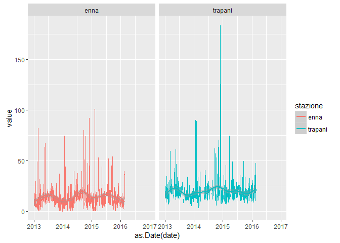

MAria\_report
================
Patrick Hausmann
08/03/2016

``` r
library('stringr')
library('reshape2')
library('ggplot2')

options(stringsAsFactors = FALSE)
```

``` r
split_names <- function(m) {
   stazione <- zz$stazione[which(str_detect(m, zz$stazione))]
   inq      <- zz$inq[which(str_detect(m, zz$inq))]
   tdm      <- zz$tdm[which(str_detect(m, zz$tdm))]
   out <- paste(stazione, inq, tdm, sep = "__")
   out
}

# tdm -> tipo di misura

zz <- read.table(header = TRUE, sep = ";", text = "
stazione;inq;tdm
partinico;SO2;Max_orario
sasol;CO;Media_24_h
enna;NO2;Max_media_8h
ex_autoparco;O3;NA
trapani;Benzene;NA
termini;PM10;NA
cda_gabbia;PM2.5;NA
termica_milazzo;NA;NA
boccetta;NA;NA
misterbianco;NA;NA
megara;NA;NA
lab_mobile1;NA;NA
porto_empedocle;NA;NA
villa_augusta;NA;NA
parcheggio_agip;NA;NA
")

zz %>% knitr::kable()
```

| stazione         | inq     | tdm            |
|:-----------------|:--------|:---------------|
| partinico        | SO2     | Max\_orario    |
| sasol            | CO      | Media\_24\_h   |
| enna             | NO2     | Max\_media\_8h |
| ex\_autoparco    | O3      | NA             |
| trapani          | Benzene | NA             |
| termini          | PM10    | NA             |
| cda\_gabbia      | PM2.5   | NA             |
| termica\_milazzo | NA      | NA             |
| boccetta         | NA      | NA             |
| misterbianco     | NA      | NA             |
| megara           | NA      | NA             |
| lab\_mobile1     | NA      | NA             |
| porto\_empedocle | NA      | NA             |
| villa\_augusta   | NA      | NA             |
| parcheggio\_agip | NA      | NA             |

``` r
x <- read.csv("http://dev.opendatasicilia.it/arpa/MAria_report.csv")

colnames(x) <- c("date", unlist(lapply(colnames(x), split_names)))

xm <- melt(x, id = "date")
xm$variable <- as.character(xm$variable)

u <- data.frame(do.call("rbind", strsplit(xm$variable, "__")), stringsAsFactors = FALSE)
colnames(u) <- c("stazione", "inq", "tdm")
fin <- data.frame(u, date = xm$date, value = xm$value)

head(fin) %>% knitr::kable()
```

| stazione  | inq | tdm         | date       |     value|
|:----------|:----|:------------|:-----------|---------:|
| partinico | SO2 | Max\_orario | 2013-01-01 |  2.227614|
| partinico | SO2 | Max\_orario | 2013-01-02 |  1.331977|
| partinico | SO2 | Max\_orario | 2013-01-03 |  4.150291|
| partinico | SO2 | Max\_orario | 2013-01-04 |  7.960566|
| partinico | SO2 | Max\_orario | 2013-01-05 |  3.602461|
| partinico | SO2 | Max\_orario | 2013-01-06 |  1.674221|

``` r
addmargins(table(fin$stazione, !is.na(fin$value), useNA= "always")) %>% knitr::kable()
```

|                  |  FALSE|   TRUE|   NA|     Sum|
|------------------|------:|------:|----:|-------:|
| boccetta         |   8034|    732|    0|    8766|
| cda\_gabbia      |   1793|   4051|    0|    5844|
| enna             |   3876|   9273|    0|   13149|
| ex\_autoparco    |    620|    841|    0|    1461|
| lab\_mobile1     |   5609|    235|    0|    5844|
| megara           |    543|    918|    0|    1461|
| misterbianco     |   3454|   9695|    0|   13149|
| parcheggio\_agip |    606|    855|    0|    1461|
| partinico        |   3241|   9908|    0|   13149|
| porto\_empedocle |  13964|    646|    0|   14610|
| sasol            |    812|    649|    0|    1461|
| termica\_milazzo |   3365|   6862|    0|   10227|
| termini          |   3564|   9585|    0|   13149|
| trapani          |   3875|   9274|    0|   13149|
| villa\_augusta   |   1302|    159|    0|    1461|
| NA               |      0|      0|    0|       0|
| Sum              |  54658|  63683|    0|  118341|

addmargins(table(fin\(stazione, fin\)inq, useNA= "always")) %&gt;% knitr::kable()

``` r
addmargins(table(fin$stazione, fin$inq, useNA= "always")) %>% knitr::kable()
```

|                  |  Benzene|     CO|    NO2|     O3|   PM10|  PM2.5|    SO2|   NA|     Sum|
|------------------|--------:|------:|------:|------:|------:|------:|------:|----:|-------:|
| boccetta         |        0|      0|   1461|   2922|   1461|      0|   2922|    0|    8766|
| cda\_gabbia      |     1461|      0|   1461|      0|      0|      0|   2922|    0|    5844|
| enna             |     1461|   2922|   1461|   2922|   1461|      0|   2922|    0|   13149|
| ex\_autoparco    |     1461|      0|      0|      0|      0|      0|      0|    0|    1461|
| lab\_mobile1     |     1461|      0|   1461|   2922|      0|      0|      0|    0|    5844|
| megara           |     1461|      0|      0|      0|      0|      0|      0|    0|    1461|
| misterbianco     |     1461|   2922|   1461|   2922|   1461|      0|   2922|    0|   13149|
| parcheggio\_agip |     1461|      0|      0|      0|      0|      0|      0|    0|    1461|
| partinico        |     1461|   2922|   1461|   2922|   1461|      0|   2922|    0|   13149|
| porto\_empedocle |     1461|   2922|   1461|   2922|   1461|   1461|   2922|    0|   14610|
| sasol            |     1461|      0|      0|      0|      0|      0|      0|    0|    1461|
| termica\_milazzo |     1461|   2922|   1461|   2922|   1461|      0|      0|    0|   10227|
| termini          |     1461|   2922|   1461|   2922|   1461|      0|   2922|    0|   13149|
| trapani          |     1461|   2922|   1461|   2922|   1461|      0|   2922|    0|   13149|
| villa\_augusta   |     1461|      0|      0|      0|      0|      0|      0|    0|    1461|
| NA               |        0|      0|      0|      0|      0|      0|      0|    0|       0|
| Sum              |    20454|  20454|  14610|  26298|  11688|   1461|  23376|    0|  118341|

### Export csv file (gzipped)

``` r
con_out <- gzfile("maria_report_04_long.csv.gz", open = "wb")
   write.csv(fin, file = con_out, row.names = FALSE)
close(con_out)
```

### PM10 - Enna e Trapani

``` r
fin_enna_pm10 <- subset(fin, subset = stazione %in% c("enna", "trapani") & inq == "PM10" & tdm == "Media_24_h")
p1 <- ggplot(fin_enna_pm10, aes(x=as.Date(date), y=value, col= stazione)) + geom_line()
p1 <- p1 + facet_wrap( ~ stazione)
p1 <- p1 + geom_smooth()
p1
```

    ## Warning: Removed 837 rows containing non-finite values (stat_smooth).

    ## Warning: Removed 606 rows containing missing values (geom_path).

<!-- -->
