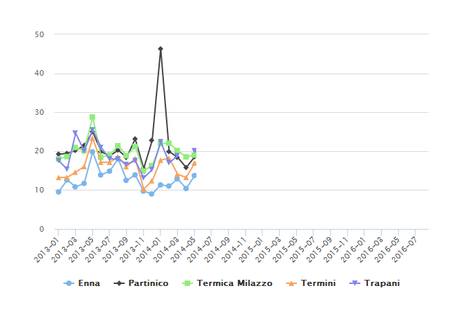

Maria\_report
================
Patrick Hausmann
2016-04-16

-   [Import the data](#import-the-data)
-   [Export csv file (gzipped)](#export-csv-file-gzipped)
-   [PM10 - Enna e Trapani](#pm10---enna-e-trapani)
-   [Highcharter](#highcharter)
-   [Vegalite](#vegalite)
-   [Maximum per year (PM10)](#maximum-per-year-pm10)
-   [Days per year with a PM10 value over 50 mg/m3 (max. 35 excedances allowed per year)](#days-per-year-with-a-pm10-value-over-50-mgm3-max.-35-excedances-allowed-per-year)

``` r
library('stringr')
library('reshape2')
library('ggplot2')
library('dplyr')
```

    ## 
    ## Attaching package: 'dplyr'

    ## The following objects are masked from 'package:stats':
    ## 
    ##     filter, lag

    ## The following objects are masked from 'package:base':
    ## 
    ##     intersect, setdiff, setequal, union

``` r
library('tidyr')
library('highcharter')
library('vegalite')
```

    ## 
    ## Attaching package: 'vegalite'

    ## The following objects are masked from 'package:ggplot2':
    ## 
    ##     scale_shape, scale_x_sqrt, scale_y_sqrt

``` r
options(stringsAsFactors = FALSE)
```

``` r
split_names <- function(m) {
   stazione <- zz$stazione[which(str_detect(m, zz$stazione))]
   inq      <- zz$inq[which(str_detect(m, zz$inq))]
   tdm      <- zz$tdm[which(str_detect(m, zz$tdm))]
   out <- paste(stazione, inq, tdm, sep = "__")
   out
}

# tdm -> tipo di misura

zz <- read.table(header = TRUE, sep = ";", text = "
stazione;inq;tdm
partinico;SO2;Max_orario
sasol;CO;Media_24_h
enna;NO2;Max_media_8h
ex_autoparco;O3;NA
trapani;Benzene;NA
termini;PM10;NA
cda_gabbia;PM2.5;NA
termica_milazzo;NA;NA
boccetta;NA;NA
misterbianco;NA;NA
megara;NA;NA
lab_mobile1;NA;NA
porto_empedocle;NA;NA
villa_augusta;NA;NA
parcheggio_agip;NA;NA
")

zz %>% knitr::kable()
```

| stazione         | inq     | tdm            |
|:-----------------|:--------|:---------------|
| partinico        | SO2     | Max\_orario    |
| sasol            | CO      | Media\_24\_h   |
| enna             | NO2     | Max\_media\_8h |
| ex\_autoparco    | O3      | NA             |
| trapani          | Benzene | NA             |
| termini          | PM10    | NA             |
| cda\_gabbia      | PM2.5   | NA             |
| termica\_milazzo | NA      | NA             |
| boccetta         | NA      | NA             |
| misterbianco     | NA      | NA             |
| megara           | NA      | NA             |
| lab\_mobile1     | NA      | NA             |
| porto\_empedocle | NA      | NA             |
| villa\_augusta   | NA      | NA             |
| parcheggio\_agip | NA      | NA             |

### Import the data

``` r
# http://88.53.168.210/Bollettino2/MAria_report.xls
x <- read.csv("http://blog.spaziogis.it/static/ods/data/mariareport/MAria_report.csv")

colnames(x) <- c("date", unlist(lapply(colnames(x), split_names)))

xm <- melt(x, id = "date")
xm$variable <- as.character(xm$variable)

u <- data.frame(do.call("rbind", strsplit(xm$variable, "__")), stringsAsFactors = FALSE)
colnames(u) <- c("stazione", "inq", "tdm")
fin <- data.frame(u, date = xm$date, value = xm$value)

head(fin) %>% knitr::kable()
```

| stazione  | inq | tdm         | date       |     value|
|:----------|:----|:------------|:-----------|---------:|
| partinico | SO2 | Max\_orario | 2013-01-01 |  2.227614|
| partinico | SO2 | Max\_orario | 2013-01-02 |  1.331977|
| partinico | SO2 | Max\_orario | 2013-01-03 |  4.150291|
| partinico | SO2 | Max\_orario | 2013-01-04 |  7.960566|
| partinico | SO2 | Max\_orario | 2013-01-05 |  3.602461|
| partinico | SO2 | Max\_orario | 2013-01-06 |  1.674221|

``` r
# most recent day
max(as.Date(fin[!is.na(fin$value), "date"]))
```

    ## [1] "2016-04-14"

``` r
addmargins(table(fin$stazione, !is.na(fin$value), useNA= "always")) %>% knitr::kable()
```

|                  |  FALSE|   TRUE|   NA|    Sum|
|------------------|------:|------:|----:|------:|
|                  |   1142|     59|    0|   1201|
| boccetta         |   6474|    732|    0|   7206|
| cda\_gabbia      |    589|   4215|    0|   4804|
| enna             |   1169|   9640|    0|  10809|
| ex\_autoparco    |    321|    880|    0|   1201|
| lab\_mobile1     |   4569|    235|    0|   4804|
| megara           |    247|    954|    0|   1201|
| misterbianco     |    738|  10071|    0|  10809|
| parcheggio\_agip |    306|    895|    0|   1201|
| partinico        |    524|  10285|    0|  10809|
| porto\_empedocle |  10222|    587|    0|  10809|
| sasol            |    514|    687|    0|   1201|
| termica\_milazzo |   1345|   7062|    0|   8407|
| termini          |    846|   9963|    0|  10809|
| trapani          |   1166|   9643|    0|  10809|
| villa\_augusta   |   1004|    197|    0|   1201|
| NA               |      0|      0|    0|      0|
| Sum              |  31176|  66105|    0|  97281|

``` r
addmargins(table(fin$stazione, fin$inq, useNA= "always")) %>% knitr::kable()
```

|                  |      |  Benzene|     CO|    NO2|     O3|  PM10|    SO2|   NA|    Sum|
|------------------|------|--------:|------:|------:|------:|-----:|------:|----:|------:|
|                  | 1201 |        0|      0|      0|      0|     0|      0|    0|   1201|
| boccetta         | 0    |        0|      0|   1201|   2402|  1201|   2402|    0|   7206|
| cda\_gabbia      | 0    |     1201|      0|   1201|      0|     0|   2402|    0|   4804|
| enna             | 0    |     1201|   2402|   1201|   2402|  1201|   2402|    0|  10809|
| ex\_autoparco    | 0    |     1201|      0|      0|      0|     0|      0|    0|   1201|
| lab\_mobile1     | 0    |     1201|      0|   1201|   2402|     0|      0|    0|   4804|
| megara           | 0    |     1201|      0|      0|      0|     0|      0|    0|   1201|
| misterbianco     | 0    |     1201|   2402|   1201|   2402|  1201|   2402|    0|  10809|
| parcheggio\_agip | 0    |     1201|      0|      0|      0|     0|      0|    0|   1201|
| partinico        | 0    |     1201|   2402|   1201|   2402|  1201|   2402|    0|  10809|
| porto\_empedocle | 0    |     1201|   2402|   1201|   2402|  1201|   2402|    0|  10809|
| sasol            | 0    |     1201|      0|      0|      0|     0|      0|    0|   1201|
| termica\_milazzo | 0    |     1201|   2402|   1201|   2402|  1201|      0|    0|   8407|
| termini          | 0    |     1201|   2402|   1201|   2402|  1201|   2402|    0|  10809|
| trapani          | 0    |     1201|   2402|   1201|   2402|  1201|   2402|    0|  10809|
| villa\_augusta   | 0    |     1201|      0|      0|      0|     0|      0|    0|   1201|
| NA               | 0    |        0|      0|      0|      0|     0|      0|    0|      0|
| Sum              | 1201 |    16814|  16814|  12010|  21618|  9608|  19216|    0|  97281|

### Export csv file (gzipped)

``` r
con_out <- gzfile("maria_report_04_long.csv.gz", open = "wb")
   write.csv(fin, file = con_out, row.names = FALSE)
close(con_out)
```

### PM10 - Enna e Trapani

``` r
fin_pm10 <- subset(fin, subset = stazione %in% c("enna", "trapani", "partinico", 
                                                 "termini", "termica_milazzo") & 
                        inq == "PM10" & tdm == "Media_24_h")
p1 <- ggplot(fin_pm10, aes(x=as.Date(date), y=value, col= stazione)) + geom_line()
p1 <- p1 + geom_smooth()
p1 <- p1 + facet_wrap( ~ stazione, nrow = 1)
p1 <- p1 + geom_hline(yintercept = 50, col = "blue")
p1 <- p1 + theme(axis.text.x = element_text(angle = 45, vjust = 1, hjust=1))
p1 <- p1 + labs(x = "Date", y = "value")
p1 <- p1 + theme(legend.position = 'bottom')
p1
```

    ## Warning: Removed 453 rows containing non-finite values (stat_smooth).

    ## Warning: Removed 6 rows containing missing values (geom_path).


### Highcharter

``` r
fin_hc <- tbl_df(fin) %>% 
          filter(stazione %in% c("enna", "trapani", "termica_milazzo", "partinico", "termini"), inq == "PM10", tdm == "Media_24_h") %>%
          mutate(year_month = format(as.Date(date), "%Y-%m")) %>%
          group_by(stazione, year_month) %>%
          summarise(mean_val = round(mean(value, na.rm = TRUE), 2)) %>%
          ungroup()

fin_hc <- data.frame(fin_hc)

hc1 <- highchart() %>% 
        hc_xAxis(categories = fin_hc$year_month) %>% 
        hc_add_series(name = "Enna", data = fin_hc[fin_hc$stazione=="enna", "mean_val"]) %>%
        hc_add_series(name = "Partinico", data = fin_hc[fin_hc$stazione=="partinico", "mean_val"]) %>%
        hc_add_series(name = "Termica Milazzo", data = fin_hc[fin_hc$stazione=="termica_milazzo", "mean_val"]) %>%
        hc_add_series(name = "Termini", data = fin_hc[fin_hc$stazione=="termini", "mean_val"]) %>%
        hc_add_series(name = "Trapani", data = fin_hc[fin_hc$stazione=="trapani", "mean_val"])

hc1
```



### Vegalite

``` r
vegalite(export=TRUE) %>%
  cell_size(400, 400) %>% 
  add_data(fin_hc) %>%
  encode_x("year_month", "temporal") %>%
  encode_y("mean_val", "quantitative") %>%
  encode_color("stazione", "nominal") %>% 
  axis_x(axisWidth=0, format="%Y", labelAngle=0) %>%
  mark_line() -> vl

vl
```


### Maximum per year (PM10)

``` r
tbl_df(fin) %>% 
          mutate(year = format(as.Date(date), "%Y")) %>%
          filter(inq == "PM10", tdm == "Media_24_h") %>%
          group_by(stazione, year) %>%
          summarise(max_val = round(max(value, na.rm = TRUE), 2)) %>%
          ungroup() %>%
          spread(year, max_val) %>% knitr::kable()
```

| stazione         |   2013|    2014|    2015|    2016|
|:-----------------|------:|-------:|-------:|-------:|
| boccetta         |  28.22|   37.60|      NA|      NA|
| enna             |  81.86|   91.95|  101.20|  216.60|
| misterbianco     |  74.32|  137.28|  112.88|  306.40|
| partinico        |  64.08|  462.20|  195.80|  229.72|
| porto\_empedocle |     NA|      NA|   75.10|      NA|
| termica\_milazzo |  99.03|  103.10|   89.70|  156.00|
| termini          |  62.62|  135.90|   70.30|  292.70|
| trapani          |  61.04|  183.87|   74.50|  141.60|

### Days per year with a PM10 value over 50 mg/m3 (max. 35 excedances allowed per year)

``` r
m <- tbl_df(fin) %>%
       filter(inq == "PM10") %>%
       mutate(year = format(as.Date(date), "%Y")) %>%
       group_by(stazione, year) %>%
       mutate(days_gt50 = cumsum(ifelse(!is.na(value) & value > 50, 1, 0))) %>%
       select(stazione, year, days_gt50) %>%
       top_n(1, days_gt50) %>%
       distinct(stazione, year) %>%
       ungroup() %>%
       arrange(stazione, year)

spread(m, year, days_gt50) %>% knitr::kable()
```

| stazione         |  2013|  2014|  2015|  2016|
|:-----------------|-----:|-----:|-----:|-----:|
| boccetta         |     0|     0|     0|     0|
| enna             |     4|     9|     6|     3|
| misterbianco     |     4|    16|     5|     4|
| partinico        |     4|    21|     9|     4|
| porto\_empedocle |     0|     0|    29|     0|
| termica\_milazzo |     5|    18|     8|     6|
| termini          |     2|     9|     6|     4|
| trapani          |     2|    12|     1|     2|

``` r
devtools::session_info()
```

    ## Session info --------------------------------------------------------------

    ##  setting  value                                   
    ##  version  R version 3.3.0 beta (2016-04-13 r70476)
    ##  system   x86_64, mingw32                         
    ##  ui       RTerm                                   
    ##  language (EN)                                    
    ##  collate  German_Germany.1252                     
    ##  tz       Europe/Berlin                           
    ##  date     2016-04-16

    ## Packages ------------------------------------------------------------------

    ##  package     * version date       source                            
    ##  assertthat    0.1     2013-12-06 CRAN (R 3.3.0)                    
    ##  base64        1.1     2011-12-03 CRAN (R 3.3.0)                    
    ##  chron         2.3-47  2015-06-24 CRAN (R 3.3.0)                    
    ##  clipr         0.2.0   2015-10-06 CRAN (R 3.3.0)                    
    ##  colorspace    1.2-6   2015-03-11 CRAN (R 3.3.0)                    
    ##  data.table    1.9.6   2015-09-19 CRAN (R 3.3.0)                    
    ##  DBI           0.3.1   2014-09-24 CRAN (R 3.3.0)                    
    ##  devtools      1.11.0  2016-04-12 CRAN (R 3.3.0)                    
    ##  digest        0.6.9   2016-01-08 CRAN (R 3.3.0)                    
    ##  dplyr       * 0.4.3   2015-09-01 CRAN (R 3.3.0)                    
    ##  evaluate      0.8.3   2016-03-05 CRAN (R 3.3.0)                    
    ##  formatR       1.3     2016-03-05 CRAN (R 3.3.0)                    
    ##  ggplot2     * 2.1.0   2016-03-01 CRAN (R 3.3.0)                    
    ##  gtable        0.2.0   2016-02-26 CRAN (R 3.3.0)                    
    ##  highcharter * 0.3.0   2016-03-28 CRAN (R 3.3.0)                    
    ##  highr         0.5.1   2015-09-18 CRAN (R 3.3.0)                    
    ##  htmltools     0.3.5   2016-03-21 CRAN (R 3.3.0)                    
    ##  htmlwidgets   0.6     2016-02-25 CRAN (R 3.3.0)                    
    ##  igraph        1.0.1   2015-06-26 CRAN (R 3.2.1)                    
    ##  jsonlite      0.9.19  2015-11-28 CRAN (R 3.3.0)                    
    ##  knitr         1.12.22 2016-04-15 Github (yihui/knitr@7268bbb)      
    ##  labeling      0.3     2014-08-23 CRAN (R 3.3.0)                    
    ##  lattice       0.20-33 2015-07-14 CRAN (R 3.3.0)                    
    ##  lazyeval      0.1.10  2015-01-02 CRAN (R 3.3.0)                    
    ##  magrittr      1.5     2014-11-22 CRAN (R 3.3.0)                    
    ##  Matrix        1.2-4   2016-03-02 CRAN (R 3.3.0)                    
    ##  memoise       1.0.0   2016-01-29 CRAN (R 3.3.0)                    
    ##  mgcv          1.8-12  2016-03-03 CRAN (R 3.3.0)                    
    ##  munsell       0.4.3   2016-02-13 CRAN (R 3.3.0)                    
    ##  nlme          3.1-126 2016-03-14 CRAN (R 3.3.0)                    
    ##  plyr          1.8.3   2015-06-12 CRAN (R 3.3.0)                    
    ##  purrr         0.2.1   2016-02-13 CRAN (R 3.3.0)                    
    ##  quantmod      0.4-5   2015-07-24 CRAN (R 3.3.0)                    
    ##  R6            2.1.2   2016-01-26 CRAN (R 3.3.0)                    
    ##  Rcpp          0.12.4  2016-03-26 CRAN (R 3.3.0)                    
    ##  reshape2    * 1.4.1   2014-12-06 CRAN (R 3.3.0)                    
    ##  rlist         0.4.6.1 2016-04-04 CRAN (R 3.3.0)                    
    ##  rmarkdown     0.9.5.9 2016-04-15 Github (rstudio/rmarkdown@445936b)
    ##  scales        0.4.0   2016-02-26 CRAN (R 3.3.0)                    
    ##  stringi       1.0-1   2015-10-22 CRAN (R 3.3.0)                    
    ##  stringr     * 1.0.0   2015-04-30 CRAN (R 3.3.0)                    
    ##  tidyr       * 0.4.1   2016-02-05 CRAN (R 3.3.0)                    
    ##  TTR           0.23-1  2016-03-21 CRAN (R 3.3.0)                    
    ##  vegalite    * 0.6.1   2016-03-22 CRAN (R 3.3.0)                    
    ##  viridisLite   0.1.3   2016-03-12 CRAN (R 3.3.0)                    
    ##  webshot       0.3     2016-03-04 CRAN (R 3.3.0)                    
    ##  withr         1.0.1   2016-02-04 CRAN (R 3.3.0)                    
    ##  xts           0.9-7   2014-01-02 CRAN (R 3.3.0)                    
    ##  yaml          2.1.13  2014-06-12 CRAN (R 3.3.0)                    
    ##  zoo           1.7-12  2015-03-16 CRAN (R 3.3.0)
